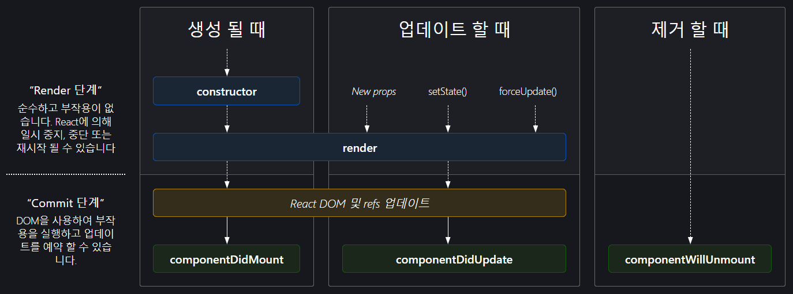

BOM PJT 회고록

[TOC]

## 안된점들😅

### FE🎈

#### Javascript

##### setTimeout() 사용하기🎇

- 문제 상황
  - 10초마다 서버로 요청을 보내야 한다
  - 최초 useEffect 선언하고 setInterval(func , time)을 사용했더니 필터링이나 다른 것들을 주었을 때 중첩되는 현상이 발생했다.
- 해결 방법
  - 요청속에 setTimeout()으로 재귀형태로 선언해 매 10초마다 요청을 보낸 뒤
    - 해당 변수를 useState를 통해 저장
  - 인자가 바뀔 때  최상단에 clearTimeout()으로 useState 변수를 킬해준 뒤 바뀐 값으로 다시 요청
- 포인트
  - 재귀구조 이해
  - setTimeout()과 clearTimeout()의 적절한 배치

```js
function PatientDetail({ isPC }) {
  const [patientDetailTimerID, setPatientDetailTimerID] = useState("");

  // useEffect를 통해 최초 요청 보냄
  useEffect(() => {
    const userType = ls.get("userType");
    if (userType === "ward") {
      ...
      );
      if (component !== 1) {
        // request 보내는 코드
        requestPatientDetailHealthInfo(
          params.id,
          filter,
          requestPatientDetailHealthInfoSuccess,
          (err) => console.log(err)
        );
      }
      if (component === 1) {
        ...
      }
  }, [params, filter]);
        
  const requestPatientDetailHealthInfoSuccess = (res) => {
    ...
    // 응답 저장
    setLiveTemperature(res.data.실시간.체온);
    ...
    const userType = ls.get("userType");
    if (userType === "ward") {
      // 타이머 걸기
      const timerID = setTimeout(
        requestPatientDetailHealthInfo,
        10000,
        params.id,
        filter,
        requestPatientDetailHealthInfoSuccess,
        (err) => console.log(err)
      );
      // 타이머를 useState에 저장
      setPatientDetailTimerID(timerID);
    }
    if (userType === "patient") {
      ...
    }
  };

  // select 태그가 변경될 때 실행되는 함수 (filter 값을 변경시켜주는데 이로 인해 useEffect 재실행)
  const selectPeriod = (event) => {
    // 이전 타이머 죽여주기
    clearTimeout(patientDetailTimerID);
    const period = { period: event.target.value };
    setFilter(period);
  };
```


---

##### 엑셀 다운로드

- 참고한 링크
  - https://soonh.tistory.com/38
  - https://wiki.jjagu.com/?p=373
  - https://minhanpark.github.io/today-i-learned/get-blob-with-axios/
- 코드

```js
// api/UserApi.js

import axios from "axios";

import ls from "helper/LocalStorage";

axios.defaults.withCredentials = true;

const UserApi = axios.create({
  baseURL: "https://thundervolt.co.kr/api/",
  // baseURL: "http://127.0.0.1:8000/api/",
  headers: {
    "Content-Type": "application/json",
  },
});

UserApi.interceptors.request.use(
  (config) => {
    const accessToken = ls.get("accessToken");
    if (accessToken) {
      config.headers["Authorization"] = "Bearer " + accessToken;
    }
    return config;
  },
  (error) => {
    return Promise.reject(error);
  }
);

export default UserApi;
```

```js
// api/PatientDetail.js api 작성하는 파일

import UserApi from "api/UserApi";

...

function requestExcelDownload(params, success, fail) {
  // axios.create를 활용해 인스턴스를 생성했을 때 get 요청의 인스턴스 메서드 확인하기
  // 참고 : https://yamoo9.github.io/axios/guide/api.html#%EC%9D%B8%EC%8A%A4%ED%84%B4%EC%8A%A4-%EC%83%9D%EC%84%B1
  UserApi.get("wards/patients/excel", { responseType: "blob", params })
    .then(success)
    .catch(fail);
}

export {
  ...
  requestExcelDownload,
};


// axios.create를 활용해 인스턴스를 생성했을 때 사용할 수 있는 메서드 목록
// axios.get(url[, config])
// axios.post(url[, data[, config]])
// axios.put(url[, data[, config]])
// axios.patch(url[, data[, config]])
// axios.delete(url[, config])
// axios.request(config)
// axios.head(url[, config])
// axios.options(url[, config])
// axios.getUri([config])
```

```js
// page/PatientDetail.js

  // 요청 성공시 실행시킬 함수
  const requestExcelDownloadSuccess = (res) => {
    // const blobURL = window.URL.createObjectURL(new Blob([response.data], { type: response.headers['content-type'] }));
    var blob = new Blob([res.data], {
      type: "application/vnd.openxmlformats-officedocument.spreadsheetml.sheet",
    });
    var blobURL = window.URL.createObjectURL(blob);
    var tempLink = document.createElement("a");
    tempLink.style.display = "none";
    tempLink.href = blobURL;
    tempLink.setAttribute("download", "test.xlsx");
    document.body.appendChild(tempLink);
    tempLink.click();
    document.body.removeChild(tempLink);
    window.URL.revokeObjectURL(blobURL);
  };

  // 온클릭 메서드 정의
  const clickExcelDownload = () => {
    // 파람스로 넘겨줄 객체 할당
    const newParams = {
      number: params.id,
      period: filter.current.period,
    };
    requestExcelDownload(newParams, requestExcelDownloadSuccess, (err) =>
      console.log(err)
    );
  };
```


---

#### React.js

##### innerWidth 값 바꿔주기🎆

```javascript
import { useState, React } from "react";

// components
import SideBar from "components/molecules/common/SideBar";
import HeadBar from "components/molecules/common/Headbar";
import PatientDetailInfo from "components/molecules/PatientDetail/PatientDetailInfo";
import DownloadBtn from "components/atoms/DownloadBtn";
import DeviceSummary from "components/molecules/PatientDetail/DeviceSummary";
import BodyInfo from "components/molecules/PatientDetail/BodyInfo";
import LiveDeviceStatus from "components/molecules/PatientDetail/LiveDeviceStatus";
import DeviceDetailInfo from "components/molecules/PatientDetail/DeviceDetailInfo";
import { useEffect } from "react";
import Logo from "components/atoms/Logo";

function PatientDetail() {
  const [component, setComponent] = useState(0);
  const [isPC, setIsPC] = useState(true);

  useEffect(() => {
    window.innerWidth > 1180 ? setIsPC(true) : setIsPC(false);
  }, []);

  setInterval(() => {
    window.innerWidth > 1180 ? setIsPC(true) : setIsPC(false);
  }, 1000);

  return (
    <>
      {isPC && ...}
      {!isPC && ...}
    </>
  );
}

export default PatientDetail;
```

- `isPC`라는 값을 `useState`로 할당
- 처음 시작될 때 `useEffect`를 사용해서 초기에 값 isPC값 채워주기
- `setInterval`을 사용해서 1초마다 isPC 초기화해주기


---

##### react life cycle🎉

`useState를 정의할 때 초기 값 -> props -> useState에 들어오는 값`

- 문제 상황 

  - state라는 useState({})을 정의하고 객체에 key, value 값을 가져올 예정
    - 예시
      - {username : 'aaa' , age: 18}

  - 다음으로 props로 username을 전달해주고 싶음 그래서 html 코드에 prop로 username을 전달해줌
    - 예시
      - <Component username={state.username} />
  - 이경우 undefined에러가 발생


- 발생원인
  - 초기에 useState를 정의할 때 {} 빈 객체로 정의했기 때문에 원하는 값을 인식할 수 없음
  - props를 초기에 읽을 때 해당 key값이 없음


- 해결방안

  - 사용할 key값을 기준으로 useState 여러개 정의

    - 예시

      ```js
      const [username, setUsername] = useState('')
      const [age, setAge] = useState(0)
      
      // setUsername, setAge 함수
      
      return <Component username={username} />
      ```




---

##### useState와 useRef의 차이🎊

1. 렌더링 여부
   - useState는 바뀔때마다 렌더링되지만 useRef는 저장은 되지만 바뀌지 않는다
   - 이로인해 useRef를 확인할 때는 console.log를 통해 진행


2. 리액트 공식문서 내용
   - useRef() Hook은 DOM ref만을 위한 것이 아닙니다. 본질적으로 useRef는 .current 프로퍼티에 변경 가능한 값을 담고 있는 “상자”와 같습니다. 만약 `<div ref={myRef} />`를 사용하여 React로 ref 객체를 전달한다면, React는 모드가 변경될 때마다 변경된 DOM 노드에 그것의 .current 프로퍼티를 설정할 것입니다. 
   - useRef는 내용이 변경될 때 그것을 알려주지는 않는다는 것을 유념하세요. .current 프로퍼티를 변형하는 것이 리렌더링을 발생시키지는 않습니다.

---

#### 퍼포먼스

##### webfont 이슈🚓

- 문제 상황
  - 퍼포먼스 점수가 85점 언저리였음
  - lighthouse를 돌리면  웹폰트 관련 이슈가 보여졌음
  - CDN이나 링크로 받아오던 폰트 파일
  - static파일을 관리하라는 알림이 뜸
- 해결방법
  - woff2 파일을 다운받아 assets에 추가하고 링크  수정
- 결과
  - 85점이던 퍼포먼스 점수를 92점까지 높임