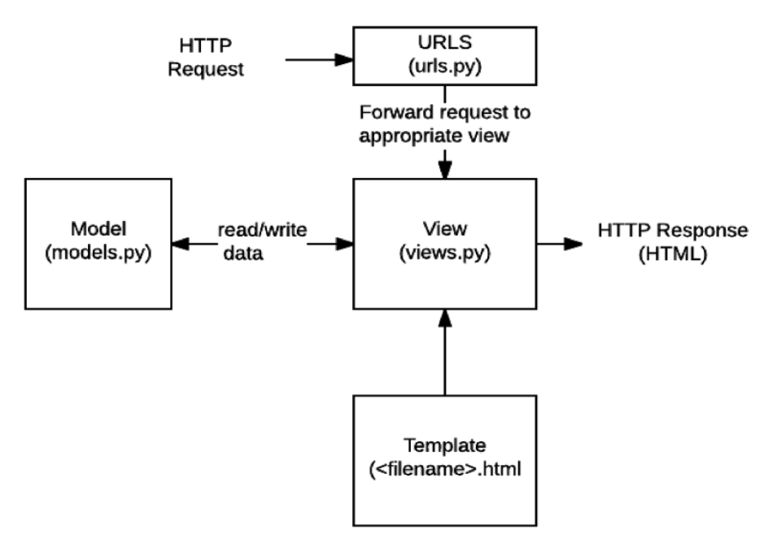

# Django The Web Framework

### Web framework

### Django

### 요청과 응답

### Template

### HTML Form

### URL

---

1. Web framework

- World Wide Web

- 인터넷에 연결된 컴퓨터를 통해 정보를 공유할 수 있는 전 세계적인 정보 공간

- Static web page(정적 웹 페이지)
  - 서버에 미리 저장된 파일이 사용자에게 그대로 전달되는 웹페이지
  - 서버가 정젖 웹 페이지에 대한 요청을 받은 경우
    - 서버는 추가적인 처리 과정없이 클라이언트에게 응답을 보냄
  - 모든 상황에서 모든 사용자에게 동일한 정보를 표시
  - 일반적으로 HTML, CSS, JavaScript로 작성됨
  - flat page라고도 함
  
- Dynamic web page
  - 웹페이지에 대한 요청을 받은 경우 서버는 추가적인 처리 과정 이후 클라이언트에게 응답을 보냄
  - 동적 페이지는 방문자와 상호작용하기 때문에 페이지 내용은 그때그때 다름
  - 서버 사이드 프로그래밍 언어(python, java, c++ 등)가 사용되며 파일을 처리하고 데이터 베이스와의 상호작용이 이루어짐
  
- Framework
  - 프로그래밍에서 특정 운영체제를 위한 응용 프로그램 표준 구조를 구현하는 클래스와 라이브러리 모임
  - 재사용할 수 있는 수많은 코드를 프레임워크로 통합함으로써 개발자가 새로운 애플리케이션을 위한 표준 코드를 다시 작성하지 않아도 같이 사용할 수 있도록 도움
  - Application framework라고도 함
  
- Web framework
  - `웹페이지를 개발하는 과정에서 겪는 어려움을 줄이는 것이 주 목적`으로 데이터 베이스 연동, 템플릿 형태의 표준, 세션관리, 코드 재사용 등의 기능을 포함
  - 동적인 웹페이지나, 웹 애플리케이션, 웹 서비스 개발 보조용으로 만들어지는 Application Framework의 일종
  
- Framework Architecture

  - MVC Design Pattern (model - view - controller)
  - 소프트웨어 공학에서 사용되는 패턴 중 하나
  - 사용자 인터페이스로부터 프로그램 로직을 분리하여
  - 애플리케이션의 시각적 요소나 이면에서 실행되는 부분을
  - 서로 영향 없이 쉽게 고칠 수 있는 애플리케이션을 만들 수 있음
  - Django는 `MTV(Model - Template -View) Pattern`이라고 함
  
- MTV Pattern

  - Model
    - 응용 프로그램의 데이터 구조를 정의하고 데이터 베이스의 기록을 관리(추가, 수정, 삭제)
  - Template
    - 파일의 구조나 레이아웃을 정의
    - 실제 내용을 보여주는데 사용(presentation)
  - View
    - HTTP요청을 수신하고 HTTP응답을 반환
    - Model을 통해 요청을 충족시키는데 필요한 데이터에 접근
    - Template에게 응답 서식 설정을 맡김
  - 
  
- 시작하기
  
    - python -m venv venv : 가상환경 만들고
  - source venv/Scripts/activate venv : 가상환경 활성화
  - pip install django==3.2.12 : 가상환경에 장고 설치
  - pip freeze > reaquirements.txt : 설치한 파일 목록 작성
  - django-admin startproject mypjt . : 현재 위치에 프로젝트 생성
    - Project
      - Project는 Applications의 집합 (collection of apps)
      - 프로젝트에는 여러 앱이 포함될 수 있음
      - 앱은 여러 프로젝트에 있을 수 있음
  
  - python manage.py runserver : 서버 실행
  - python manage.py startapp articles : 앱 생성, 일반적으로 이름은 `복수형`으로 생성하는 것을 권장
    - Application
      - 앱은 실제 요청을 처리하고 페이지를 보여주고 하는 등의 역할 담당
      - 하나의 프로젝트는 여러 앱을 가짐
      - 일반적으로 앱은 하나의 역할 및 기능 단위로 작성함
    - 앱 생성 시 주의 사항
      - 반드시 생성 후 등록
      - INSTALLED_APPS에 먼저 작성(등록)하고 생성하려면 앱이 생성되지 않음
  - mypjt - settings.py에 articles : 등록

---

- 정리
    - URL => view => templates 순서로 수정
    - DTL(문법의 이름, 파이썬같아 보이나 파이썬 아님)
        - variable
        - filter
        - tag (for, if)
        - comment
    - 약속된 경로 
        - 'app/templates'
    - 추가 템플릿 경로 
        - settings.py => templates =>DIRS
    - 상속
        - DRY(Don't Repeat Yourself)
        - extends & block
    - include tag
    - URLs
    - HTML form tag (요청과 응답)

---

2. 요청과 응답

- URLs
  - HTTP 요청(request)을 알맞은 view로 전달
- View
  - HTTP 요청을 수신하고 HTTP응답을 반환하는 함수 작성
  - Model을 통해 요청에 맞는 필요 데이터에 접근
  - Template엑 HTTP응답 서식을 맡김
- Templates
  - 실제 내용을 보여주는데 사용되는 파일
  - 파일 구조나 레이아웃을 정의 (ex. HTML)
  - Template 파일 경로의 기본 값은 `app 폴더 안의 templates폴더`로 저장되어있음
- 추가설정
  - LANGUAGE_CODE
    - 모든 사용자에게 제공되는 번역을 결정
    - USE_l18N이 활성화되어 있어야 함
  - TIME_ZONE
    - 데이터 베이스 연결의 시간대를 나타내는 문자열 지정
    - USE_TZ가 True이고 이 옵션이 설정된 경우 데이터베이스에서 날짜 시간을 읽으면, UTC 대신 새로 설정한 시간대의 인식 날짜&시간이 반환됨
    - USE_TZdl False인 상태로 이 값을 설정하는 것은 error가 발생


3. Template

- Django Template

  - "데이터를 표현하는 제어도구이자 표현에 관련된 로직"
  - 사용하는 built-in system
    - Django template language

- Django Template Language(DTL)

  - Django Template에서 사용하는  built-in template system
  - 조건, 반복, 변수 치환, 필터 등의 기능을 제공
  - 단순히 Python이 HTML에 포함된 것이 아니며, 프로그래밍적 로직이 아니라 `프레젠테이션을 표현하기 위한 것`
  - Python처럼 일부 프로그래밍 구조(if, for 등)를 사용할 수 있지만, 이것은 해당 Python코드로 실행되는 것이 아님

- DTL Syntax

  1. Variable

  - render()를 사용하여 views.py에서 정의한 변수를 template 파이ㅏㄹ로 넘겨 사용하는 것
  - 변수명은 연어, 숫자와 밑줄(_)의 조합으로 구성될 수 있으나 밑줄로는 시작할 수 없음
    - 공백이나 구두점 문자 또한 사용할 수 없음
  - dot(.)을 사용하여 변수 속성에 접근할 수 있음
  - render()의 세번째 인자로 {'key': value}와 같이 딕셔너리 형태로 넘겨주며, 여기서 정의한 key에 해당하는 문자열이 template에서 사용가능한 변수명이 됨

  2. Filters

  - 표시할 변수를 수정할 때 사용
  - 예시

  ```django
  {{ variable|filter }}
  {{ name|lower }}
  {{ variable|truncatewords:30 }}
  ```

  - 60개의 built-in template filters 제공
  - chained가 가능하며 일부 필터는 인자를 받기도 함

  3. Tags

  ```django
  
  
  ```

  - 출력 텍스트를 만들거나, 반복 또는 논리를 수행하여 제어 흐름을 만드는 등 변수보다 복잡한 일들을 수행
  - 일부 태그는 시작과 종료 태그가 필요
  - 약 24개의 built-in template tags 제공

  4. Comments

  ```django
  {#  #}
  
  {#  text  #}
  유효하지 않은 템플릿 코드가 포함될 수 있음
  한줄 주석에만 사용할 수 있음 (줄 바꿈이 허용되지 않음)
  
  
  	주석
  	주석
  
  여러줄 주석은 위와같이 입력
  ```

  - Django template에서 라인의 주석을 표현하기 위해 사용

- Template inheritance (템플릿 상속)

  - 템플릿 상속은 기본적으로 코드의 재사용성에 초점을 맞춤

  - 템플릿 상속을 사용하면 사이트의 모든 공통 요소를 포함하고, 하위 템플릿이 재정의(override)할 수 있는 블록을 정의하는 기본"skeleton" 템플릿을 만들 수 있음

  - tags

    ```django
    
    자식(하위)템플릿이 부모 템플릿을 확장한다는 것을 알림
    반드시 템플릿 최상단에 작성되어야 함
    
    	
    하위 템플릿에서 재지정(overriden)할 수 있는 블록을 정의
    즉, 하위 템플릿을 채울 수 있는 공간
    ```

- Template Tag - "include"

  ```django
  
  ```

  - 템플릿을 로드하고 현재 페이지로 렌더링
  - 템플릿 내에 다른 템플릿을 "포함(including)"하는 방법

- Django template system (feat. Django 설계 철학)

  - "표현과 로직(view)을 분리"
    - 템플릿 시스템은 표현을 제어하는 도구이자 표현에 관련된 로직일 뿐
    - 즉, 템플릿 시스템은 이러한 기본 목표를 넘어서는 기능을 지원하지 않음
  - "중복을 배제"
    - 대다수의 도적 웹사이트는 공통 header, footer, navbar같은 사이트 공통 디자인을 갖는다.
    - Django 템플릿 시스템은 이러한 요소를 한 곳에 저장하기 쉽게하여 중복 코드를 없애야 한다.
    - 이것이 템플릿 상속의 기초가 되는 철학

---

[참고]

```코드작성 순서```

- 데이터의 흐름에 맞추어 작성

1. urls.py
2. views.py
3. templates

---

