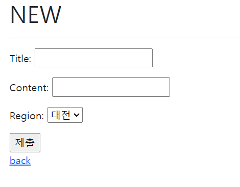

# Form/Model_Form

### Form Class

- Form은 Django의 유효성 검사 도구 중 하나로 외부의 악의적 공격 및 데이터 손상에 대한 중요한 방어 수단
- 장고는 Form과 관련한 유효성 검사를 단순화하고 자동화할 수 있는 기능을 제공하여 개발자로 하여금 직접 작성하는 코드보다 더 안전하고 빠르게 수행하는 코드를 작성할 수 있게함
- 장고는 Form에 관련된 작업의 아래 세 부분을 처리해 줌
  1. 렌더링을 위한 데이터 준비 및 재구성
  2. 데이터에 대한 HTML forms 생성
  3. 클라이언트로부터 받은 데이터 수신 및 처리
- The Django 'Form Class'
  - 장고 Form 관리 시스템의 핵심
  - Form내 filed, field 비채, display widget, label  초기값, 유효하지 않은 field에 관련된 에러 메시지를 결정
  - Django는 사용자의 데이터를 받을 때 해야할 과중한 작업(데이터 유효성 검증, 필요시 입력된 데이터 검증 결과 재출력, 유효한 데이터에 대해 요구되는 동작 수행 등)과 반복 코드를 줄여줌
- Form 선언하기
  - Model을 선언하는 것과 유사하며 같ㅌ은 field타입을 사용(또한, 일부 매개변수도 유사함)
  - forms 라이브러리에서 파생된 Form Class를 상속받음
  - forms.py 만들기 - 약속이 있는 것은 아니나 분류를 하기 위해 만듦. 일반적으로 forms.py

```python
articles 앱 내 forms.py 생성 후 /forms.py

from django import forms

class ArticleForm(forms.Form):
    title = forms.CharField(max_length=10)
    content = forms.CharField()
```

```python
/views.py

def new(request):
    form = ArticleForm()
    context = {
        'form': form,
    }
    return render(request, 'articles/new.html', context)
```

```django
/new.html





  <h1>NEW</h1>
  <hr>
  <form action="" method="POST">
    
    {{ form.as_p }}
     <label for="title">Title: </label>
    <input type="text" id="title" name="title"><br>
    <label for="content">Content: </label>
    <textarea name="content" id="content" cols="30" rows="10"></textarea> 
    <input type="submit">
  </form>
  <a href="">back</a>

```

- Form rendering options

  - \<label> & \<input> 쌍에 대한 3가지 출력 옵션

  1. as_p()
     - 각 field가 단락\<p>태그로 감싸져서 랜더링됨
  2. as.ul()
     - 각 field가 목록 항복\<li>로 감싸져서 렌더링 됨
     - \<ul>태그는 직접 작성해야 함
  3. as_table()
     - 각 field가 테이블 \<tr>태그 행으로 감싸져서 렌더링 됨
     - \<table>태그는 직접 작성해야 함

- 장고의 HTML input 요소 표현 방법 2가지

1. Form fields
   - input에 대한 유효성 검사 로직을 처리하며 탬플릿에서 직접 사용됨
2. Widgets
   - 웹페이지의 HTML input 요소 렌더링
   - GET/POST 딕셔너리에서 데이터 추출
   - widgets은 반드시 Form fields에 할당됨

- Widgets
  - 장고의 HTML input element 표현
  - HTML 렌더링 처리
  - `Form field 안에서 사용`
  - 주의 사항
    - `Form Fields와 혼동되어서는 안됨`
    - `Form Fields는 input 유효성 검사를 처리`
    - Widgets은 웹페이지에서 input element의 단순 `raw한 렌더링 처리`
  - 위젯은 외우는게 아니라 `구글에 장고 위젯` 검색 후 목록에서 필요한 것 찾기!
- Form field 및  widget 응용



```python
/forms.py

from django import forms

class ArticleForm(forms.Form):
    REGION_A = 'SL'
    REGION_B = 'DJ'
    REGION_C = 'GJ'
    REIONS_CHOICES = [
        (REGION_A, '서울'),
        (REGION_B, '대전'),
        (REGION_C, '광주')
    ]
    title = forms.CharField(max_length=10)
    content = forms.CharField(widget=forms.PasswordInput)
    region = forms.ChoiceField(widget=forms.Select, choices=REIONS_CHOICES)
```


---

### ModleForm

- 장고 Form을 사용하다 보면 Model에 정의한 field를 유저로부터 입력받기 위해 Form에서 Model field를 재정의 하는 행위가 중복될 수 있음
- 그래서 장고는 Model을 통해 Form Class를 만들 수 있는 ModelForm이라는 Helper 제공
- ModelForm Class
  - Model을 통해 폼 Class를 만들 수 있는 Helper
  - 일반 폼 Class와 완전히 같은 방식(객체 생성)으로 view에서 사용가능
- ModelForm 선언하기
  - 기존의 폼을 ModelForm으로 변경해보기
  - forms 라이브러리에서 파생된 ModelForm Class를 상속받음
  - 정의한 Class 안에 Meta Class를 선언하고, 어떤 Model을 기반으로 Form을 작성할 것인지에 대한 정보를 MetaClass에 지정
    - [주의] : Class 변수 fields와 exclude는 동시에 사용할 수 없음
- Meta class
  - Model의 정보를 작성하는 곳
  - ModelForm을 사용할 경우 사용할 Model이 있어야 하는데 Meta Class가 이를 구성함
    - 해당 Model에 정의한 field 정보를 Form에 적용하기 위함
  - [참고] Inner Class(Nested Class)
    - Class 내에 선언된 다른 Class
    - 관련 Class를 함께 그룹화하여 가독성 및 프로그램 유지 관리를 지원 (논리적으로 묶어서 표현)
    - 외부에서 내부 Class에 접근할 수 없으므로 코드의 복잡성을 줄일 수 있음
  - [참고] Meta 데이터
    - '데이터에 대한 데이터'
    - 사진촬영 - 사진데이터 - 사진의 메타 데이터(촬영시각, 렐즈, 조리개 값 등등...)
- 모델폼이 쉽게 해주는 것

1. 모델 필드 속성에 맞는 HTML element를 만들어 주고
2. 이를 통해 받은 데이터를 view 함수에서 유효성 검사를 할 수 있도록 함

- create view 수정

```python
# articles/views.py
def create(request):
    form = ArticleForm(request.POST)
    if form.is_valid():
        article = form.save()  # 인스턴스를 저장하는 행위
        return redirect('articles:detail', article.pk)
    return redirect('article:create')
```

- is_valid() method
  - 유효성 검사를 실행하고 데이터가 유효한지 여부를 boolean으로 반환
  - 데이터 유효성 검사를 보장하기 위한 많은 테스트에 대해 Django는 is_valid()를 제공
  - [참고] 유효성 검사
    - 요청한 데이터가 특정 조건에 충족하는지 확인하는 작업
    - 데이터베이스 각 필드 조건에 올바르지 않은 데이터가 서버로 전성되거나 저장되지 않도록 하는 것
- save() method
  - Form에 바인딩 된 데이터에서 데이터 베이스 객체를 만들고 저장
  - 모델폼의 하위(sub) 클래스는 기존 모델 인스턴스를 키워드 인자 `instance`로 받아 들일 수 있음
    - 이것이 제공되면 save()는 인스턴스를 수정(UPDATE)
    - 제공되지 않은 경우 save()는 지정된 모델의 새 인스턴스를 만듦(CREATE)
  - 폼의 유효성이 확인되지 않은 경우 save()를 호출하면 form.errors를 확인하여 에러 확인 가능

```python
# POST 받은 데이터를 사용해 form instance 생성
form = ArticleForm(request.POST)

# CREATE
# form 데이터를 활용해 새로운 Article 객체 저장
new_article = form.save()

# UPDATE
# 존재하는 Article을 수정하기 위해 form을 만듦, 그러나 POST로 받은 데이터는 form을 증식하지 않는다.
article = Article.objects.get(pk=1)
form = ArticleForm(request.POST, instance=article)
form.save()
```

- CREATE

```python
# views.py

def create(request):
    if request.method == 'POST':
        form = ArticleForm(request.POST)
        if form.is_valid():
            article = form.save()        
            return redirect('articles:detail', article.pk)
    else:
        form = ArticleForm()
    context = {
        'form': form
    }
    return render(request, 'articles/create.html', context)
```

```django
# create.html




<h1>CREATE</h1>
<hr>
<form action="" method="POST">
  
  {{ form.as_p }}

  <label for="title">Title : </label>
 <input type="text" id="title" name="title"><br>
 <label for="content">Content : </label>
 <textarea name="content" id="content" cols="30" rows="10"></textarea> 
 <input type="submit">

</form>


```

- UPDATE 

```python
# views.py

def update(request, pk):
    if request.method == 'POST':
        article = Article.objects.get(pk=pk)
        form = ArticleForm(request.POST, instance=article)
        if form.is_valid():
            article = form.save()
            return redirect('articles:detail', article.pk)
    else:
        article = Article.objects.get(pk=pk)
        form = ArticleForm(instance=article)
    context = {
            'article': article,
            'form': form
    }
    return render(request, 'articles/update.html', context)
```

```django
# update.html




  <h1>UPDATE</h1>
  <hr>
  <form action="" method="POST">
    
    {{ form.as_p }}
    <input type="submit">
  </form>
  <a href="">BACK</a>

```

- Form & ModelForm 비교
  - Form
    - 어떤 모델에 저장해야 하는지 알 수 없으므로 유효성 검사 이후 cleaned_data 딕셔너리를 생성
    - cleaned_data 딕셔너리에서 데이터를 가져온 후 .save() 호출해야 함
    - Model에 연관되지 않은 데이터를 받을 때 사용
  - ModelForm
    - Django가 해당 model에서 양식에 필요한 대부분의 정보를 이미 정의
    - 어떤 레코드를 만들어야 할 지 알고 있으므로 바로 .save() 호출 가능
- forms.py 파일 위치
  - Form class는 forms.py뿐만 아니라 다른 어느 위치에 두어도 상관없음
  - 하지만 되도록 `app폴더/forms.py`에 작성하는 것이 일반적인 구조

---

### Rendering fields manually

