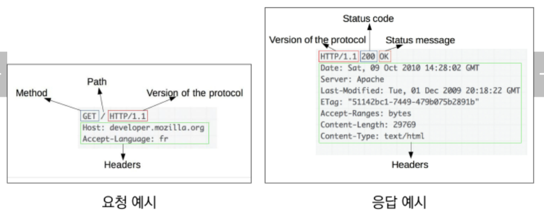

# REST API

- HTTP

- RESTful API
- Response
- Single Model
- 1:N Relation

---

### HTTP

- HyperText Transfer Protocol

- 웹 상에서 컨텐츠를 전송하기 위한 약속

- HTML 문서와 같은 리소스들을 가져올 수 있도록 하는 프로토콜 (규칙, 약속)

- 웹에서 이루어지는 모든 데이터 교환의 기초

  - 요성(request)
    - 클라이언트에 의해 전송되느 메시지

  - 응답(response)
    - 서버에서 응답으로 전송되는 메시지

- 기본 특성

  - Stateless
  - Connectionless

- 쿠티와 세션을 통해 서버 상태를 요청과 연결하도록 함

- HTTP 메시지

- HTTP request methods

  - 자원에 대한 행위(수행하고자 하는 동작)을 정의
  - 주어진 리소스(자원)에 수행하길 원하는 행동을 나타냄
  - HTTP Method 예시
    - GET , POST , PUT , DELETE

- HTTP response status codes

  - 특정 HTTP 요청이 성공적으로 완료되었는지 여부를 타나냄
  - 응답은 5개의 그룹으로 나뉘어짐
    1. Informational responses (1xx)
    2. Successful responses (2xx)
    3. Redirection messages (3xx)
    4. Client error responses (4xx)
    5. Server error responses (5xx)

- 웹에서의 리소스 식별

  - HTTP 요청의 대상을 리소스(resource, 자원)라고 함
  - 리소스는 문서, 사진 또는 기타 어떤 것이는 될 수 있음
  - 각 리소스는 리소스 식별을 위해 HTTP 전체에서 사용되는 URI(Uniform Resource Identifier)로 식별됨

- URL, URN

  - URL (Uniform Resource Locator)
    - 통합자원 위치
    - 네트워크 상에 자원이 어디 있는지 알려주기 위한 약속
    - 과거에는 실제 자원의 위치를 나타냈지만 현재는 추상화된 의미론적인 구성
    - '웹주소' , '링크'라고도 불림
  - URN (Uniform Resource Name)
    - 통합 자원 이름
    - URL과 달리 자원의 위치에 영향을 받지 않는 유일한 이름 역할을 함
    - 예시
      - ISBN (국제 표준 도서 번호)

- URI

  - Uniform Resource Identifier
    - 통합 자원 식별자
    - 인터넷의 자원을 식별하는 유일한 주소 (정보의 자원을 표현)
    - 인터넷에서 자원을 식별하거나 이름을 지정하는데 사용되는 간단한 문자열
    - 하위 개념
      - URL, URN
  - URI는 크게 URL과 URN으로 나눌 수 있지만, URN을 사용하는 비중이 매우 적기 때문에 일반적으로 URL은 URI와 같은 의미처럼 사용하기도 함

- URI 구조

  - Scheme (protocol)

    - 브라우저가 사용해야 하는 프로토콜
    - http(s), data, file, ftp, mailto

    

  - Host (Domain name)

    - 요청을 받는 웹 서버의 이름
    - IP address를 직접 사용할 수도 있지만, 실 사용시 불편하므로 웹에서 그리 자주 사용되지는 않음 (google의 IP address - 152.251.52.142)

    

  - Port

    - 웹 서버 상의 리소스에 접근하는데 사용되는 기술적인 '문(gate)'
    - HTTP 프로토콜의 표준 포트
      - HTTP80
      - HTTPS 443

    

  - Path

    - 웹 서버 상의 리소스 경로
    - 초기에는 실제 파일이 위치한 물리적 위치를 나타냈지만, 오늘날은 물리적인 실제 위치가 아닌 추상화 형태의 구조로 표현

    

  - Query (Identifier)

    - Query String Parameters
    - 웹 서버에 제공되는 추가적인 매개 변수
    - &로 구분되는 key-value 목록

    

  - Fragment

    - Anchor
    - 자원 안에서의 북마크의 한 종류를 나타냄
    - 브라우저에게 해당 문서(HTML)의 특정 부분을 보여주기 위한 방법
    - 브라우저에게 알려주는 요소이기 때문에 fragment identifier(부분 식별자)라고 부르며 '#' 뒤의 부분은 요청이 서버에 보내지지 않음

    

---

### RESTful API

- API

  - Application Programming Interface

    - 프로그래밍 언어가 제공하는 기능을 수행할 수 있게 만든 인터페이스
      - 애플리케이션과 프로그래밍으로 소통하는 방법
      - CLI는 명령줄, GUI는 그래픽(아이콘), API는 프로그래밍을 통해 특정한 기능 수행

    - Web API
      - 웹 애플리케이션 개발에서 다른 서비스에 요청을 보내고 응답을 받기 위해 정의된 명세
      - 현재 웹 개발은 모든 것을 직접 개발하기보다 여러 Open API를 활용하는 추세

    - 응답 데이터 타입
      - HTML, XML, JSON 등

  - 대표적이 API 서비스 목록
    - Youtube API, Naver Papago API, Kakao Map API ...

- REST

  - REpresentational Sate Transfer
  - API Server를 개발하기 위한 일종의 소프트웨어 설계 방법론
    - 2000년 로이 필딩의 박사하귀 논문에서 처음으로 소개 된 후 네트워킹 문화에 널리 퍼짐
  - 네트워크 구조(Network Architecture) 원리의 모음
    - 자원을 정의하고 자원에 대한 주소를 지정하는 전반적인 방법
  - REST 원리를 따르는 시스템을 RESTful이란 용어로 지칭함
  - 자원을 정의하는 방법에 대한 고민
    - 예) 정의된 자원을 어디에 위치시킬 것인가
  - REST의 자원과 주소의 지정 방법
    1. 자원
       - URI
    2. 행위
       - HTTP Method
    3. 표현
       - 자원과 행위를 통해 궁극적으로 표현되는 (추상화된) 결과물
       - JSON으로 표현된 데이터를 제공
       - JSON
         - JSON(JavaScript Object Notation)
           - JSON is a lightweight data-interchange format
           - JavaScript의 표기법을 따른 단순 문자열
         - 특징
           - 사람이 읽거나 쓰기 쉽고 기계가 파싱(해석, 분석)하고 만들어내기 쉬움
           - 파이썬의 dictionary, 자바스크립트의 object처럼 C 계열의 언어가 갖고 있는 자료구조로 쉽게 변화할 수 있는 key-value 형태의 구조를 갖고 있음
  - REST의 핵심 규칙
    1. '정보'는 URI로 표현
    2. 자원에 대한 '행위'는 HTTP Method로 표현 (GET, POST, PUT, DELETE - RCUD) 
  - 설계 방법론은 지키지 않았을 때 잃는 것보다 지켰을 때 얻는 것이 훨씬 많음
    - 단, 설계 방법론을 지키지 않더라도 동작 여부에 큰 영향을 미치지는 않음

- RESTful API

  - REST 원리를 따라 설계한 API
  - RESTful services, 혹은 simply REST services라고도 부름
  - 프로그래밍을 통해 클라이언트의 요청에 JSON을 응답하는 서버를 구성
    - 지금까지 사용자의 입장에서 썼던 API를 제공자의 입장이 되어 개발해보기

---

### RESPONSE

