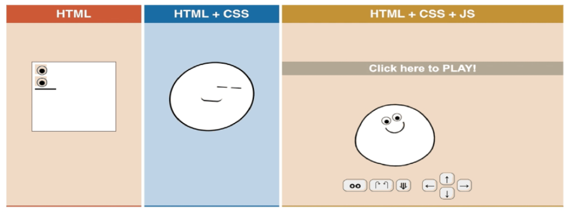
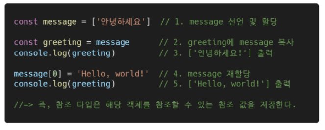

JavaScript 01

- Intro
- 변수
- 데이터 타입
- 연산자
- 조건/반복
- 함수
- 배열, 객체
- this

---

### INTRO

- 동작방식

- 브라우저(browser)
  - URL로 웹(WWW)을 탐색하며 서버와 통신하고, HTML 문서나 파일을 출력하는 GUI 기반의 소프트웨어
  - 인터넷의 컨텐츠를 검색 및 열람하도록 함
  - "웹 브라우저"라고도 함
  - 주요 브라우저
    - Google Chrome, Mozilla Firefox, Microsoft Edge, Opera, Safari

- JavaScript의 필요성

  - 브라우저 화면을 '동적'으로 만들기 위함
  - 브라우저를 조작할 수 있는 유일한 언어

  

- BROWSER

  - 브라우저에서 할 수 있는 일
    - DOM(Domcument Object Model) 조작
      - 문서(HTML) 조작
    - BOM(Browser Object Model) 조작
      - navigator, screen, location, frames, history, XHR
    - JavaScript Core(ECMAScript)
      - Data Structure(Object, Array), Conditional Expresssion, Iteration
  - DOM 이란?
    - HTML, XML과 같은 문서를 다루기 위한 프로그래밍 인터페이스
    - 문서를 구조화하고, 구조화된 구성 요소를 하나의 객체로 취급하여 다루는 논리적 트리 모델
    - 문서가 객체(object)로 구조화되어 있으며 key로 접근 가능
    - 단순한 속성 접근, 메서드 활용 뿐만 아니라 프로그래밍 언어적 특성을 활용한 조작 가능
    - 주요 객체
      - window : DOM을 표현하는 창 (브라우저 탭). 채상위 객체 (작성 시 생략 가능)
      - document : 페이지의 컨텐츠의 Entry Point 역할을 하며, \<head>, \<body> 등과 같은 수많은 다른 요소들을 포함
      - navigator , location , history , screen

  

  - DOM - 해석

    - 파싱 (Parsing)

      - 구문 분석, 해석
      - 브라우저가 문자열을 해석하여 DOM Tree로 만드는 과정

      

  - BOM이란?

    - Browser Object Model
    - 자바스크립트가 브라우저와 소통하기 위한 모델
    - 브라우저의 창이나 프레임을 추상화해서 프로그래밍적으로 제어할 수 있도록 제공하는 수단
      - 버튼, URL 입력창, 타이틀 바 등 브라우저 윈도우 및 웹 페이지 일부분을 제어 가능
    - window 객체는 모든 브라ㅜ저로부터 지원받으며 브라우저의 창(window)를 지칭

  - JavaScript Core

    - 브라우저(BOM & DOM)을 조작하기 위한 명령어 약속(언어)

  - 정리

    

    - 브라우저(BOM)과 그 내부의 문서(DOM)를 조작하깅 위해 ECMAScript(JS)를 학습

---

### ECMAScript

- ECMA?
  - ECMA (ECMA International)
    - 정보 통신에 대한 **표준을 제정하는 비영리 표준화 기구**
  - ECMAScript는 ECMA에서 ECMA-262 규격에 따라 정의한 언어
    - ECMA-262 : 범용적인 목적의 프로그래밍 언어에 대한 명세
  - **ECMAScript6는 ECMA에서 제안하는 6번째 표준 명세를 말함**
    - (참고) ECMAScript6의 발표 연도에 따라 ECMAScript2015라고도 불림

---

### 세미콜론

- 세미콜론(semicolon)
  - 자바스크립트는 **세미콜론을 선택적으로 사용 가능**
  - 세미콜론이 없으면 **ASI**에 의해 자동으로 세미콜론이 삽입됨
    - ASI : 자동 세미콜론 삽입 규칙 (Automatic Semicolon Insertion)

---

### 코딩 스타일 가이드

- 코딩 스타일의 핵심은 **합의된 원칙과 일관성**
  - 절대적인 하난의 정답은 없으며, 상황에 맞게 원칙을 정하고 일관성 있게 사용하는 것이 중요
- 코딩 스타일은 **코드의 품질에 직결되는 중요한 요소**
  - 코드의 가독성, 유지보수 또는 팀원과의 커뮤니케이션 등 **개발 과정 전체에 영향을 끼침**
- (참고) 다양한 자바스크립트 코딩 스타일 가이드
  - Airbnb JavaScript Style Guide
  - Google JavaScript Style Guide
  - standardjs

---

### 변수와 식별자

- 식별자 정의와 특징
  - 식별자(identifier)는 변수를 구분할 수 있는 변수명을 말함
  - 식별자는 반드시 무자, 달러($) 또는 밑줄(_)로 시작
  - 대소문자를 구분하며, 클래스명 외에는 모두 소문자로 시작
  - 예약어* 사용 불가능
    - 예약어 예시 : for , if , function 등

- 식별자 작성 스타일
  - 카멜 케이스(camel**C**ase, lower-camel-case)
    - 변수 , 객체 , 함수에 사용
    - **두 번째 단어의 첫 글자부터** 대문자
  - 파스칼 케이스(**P**ascal**C**ase, upper-camel-case)
    - 클래스, 생성자에 사용
    - **모든 단어의 첫 번째 글자를** 대문자로 작성
  - 대문자 스네이크 케이스(SNAKE**_**CASE)
    - 상수(constants)에 사용
      - 상수의 정의 : 개발자의 의도오 상관없이 변경될 가능성이 없는 값을 의미
      - **모든 단어 대문자 작성 & 단어 사이에 언더스코어** 삽입

- 변수 선언 키워드 (let , const)

  - let

    - **재할당 할 예정인** 변수 선언시 사용
    - 변수 **재선언 불가능**
    - 블록 스코프

  - const

    - **재할당 할 예정이 없는** 변수 선언 시 사용
    - 변수 **재선언 불가능**
    - 블록 스코프

  - (참고) 선언, 할당, 초기화

    

    - 선언 (Declaration)
      - **변수를 생성**하는 행위 또는 시점
    - 할당 (Assignment)
      - **선언된 변수에 값을 저장**하는 행위 또는 시점
    - 초기화 (Initialization)
      - **선언된 변수에 <u>처음으로</u> 값을 저장**하는 행위 또는 시점

  - 블록 스코프(block scope)

    

    - if, for, 함수 등의 **중괄호 내부**를 가리킴
    - 블록 스코프를 가지는 변수는 **블록 바깥에서 접근 불가능**

- 변수 선언 키워드 - 'var'

  - var

    - var로 선언한 변수는 재선언 및 재할당 모두 가능
    - ES6 이전에 변수를 선언할 때 사용되던 키워드
    - 호이스팅되는 특성으로 인해 예기치 못한 문제 발생 가능
      - 따라서 ES6 이후 부터는 var 대신 const와 let을 사용하는 것을 권장
    - 함수 스코프

  - 호이스팅(hoisting)

    

    - 변수 선언 이전에 참조할 수 있는 현상
    - 변수 선언 이전의 위치에서 접근 시 undefined를 반환

- 변수와 식별자 QUIZ

  

- let, const, var 비교

---

### 데이터 타입

- 데이터 타입 종류

  - 자바스크립트의 모든 값은 **특정한 데이터 타입을 가짐**
  - 크게 **원시타입(Primitive type)**과 **참조타입(Reference type)**으로 분류됨

  

- (참고) 원시 타입과 참조 타입 비교

  - 원시 타입(Primitive type)

    - **객체(object)가 아닌** 기본 타입
    - 변수에 **해당 타입의 값이 담김**
    - 다른 변수에 복사할 때 **실제 값이 복사됨**

    

  - 참조 타입(Reference type)

    - **객채(object) 타입**의 자료형
    - 변수에 해당 **객체의 참조값이 담김**
    - 다른 변수에 복사할 때 **참조 값이 복사됨**

    

    

- 원시 타입 (Primitive type)

  - **숫자 (Number) 타입**

    

    - **정수, 실수 구분없는 하나의 숫자 타입**
    - **부동 소수점 형식**을 따름
    - (참고) NaN (Not-A-Number)
      - **계산 불가능한 경우** 반환되는 값
        - 예: 'Angel' / 1004 => NaN

  - **문자열 (String) 타입**

    

    - **텍스트 데이터**를 나타내는 타입
    - 16비트 유니코드 문자의 집합
    - **작은따옴표** 또는 큰 따옴표 모두 가능
    - **템플릿 리터럴 (Template Literal)**
      - **ES6부터 지원**
      - **따옴표 대신 backtick(``)**으로 표현
      - **${ expression }** 형태로 표현식 삽입 가능

  - **undifined**

    

    - 변수의 **값이 없음**을 나타내는 데이터 타입
    - 변수 선언 이후 **직접 값을 할당하지 않으면, 자동으로 undefined가 할당됨**

  - **null**
    - 변수의 **값이 없음**을 **의도적으로 표현**할 때 사용하는 데이터 타입
    - (참고) null타입과 **typeof 연산자**
      - typeof 연산자 : 자료형 평가를 위한 연산자
      - null 타입은 ECMA 명세의 원시 타입의 정의에 따라 원시 타입에 속하지만, **typeof 연산자의 결과는 객체(object)로 표현됨**