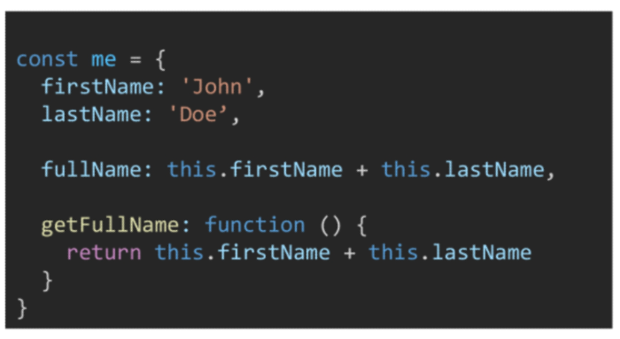

### 함수

- 함수 in JavaScript
  - 참조 타입 중 하나로써 function 타입에 속함
  - JavaScript에서 함수를 정의하는 방법은 주로 2가지로 구분
    - 함수 선언식 (function declaration)
    - 함수 표현식 (function expression)
  - (참고) JavaScript의 함수는 일급 객체 (First-class citizen)에 해당
    - 일급 객체 : 다음 조건들을 만족하는 객체를 의미함
      - 변수에 할당 가능
      - 함수의 매개 변수로 전달 가능
      - 함수의 반환 값으로 사용가능


- 함수 선언식(function statemetn, declaration)

  

  - 함수의 이름과 함께 정의하는 방식
  - 3가지 부분으로 구성
    - 함수의 이름 (name)
    - 매개변수 (args)
    - 몸통 (중괄호 내부)


- 함수 표현식(function expression)

  

  - 함수를 표현식 내에서 정의하는 방식
    - (참고)표현식 : 어떤 하나의 값으로 결정되는 코드의 단위
  - 함수의 이름을 생략하고 익명 함수로 정의 가능
    - 익명 함수(anonymous function) : 이름이 없는 함수
    - 익명 함수는 함수 표현식에서만 가능
  - 3가지 부분으로 구성
    - 함수의 이름 (생략 가능)
    - 매개 변수 (args)
    - 몸통 (중괄호 내부)


- 기본 인자(default arguments)

  - 인자 작성 시 '=' 문자 뒤 기본 인자 선언 가능

  


- 매개 변수와 인자의 개수 불일치 허용

  - 매개 변수보다 인자의 개수가 많을 경우,

  

  - 매개변수보다 인자의 개수가 적을 경우,

  


- Rest Parameter

  - rest parameter(...)를 사용하면 함수가 정해지지 ㅇ낳은 수의 매개변수를 배열로 받음(python 의 *arg와 유사)

    - 만약 rest parameter로 처리한 매개변수에 인자가 넘어오지 않을 경우에는, 빈 배열로 처리

  - 함수의 선언문의 파라미터에 Spread operator(....) 이용해서 받으면 가변인자를 받아 배열로 만들어서 사용하는 것

    


- Spread operator

  - spread operator(...)를 사용하면 배열 인자를 전개하여 전달 가능
  - 함수 호출문의 파라미터에 spread operator를 이용해서 호출하면 배열이 해당 매개변수로 각각 매핑되는 것

  


---

### 선언식 vs 표현식

- 함수 선언식과 표현식 비교 정리


- 함수의 타입

  - 선언식 함수와 표현식 함수 모두, 타입은 function으로 동일

  

  

- 호이스팅(hoisting) - 함수 선언식

  - 함수 선언식으로 선언한 함수는 var로 정의한 변수처럼 hoisting 발생
  - 함수 호출 이후에 선언해도 동작

  


- 호이스팅(hoisting) - 함수 표현식

  - 반면 함수 표현식으로 선언한 함수는 함수 정의 전에 호출 시 에러 발생
  - 함수 표현식으로 정의된 함수는 변수로 평가되어 변수의 scope 규칙을 따름

  


- (참고) 호이스팅(hoisting) - 함수 표현식

  - 함수 표현식을 var 키워드로 작성한 경우 변수가 선언 전 undefined로 초기화 되어 다른 에러가 발생

  

  

---

### Arrow Function

- 화살표 함수 (Arrow Function)

  - 함수를 비교적 간결하게 정의할 수 있는 문법
  - **function 키워드 생략 가능**
  - 함수의 **매개변수가 단 하나 뿐이라면, '( )' 도 생략 가능**
  - 함수 **몸통이 표현식 하나라면 '{ }' 과 return도 생략 가능**

  ```javascript
  const myName = function (name) {
      return 'hello'
  }
  
  const arrow1 = function (name) {
      return 'hello'
  }
  
  const arrow2 = (name) => { return 'hello' }
  
  const arrow3 = name => { return 'hello' }
  
  const arrow4 = name => 'hello'
  ```

  

  

- 함수 (Function) Quiz


---

### 문자열 (String)

- 문자열 관련 주요 메서드 목록


- 문자열 관련 주요 메서드 - includes

  - ```javascript
    string.includes(value)
    ```

    - 문자열에 value가 존재하는지 판별 후 참 또는 거짓 반환

    


- 문자열 관련 주요 메서드 - split

  - ```javascript
    stirng.split(value)
    ```

    - value가 없을 경우, 기존 문자열을 배열에 담아 반환
    - value가 빈 문자열일 경우 각 문자로 나눈 배열을 반환
    - value가 기타 문자열일 경우, 해당 문자열로 나눈 배열을 반환

    


- 무자열 관련 주요 메서드 - replace

  - ```javascript
    string.replace(from, to)
    ```

    - 문자열에 from 값이 존재할 경우, 1개만 to 값으로 교체하여 반환

  - ```javascript
    string.replaceAll(from, to)
    ```

    - 문자열에 from  값이 존재할 경우, 모두 to 값으로 교체하여 반환

    


- 문자열 관련 주요 메서드 - trim

  - ```javascript
    string.trim()
    ```

    - 문자열의 시작과 끝의 모든 공백문자(스페이스, 탭, 엔터 등)를 제거한 문자열 반환

  - ```javascript
    string.trimStart()
    ```

    - 문자열 시작의 공백문자(스페이스, 탭, 엔터 등)를 제거한 문자열 반환

  - ```javascript
    string.trimEnd()
    ```

    - 문자열 끝의 공백문자(스페이스, 탭, 엔터 등)를 제거한 문자열 반환

  


---

### 배열 (Arrays)

- 배열의 정의와 특징
  - 키와 속성들을 담고 있는 참조 타입의 **객체(object)**
  - 순서를 보장하는 특징이 있음
  - 주로 대괄호를 이용하여 생성하고, 0을 포함한 양의 정수 인덱스로 특정 값에 접근 가능
  - 배열의 길이는 array.length 형태로 접근 가능
    - (참고) 배열의 마지막 원소는 array.length -1로 접근


- 배열 관련 주요 메서드 목록 (1) - 기본편 (기본 배열 조작)


- 배열관련 주요 메서드 - reverse

  - ```javascript
    array.reverse()
    ```

    - 원본 배열의 요소들의 순서를 반대로 정렬

    


- 배열관련 주요 메서드 - push & pop

  - ```javascript
    array.push()
    ```

    - 배열의 가장 뒤에 요소 추가

  - ```javascript
    array.pop()
    ```

    - 배열의 마지막 요소 제거

    


- 배열관련 주요 메서드 - unshift & shift

  - ```javascript
    array.unshift()
    ```

    - 배열의 가장 앞에 요소 추가

  - ```javascript
    array.shift()
    ```

    - 배열의 첫번째 요소 제거

    


- 배열관련 주요 메서드 - includes

  - ```javascript
    array.includes(value)
    ```

    - 배열에 특정 값이 존재하는지 판별 후 참 또는 거짓 반환

    


- 배열관련 주요 메서드 - indexOf

  - ```javascript
    array.indexOf(value)
    ```

    - 배열에 특정 값이 존재하는지 확인 후 가장 첫 번째로 찾은 요소의 인덱스 반환
    - 만약 해당 값이 없을 경우 -1 반환


- 배열관련 주요 메서드 - join

  - ```javascript
    array.join([separator])
    ```

    - 배열의 모든 요소를 연결하여 반환
    - separator(구분자)는 선택적으로 지정 가능하며, 생략 시 쉼표를 기본 값으로 사용

    


- Spread operator

  - **spread operator(...)**를 사용하면 배열 내부에서 배열 전개 가능.
  - ~~ES5까지는 Array.concat() 메서드 사용~~
  - 얕은 복사에 활용 가능.

  


- 배열 관련 주요 메서드 목록(2) - 심화편 (Array Helper Methods)

  - 배열을 순회하며 특정 로직으 수행하는 메서드
  - 메서드 호출 시 인자로 **callback 함수**를 받는 것이 특징
    - **callback 함수** : 어떤 함수의 내부에서 실행될 목적으로 인자로 넘겨받는 함수를 말함

  


- (참고) Django로 보는 callback 함수 예시


- 배열 관련 주요 메서드 - forEach

  ```javascript
  array.forEach(callback(element[, index[,array]]))
  ```

  - 배열의 각 요소에 대해 콜백 함수를 한 번씩 실행
  - 콜백 함수는 3가지 매개변수로 구성
    - element : 배열의 요소
    - index : 배열 요소의 인덱스
    - array : 배열 자체
  - **반환 값(return)이 없는 메서드**

  ```javascript
  const fruits = ['strawberry', 'watermelon', 'apple', 'cherry']
  
  fruits.forEach(function (fruit, index) {
      console.log(fruit, index)
  })
  
  fruits.forEach((fruit, index) => {
      console.log(fruit, index)
  })
  
  strawberry 0
  watermelon 1
  apple 2
  cherry 3
  strawberry 0
  watermelon 1
  apple 2
  cherry 3
  ```

  


- 배열 관련 주요 메서드 - map

  ```javascript
  array.map(callback(element[, index[, array]]))
  ```

  - 배열의 각 요소에 대해 콜백 함수를 한 번씩 실행
  - 콜백 **함수의 반환값을 요소로 하는** 새로운 배열 반환
  - 기존배열 전체를 다른 형태로 바꿀 때 유용

  ```javascript
  const nums = [1, 2, 3, 4, 5]
  
  const doubleNum = nums.map(function (num) {
      return num * 2
  })
  
  // const doubleNum = numbers.map(num => num * 2)
  
  console.log(doubleNum)
  
  [2, 4, 6, 8, 10]
  ```

  

- 배열 관련 주요 메서드 - filter

  ```javascript
  array.filter(callback(element[, index[, array]]))
  ```

  - 배열의 각 요소에 대해 콜백함수를 한 번씩 실행
  - 콜백 **함수의 반환 값이 참인 요소들만** 모아서 새로운 배열을 반환
  - 기존 배열의 요소들을 필터링할 때 유용

  ```javascript
  const numbers = [1, 2, 3, 4, 5]
  
  const oddNums = numbers.filter((num, index) => 
  	{return num % 2
  })
  
  console.log(oddNums)  // 1, 3, 5
  ```

  

- 배열 관련 주요 메서드 - reduce

  ```javascript
  array.reduce(callback(acc, element, [index[, array]])[, initaialValue])
  ```

  - 배열의 각 요소에 대해 콜백 함수를 한 번씩 실행
  - 콜백 함수의 반환 값들을 **하나의 값(acc)에 누적 후 반환**
  - reduce 메서드의 주요 매개변수
    - acc
      - 이전 callback 함수의 반환값이 누적되는 변수
    - initailValue(optional)
      - 최초 callback 함수 호출 시 acc에 할당되는 값, default 값은 배열의 첫 번째 값
  - (참고) 빈 배열의 경우 initialValue를 제공하지 않으면 에러 발생

  ```javascript
  const numbers = [1, 2, 3]
  
  const result = numbers.reduce((acc, num) => {
      return acc + num
  }, 0)
  ```

  - reduce 동작 방식

  


- 배열 관련 주요 메서드 - find

  ```javascript
  array.finde(callback(element[, index[,array]]))
  ```

  - 배열의 각 요소에 대해 콜백 함수를 한 번씩 실행
  - 콜백 함수의 **반환 값이 참이면, 조건을 만족하는 첫번째 요소를 반환**
  - 찾는 값이 배열에 없으면 undefined 반환

  ```javascript
  const avengers = [
      { name: 'Tony Start', age: 45},
      { name: 'Thor', age: 40},
  ]
  
  const result = avengers.find((avenger) => {
      return avenger.name === 'Thor'
  })
  
  console.log(result) // {name: "Thor", age: 40}
  ```


- 배열 관련 주요 메서드 - some

  ```javascript
  array.some(callback(element[, index[, array]]))
  ```

  - 배열의 **요소 중 하나라도** 주어진 판별 함수를 통과하면 참을 반환
  - 모든 요소가 통과하지 못하면 거짓 반환
  - (참고) 빈 배열은 항상 거짓 반환

  ```javascript
  const numbers = [1, 3, 5, 7, 9]
  
  const hasEvenNumber = numbers.some((num) => {
      return num % 2 === 0
  })
  console.log(hasEvenNumber)  // false
  
  const hasEvenNumber = numbers.some((num) => {
      return num % 2
  })
  console.log(hasEvenNumber)  // true
  ```

  

- 배열 관련 주요 메서드 - every

  ```javascript
  array.every(callback(element[, index[,array]]))
  ```

  - 배열의 **모든 요소가** 주어진 판별 함수를 통과하면 참을 반환객
  - 하나의 요소라도 통과하지 못하면 거짓 반환
  - (참고) 빈 배열은 항상 참 반환

  ```javascript
  const numbers = [2, 4, 6, 8, 10]
  
  const isEveryNumberEven = numbers.every((num) => {
      return num % 2 === 0
  })
  console.log(isEveryNumberEven)  // true
  
  const isEveryNumberOdd = numbers.every((num) => {
      return num % 2
  })
  console.log(isEveryNumberOdd)  //false
  ```


- (참고) 배열 순회 방법 비교


- 배열 (Arrays) Quiz


---

### 객체 (Objects)

- 객체의 정의와 특징

  - 객체는 속성(property)의 집합이며, 중괄호 내부에 key와 value의 쌍으로 표현
  - key는 문자열 타입만 가능
    - (참고) key 이름에 띄어쓰기 등의 구분자가 있으면 따옴표로 묶어서 표현
  - value는 모든 타입(함수 포함) 가능
  - 객체 요소 접근은 점 또는 대괄호로 가능
    - (참고) key 이름에 띄어쓰기 같은 구분자가 있으면 대괄호 접근만 가능

  


- 객체와 메서드

  - 메서드는 어떤 객체의 속성이 참조하는 함수.

  - **객체.메서드**명() 으로 호출 가능.

  - 메서드 내부에서는 this 캐워드가 **객체**를 의미함.

    

    - fullName은 메서드가 아니기 때문에 정상 출력되지 않음(NaN)
    - getFullName은 메서드이기 때문에 해당 객체의 firstName과 lastName을 정상적으로 이어서 반환


- 객체 관련 ES6 문법 익히기
  - ES6에 새로 도입된 문법들로 객체ㅔ 생성 및 조작에 유용하게 사용 가능
    - 속성명 축약
    - 메서드명 축약
    - 계산된 속성명 사용하기
    - 구조 분해 할당
      - (참고) 구조 분해 할당은 배열도 가능함
    - 객체 전개 구문(Spread Operator)


- 객체 관련 ES6 문법 (1) - 속성명 축약 (shorthand)

  - 객체를 정의할 때 **key와 할당하는 변수의 이름이 같으면** 예시와 같이 축약 가능

  

  

- 객체 관련 ES6 문법 (2) - 메서드명 축약 (shorthand)

  - 메서드 선언 시 **function 키워드 생략 가능**

  


- 객체 관련 ES6 문법 (3) - 계산된 속성 (computed property name)

  - 객체를 정의할 때 key의 이름을 표현식을 이용하여 동적으로 생성 가능

  


- 객체 관련 ES6 문법 (4) - 구조 분해 할당 (destructing assignment)

  - 배열 또는 객체를 분해하여 속성을 변수에 쉽게 할당할 수 있는 문법

  


- 객체 관련 ES6 문법 (5) - Spread operator

  - **spread operator(...)**를 사용하면 객체 내부에서 객체 전개 가능.
  - ~~ES5까지는 Object.assign() 메서드를 사용.~~
  - 얕은 복사에 활용 가능

  


- JSON (JavaScript Object Notation)

  - key-value 쌍의 형태로 데이터를 표기하는 언어 독립적 표준 포맷
  - 자바스크립트의 객체와 유사하게 생겼으나 실제로는 문자열 타입
    - 따라서 JS의 객체로써 조작하기 위해서는 구문 분석(parsing)이 필수
  - 자바스크립트에서는 JSON을 조작하기 위한 두가지 내장 메서드를 제공
    - JSON.parse()
      - JSON => 자바스크립트 객체
    - JSON.stringify()
      - 자바스크립트 객체 => JSON

  


- 객체 (Objects) Quiz


- (참고) 배열은 객체다

  - 키와 속성들을 담고 있는 참조 타입의 **객체(object)**
  - 배열은 인덱스를 키로 갖으며 length 프로퍼티를 갖는 특수한 객체

  


---

### this 정리

- this is window? object?

  - JS의 this는 실행 문맥(execution context)에 따라 다른 대상을 가리킨다.
  - class 내부의 생성자(constructor)함수
    -  this는 생성되는 객체를 가리킴(Python의 self)
  - 메서드(객체.메서드명()으로 호출 가능한 함수)
    - this는 해당 메서드가 소속된 객체를 가리킴
  - 위의 두가지 경우를 제외하면 모두 최상위 객체(window)를 가리킴.

  


- function 키워드와 화살표 함수의 차이

  

  - **this.radiuses**는 메서드(객체.메서드명()으로 호출 가능) 소속이기 때문에 정상적으로 접근 가능
  - forEach의 콜백함수의 경우 메서드가 아님(객체.메서드명()으로 호출 불가능)
  - 때문에 콜백함수 내부의 this는 window가 되어 this.PI는 정상적으로 접근 불가능
  - 이 콜백 함수 내부에서 this.PI에 접근하기 위해서 함수객체.bind( this ) 메서드를 사용.
  - 이 번거로운 bind 과정을 없앤 것이 화살표 함수

  

  - Summary
    - 함수 내부에 this 키워드가 존재할 경우
      - 화살표 함수와 function 키워드로 선언한 함수가 다르게 동작
    - 함수 내부에 this 키워드가 존재하지 않을 경우
      - 완전히 동일하게 동작


---

### lodash

- A modern JavaScript utility **library**
  - 모듈성, 성능 및 추가 기능을 제공하는 JavaScript 유틸리티 라이브러리
  - array, object 등 자료구조를 다룰 때 사용하는 유용하고 간편한 유틸리티 함수들을 제공
  - 함수 예시
    - reverse, sortBy, range, random, cloneDeep


- 사용 예시


**lodash**를 사용하지 않을 경우, 깊은 복사는 직접 함수를 만들어서 구현해야 함 (내장된 깊은 복사 관련 함수 없음)


