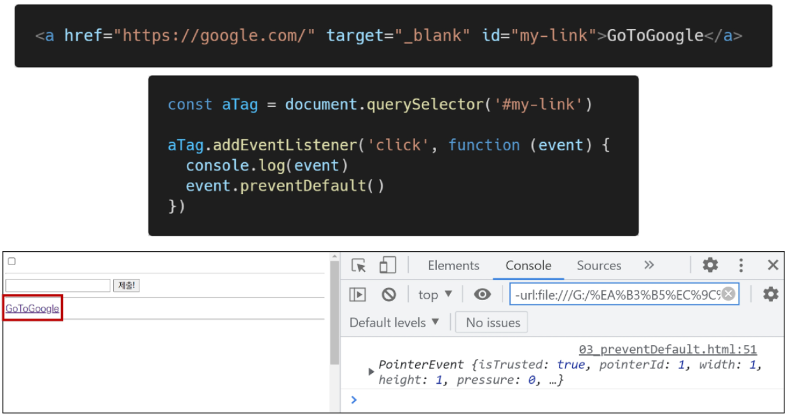

# DOM 조작과 EVENT

- DOM
- DOM 조작
- DOM 조작 실습
- EVENT
- 마무리

----

### DOM(Document Object Model)

- 브라우저에서 할 수 있는 일
  -  DOM 조작
    - 문서(HTML) 조작
  - BOM 조작
    - navigator, screen, location, frames, history, XHR
  - JavaScript COre (ECMAScript)
    - Data Structure(Object, Array), Conditional Expression, Iteration

- - DOM 이란?

    - HTML, XML과 같은 문서를 다루기 위한 프로그래밍 인터페이스

    - 문서를 구조화하고, 구조화된 구성 요소를 하나의 객체로 취급하여 다루는 논리적 트리 모델

    - 문서가 객체(object)로 구조화되어 있으며 key로 접근 가능

    - 단순한 속성 접근, 메서드 활용 뿐만 아니라 프로그래밍 언어적 특성을 활용한 조작 가능

    - 주요 객체

      - window : DOM을 표현하는 창 (브라우저 탭). 채상위 객체 (작성 시 생략 가능)
      - document : 페이지의 컨텐츠의 Entry Point 역할을 하며, \<head>, \<body> 등과 같은 수많은 다른 요소들을 포함
      - navigator , location , history , screen

      

- DOM - 해석

  - 파싱 (Parsing)

    - 구문 분석, 해석
    - 브라우저가 문자열을 해석하여 DOM Tree로 만드는 과정

    

    

- DOM - 조작

- BOM이란?

  - Browser Object Model

  - 자바스크립트가 브라우저와 소통하기 위한 모델
    - 브라우저의 창이나 프레임을 추상화해서 프로그래밍적으로 제어할 수 있도록 제공하는 수단
      - 버튼, URL 입력창, 타이틀 바 등 브라우저 윈도우 및 웹 페이지 일부분을 제어 가능

  - window 객체는 모든 브라우저로부터 지원받으며 브라우저의 창(window)를 지칭

- BOM 조작

- JavaScript Core

  - 프로그래밍 언어

  

---

### DOM 조작

- DOM 조작 - 개념
  - Domcument는 문서 한 장(HTML)에 해당하고 이를 조작
  - DOM 조작 순서
    1. 선택 (Select)
    2. 변경 (Maniapulation)

- Document 위치

- DOM 관련 객체의 상속 구조

  - EventTarget
    - Event Listener를 가질 수 있는 객체가 구현하는 DOM 인터페이스
  - Node
    - 여러가지 DOM 타입들이 상속하는 인터페이스

  

  - Element
    - Document 안의 모든 객체가 상속하는 가장 범용적인 인터페이스
    - 부모인 Node와 그 부모인 EventTarget의 속성을 상속
  - Document
    - 브라우저가 불러온 웹 페이지를 나타냄
    - DOM 트리의 진입점(entry point)역할을 수행
  - HTMLElement
    - 모든 종류의 HTML 요소
    - 부모 element의 속성 상속

  

- DOM 선택 - 선택 관련 메서드
  - document.**qurySelector(selector)**
    - 제공한 선택자와 일치하는 element 하나 선택
    - 제공한 CSS selector를 만족하는 첫번째 element 객체를 반환 (없다면 null)
  - document.**querySelectorAll(selector)**
    - 제공한 선택지와 일치하는 여러 element를 선택
    - 매칭 할 하나 이상의 셀렉터를 포함하는 유효한 CSS selector를 인자(문자열)로 받음
    - 지정된 셀렉터에 일치하는 NodeList를 반환
  - getElementById(id)
  - getElementsByTagName(name)
  - getElementByClassName(names)
  
  
  
  - **querySelector( ), querySelectorAll( )을 사용하는 이유**
    - id, class, 그리고 tag 선택자 등을 모두 사용 가능하므로, 더 구체적이고 유연하게 선택 가능
      - ex) document.querySelector( '#id' ), document.querySelectorAll( '.class' )

- DOM 선택 - 선택 메서드 별 반환 타입
  1. 단일 element
     - ~~getElementById( )~~
     - querySelector( )
  2. HTMLCollection
     - getElementsByTagName( )
     - getElementsByClassName( )
  3. NodeList
     - querySelectorAll( )

- DOM 선택 - HTMLCollection & NodeList
  - 둘 다 배열과 같이 각 항목에 접근하기 위한 index를 제공 (유사 배열)
  - **HTMLCollection**
    - name, id, index 속성으로 각 항목에 접근 가능
    - 단, HTMLCollection과 달리 배열에서 사용하는 forEach 메서드 및 다양한 메서드 사용 가능
  - 둘 다 Live Collecion으로 DOM의 변경 사항을 실시간으로 반영하지만, **querySelectorAll( )에 의해 반환되는 NodeList는 Static Collection으로 실시간으로 반영되지 않음**

- DOM 선택 - Collection

  - Live Collection
    - 문서가 바뀔 때 실시간으로 업데이트 됨
    - DOM의 변경사항을 실시간으로 collection에 반영
    - 예) HTMLCollection, NodeList

  - Static Collection (non-live)
    - DOM이 변경되어도 collection 내용에는 영향을 주지 않음
    - querySelectorAll( )의 반환 NodeList만 static collection

- DOM 선택 실습

- DOM 변경 - 변경 관련 메서드 (Creation)
  - document.createElement( )
    - 작성한 ㅌ태그 명의 HTML 요소를 생성하여 반환

- DOM 변경 - 변경관련 메서드 (append DOM)
  - Element.append( )
    - 특정 부모 Node의 자식 NodeList 중 마지막 자식 다음에 Node 객체나 DOMString을 삽입
    - 여러 개의 Node 객체, DOMString을 추가할 수 있음
    - 반환 값이 없음
  - Node.appendChild( )
    - 한 Node를 특정 부모 Node의 자식 NodeList 중 마지막 자식으로 삽입 (Node만 추가 가능)
    - 한번에 오직 하나의 Node만 추가할 수 있음
    - 만약 주어진 Node가 이미 문서에 존재하는 다른 Node를 참조한다면 새로운 위치로 이동

- DOM 병경 실습

  - Element.append( )

  

  - Node.appendChild( )

  

- ParentNode.append( ) vs Node.appendChild( )
  - append()를 사용하면 DOMStirng 객체를 추가할 수도 있지만, .appendChild()는 Node 객체만 허용
  - append()는 반환값이 없지만, appendChild()는 추가된 Node 객체를 반환
  - append()는 여러 Node 객체와 문자열을 추가할 수 있지만 appendChild()는 하나의 Node 객ㅊ체만 추가할 수 있음

- DOM 변경 - 변경

  - Node.innerText
    - Node 객체와 그 자손의 텍스트 컨텐츠(DOMString)를 표현 (해당 요소 내부의 raw text) (사람이 읽을 수 있는 요소만 남김)
    - 즉, 줄 바꿈을 인식하고 숨겨진 내용을 무시하는 등 최종적으로 스타일링이 적용된 모습으로 표현

  - Element.innerHTML
    - 요소(element) 내에 포함된 HTML 마크업을 반환
    - [참고] XSS 공격에 취약하므로 사용 시 주의

- DOM 변경 실습

  - innerText vs innerHTML

  

  

- XSS (Cross-site Scripting)
  - 공격자가 입력요소를 사용하여(\<input>)웹사이트 클라이언트 측 코드에 악성 스크립트를 삽입해 공격하는 방법
  - 피해자(사용자)의 브라우저가 악성 스크립트를 실행하며 공격자가 엑세스 제어를 우회하고 사용자를 가장 할 수 있도록 함
    - ex)게시판이나 메일 등 악성 자바스크립트 코드를 삽입해 민감한 정보를 탈취할 수 있음

- DOM 삭제 - 삭제 관렬 메서드
  - ChildNode.remove( )
    - Node가 속한 트리에서 해당 Node를 제거
  - Node.removeChild( )
    - DOM에서 자식 Node를 제거하고 제거된 Node를 반환
    - Node는 인자로 들어가는 자식 Node의 부모 Node

- DOM 삭제 실습

  - ChildNode.remove( )

  

  - Node.removeChild( )

  

- DOM 속성 - 속성 관련 메서드
  - Element**.setAttribute(name, value)**
    - 지정된 요소의 값을 설정
    - 속성이 이미 존재하면 값을 갱신, 존재하지 않으면 지정된 이름과 값으로 새 속성을 추가
  - Element**.getAttribute(attributeName)**
    - 해당 요소의 지정된 값(문자열)을 반환
    - 인자(attributeName)는 값을 얻고자 하는 속성의 이름

- DOM 속성 실습

  - Element**.setAttribute(name, value)**

  

  - Element**.getAttribute(attributeName)**

  

- DOM 조작 - 정리

---

### Event

- Event(이벤트) 개념
  - 네트워크 활동이나 사용자와의 상호작용 같은 사건의 발생을 알리기 위한 객체
  - 이벤트 발생
    - 마우스를 클릭하거나 키보드를 누르는 등 사용자 행동으로 발생할 수도 있음
    - 특정 메서드를 호출(Element.click( ))하여 프로그래밍적으로도 만들어 낼 수 있음

- Event 기반 인터페이스

  - AnimationEvent, ClipboardEvent, DragEvent 등

  - UIEvent
    - 간단한 사용자 인터페이스 이벤트
    - Event의 상속을 받음
    - MouseEvent, KeyboardEvent, InputEvent, FocusEvent 등의 부모 객체 역할을 함

- Event의 역할

  **"~ 하면 ~ 한다"**

  - "클릭하면, 경고창을 띄운다"

  - "특정 이벤트가 발생하면, 할일을 등록한다."

- Event handler - addEventListener( )

  - EventTarget**.addEventListener( )**
    - 지정한 이벤트가 대상에 전달될 때마다 호출할 함수를 설정
    - 이벤트를 지원하는 모든 객체(Element, Document, Window 등)를 대상으로 지정가능

  - target**.addEventListener(type, listener**[, options]**)**
    - type
      - 반응 할 이벤트 유형 (대소문자 구분 문자열)
    - listener
      - 지정된 타입의 이벤트가 발생했을 때 알림을 받는 객체
      - EventListener 인터페이스 혹은 JS function 객체(콜백 함수)여야 함

- Event handler - addEventListener( )

  "대상에 특정 이벤트가 발생하면, 할 일을 등록하자"

  

- addEventListener 예시

- addEventListener 실습

- Event 취소
  - event**.preventDefault( )**
  - 현재 이벤트의 기본 동작을 중단
  - HTML 요소의 기본 동작을 작동하지 않게 막음
    - ex) a 태그의 기본 동작은 클릭 시 링크로 이동 / form  태그의 기본 동작은 form 데이터 전송
  - 이벤트를 취소할 수 있은 경우, 이벤트의 전파를 막지 않고 그 이벤트를 취소

- Event 취소 실습

