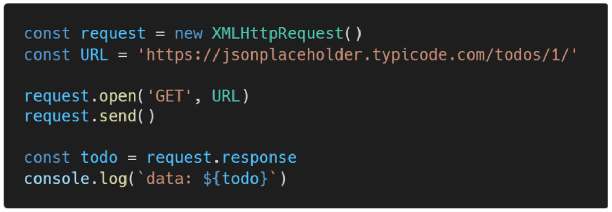
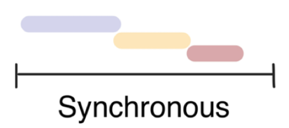
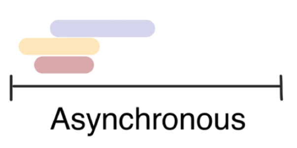
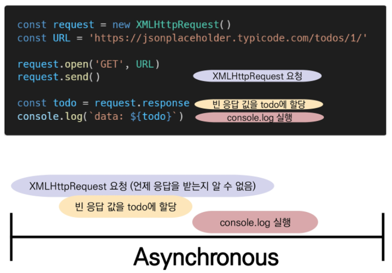
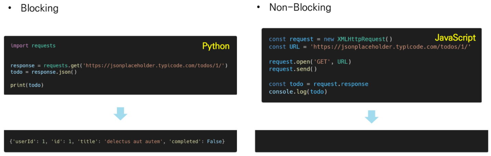
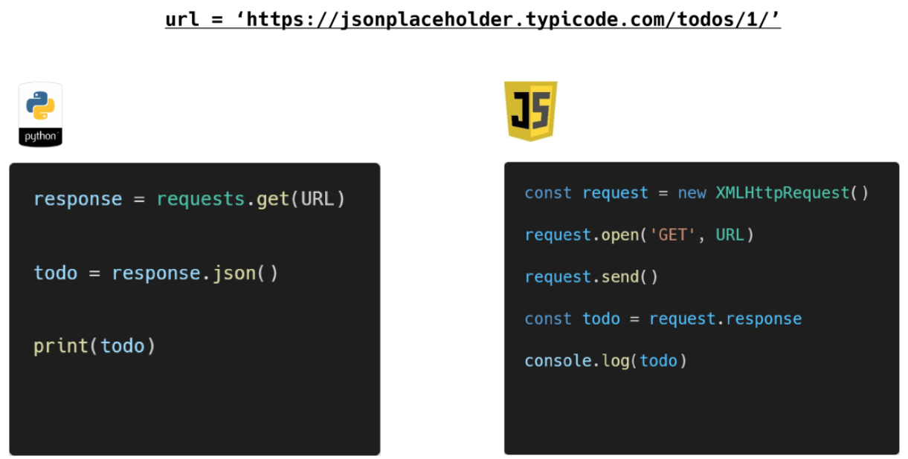
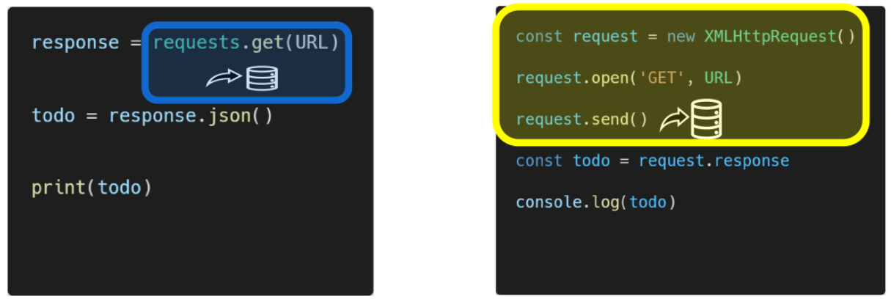
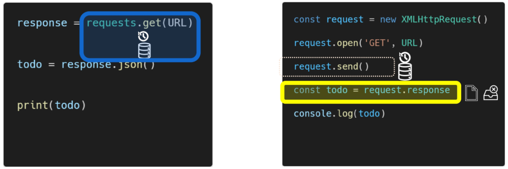
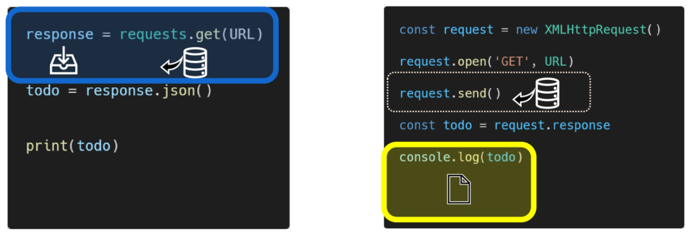
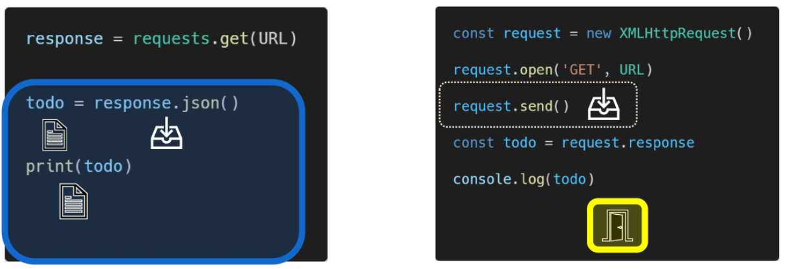

# JavaScript03

- AJAX
- Asynchronous JavaScript
- Callback Function
- Promise
- Axios
- (부록) async & await

---

### AJAX

- AJAX란
  - Asynchronous JavaScript And XML (비동기식 JS와 XML)
  - 서버와 통신하기 위해 `XMLHttpRequest` 객체를 활용
  - JSON , XML , HTML 그리고 일반 텍스트 형식 등을 포함한 다양한 포맷을 주고 받을 수 있음
    - [참고] AJAX의 X가 XML을 의미하긴 하지만, 요즘은 더 가벼운 용량과 JS의 일부라는 장점 때문에 JSON을 더 많이 사용함

- AJAX의 특징
  - 페이지 전체를 reload(새로고침)를 하지 않고서도 수행되는 "비동기성"
    - 서버의 응답에 따라 전체 페이지가 아닌 일부분만을 업데이트 할 수 있음
  - AJAX의 주요 두가지 특징은 아래의 작업을 할 수 있게 해줌
    1. 페이지 새로 고침 없이 서버에 요청
    2. 서버로부터 데이터를 받고 작업을 수행

- [참고] AJAX의 배경
  - 2005년 Google Maps & Gmail등에 활용되는 기술을 설명하기 위해 AJAX라는 용어를 최초로 사용
  - AJAX는 특정 기술이 아닌 기존의 여러 기술을 사용하는 새로운 접근법을 설명하는 용어
    - 기존 기술을 잘 활용할 수 있는 방식으로 구성 및 재조합한 새로운 접근법
  - Google 사용 예시
    - Gmail
      - 메일 전송 요청이 모두 처리되기 전 다른 페이지로 넘어가더라도 메일은 전송됨
    - Google Maps
      - 스크롤 행위 하나하나가 모두 요청이지만 페이지는 갱신되지 않음

- XMLHttpRequest 객체
  - 서버와 상호작용하기 위해 사용되며 전체 페이지의 새로고침 없이 데이터를 받아올 수 있음
  - 사용자의 작업을 방해하지 않으면서 페이지의 일부를 업데이트 할 수 있음
  - 주로 AJAX 프로그래밍에 사용
  - 이름과 달리 XML뿐만 아니라 모든 종류의 데이터를 받아올 수 있음
  - 생성자
    - XMLHttpRequest( )

- XMLHttpRequest 예시

  

  - console에 todo 데이터가 출력되지 않음
  - 데이터 응답을 기다리지 않고 console.log()를 먼저 실행했기 때문

---

### Asynchronous JavaScript

- 동기식

  

  - 순차적, 직렬적 Task 수행
  - 요청을 보낸 후 응답을 받아야만 다음 동작이 이루어짐 (blocking)

  

  - 버튼 클릭 후 alert메시지의 확인 버튼을 누를 때까지 문장이 만들어지지 않음
  - 즉, alert 이후의 코드는 alert의 처리가 끝날 때까지 실행되지 않음
  - 왜 이런 형상이 발생할까?
    - JavaScript는 `single threaded`

- 비동기식	

  

  - 병렬적 Task 수행
  - 요청을 보낸 후 응답을 기다리지 않고 다음 동작이 이루어짐 (non-blocking)

  

  - 요청을 보내고 응답을 기다리지 않고 다음 코드가 실행됨
  - 결과적으로 변수 todo에는 응답데이터가 할당되지 않고 빈 문자열이 출력
  - 그렇다면 JS는 왜 기다려주지 않는 방식으로 동작하는가?
    - JavaScript는 `single threaded`

- 왜 비동기(Asynchronous)를 사용하는가?
  - **"사용자 경험"**
    - 매우 큰 데이터를 동반하는 앱이 있다고 가정
    - 동기식 코드라면 데이터를 모두 불러온 뒤 앱이 실행됨
      - 즉, 데이터를 모두 불러올 때까지는 앱이 모두 멈춘 것처럼 보임
      - 코드실행을 차단하여 화면이 멈추고 응답하지 않는 것 같은 사용자 경험을 제공
    - 비동기식 코드라면 데이터를 요청하고 응답 받는 동안, 앱 실행을 함께 진행함
      - 데이터를 불러오는 동안 지속적으로 응답하는 화면을 보여줌으로써 더욱 쾌적한 사용자 경험을 제공
    - 때문에 많은 웹 API 기능은 현재 비동기 코드를 사용하여 실행됨

- [참고] Threads
  - 프로그램이 작업을 완료하기 위해 사용할 수 있는 단일 프로세스
  - 각 thread(스레드)는 한 번에 하나의 작업만 수행할 수 있음
  - 예시) Task A -> Task B -> Task C
    - 다음 작업을 시작하려면 반드시 앞의 작업이 완료되어야 함
    - 컴퓨터 CPU는 여러 코어를 가지고 있기 때문에 한 번에 여러가지 일을 처리할 수 있음

- Blocking vs. Non-Blocking

- "JavaScript는 single threaded이다."
  - 컴퓨터가 여러개의 CPU를 가지고 있어도 main thread라 불리는 단일 스레드에서만 작업 수행
  - 즉, 이벤트를 처리하는 `Call Stack`이 하나인 언어라는 의미
  - 이문제를 해결하기 위해 JS는 
    1. 즉시 처리하지 못하는 이벤트들을 **다른곳**`(Web API)`으로 보내서 처리하도록 하고,
    2. 처리된 이벤트들은 처리된 순서대로 **대기실**`(Task queue)`에 줄을 세워 놓고
    3. Call Stack이 비면 **담당자**`(Event Loop)`가 대기 줄에서 가장 오래된(제일 앞의) 이벤트를 Call Stack으로 보냄

- Concurrency model
  - Event loop를 기바은로 하는 **동시성 모델(Concurrency model)**
    1. Call Stack
    2. Web API (Browser API)
    3. Task Queue (Event Queue, Message Queue)
    4. Event Loop
  - Call Stack
    - 요청이 들어올 때마낟 요청을 순차적으로 처리하느 Stack(LIFO)형태의 자료 구조
  - Web API (Browser API)
    - JS 엔진이 아닌 브라우저 영역에서 제공하느 API
    - `setTimeout( ),  DOM events 그리고 AJAX로 데이터를 가져오는 시간이 소요되는 일들을 처리`
  - Task Queue (Event Queue, Message Queue)
    - 비동기 처리된 callback 함수가 대기하는 Queue(FIFO) 형태의 자료구조
    - main thread가 끝난 후 실행되어 후속 JS 코드가 차단되는 것을 방지
  - Event Loop
    - Call Stack이 비어 있는지 확인
    - 비어 있는 경우 Task Queue에서 실행대기 중인 callback함수가 있는지 확인
    - Task Queue에 대기 중인 callback 함수가 있다면 가장 앞에 있는 callback 함수를 Call Stack으로 push

- Zero delays

  

  - 실제로 0ms 후에 callback 함수가 시작된다는 의미가 아님
  - 실행은 Task Queue에 대기 중인 작업 수에 따라 다르며 해당 예싲에서는 call back 함수의 메시지가 처리되기 전에 'HI'와 'Bye'가 먼저 출력됨
  - 왜냐하면 delay(지연)는 JS가 요청을 처리하는데 필요한 최소 시간이기 때문 (보장된 시간이 아님)
  - 기본적으로 setTimeout 함수에 특정 시간제한을 설정했더라도 대기 중인 메시지의 모든 코드가 완료될 때까지 대기해야함

- 순차적인 비동기 처리하기
  - Web API로 들어오는 순서는 중요하지 않고, 어떤 이벤트가 `먼저`처리되느냐가 중요 (즉, 실행순서 불명확)
  - 이를 해결하기 위해 순차적인 비동기 처리를 위한 2가지 작성 방식
    1. Async callbacks
       - 백그라운드에서 실행을 시작할 함수를 호출할 때 인자로 지정된 함수
       - 예시) addEventListener( )의 두번째 인자
    2. promise-style
       - Modern Web APIs에서의 새로운 코드 스타일
       - XMLHttpRequest 객체를 사용하는 구조보다 조금 더 현대적인 버전