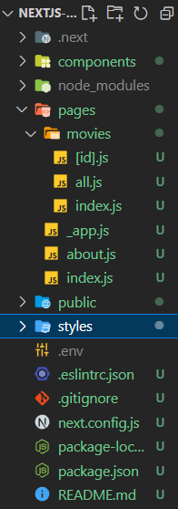

# Next JS Practice

[toc]

### Patterns

- layout 패턴

  - app component를 커스텀할 때 사용

  - 보통 _app.js파일이 엄청 커지는 걸 원하지 않음 -> Layout.js 만들어서 사용

    ```js
    // Layout.js
    
    import NavBar from "./NavBar";
    
    // children, react.js가 제공하는 prop
    // 컴포넌트 안에 컴포넌트를 넣고 싶을 떄 사용
    export default function Layout({ children }) {
      return (
        <>
          <NavBar />
          <div>{children}</div>
        </>
      );
    }
    ```

    ```js
    // _app.js
    
    import Layout from "../components/Layout";
    
    export default function App({ Component, pageProps }) {
      return (
        <Layout>
          <Component {...pageProps} />
        </Layout>
      );
    }
    ```

    

- Head 설정

  - `import Head from "next/head";`

  - 각각의 페이지에 직접 작성 혹은 컴포넌트로 보내줌

    ```js
    // 컴포넌트로 만들어서 props해주는 경우
    
    // index.js
    
    import Seo from "../components/Seo";
    
    export default function Home() {
      return (
        <div>
          <Seo title="Home" />
          <h1 className="active">Hello </h1>
        </div>
      );
    }
    
    // Seo.js
    
    import Head from "next/head";
    
    export default function Seo({ title }) {
      return (
        <Head>
          <title>{title} | Next Movies</title>
        </Head>
      );
    }
    ```

    

---

### Fetching Data

- [source code](https://github.com/nomadcoders/nextjs-fundamentals/commit/c27afcdae77839ad52b9ab0f96fc6778c3374f54#diff-d0f80c8bfc7dde255ab6eccc4a05f91c65d3bd18a7519b61c85591df0728e2af)

  ```js
  // index.js
  
  import { useEffect, useState } from "react";
  import Seo from "../components/Seo";
  
  const API_KEY = "10923b261ba94d897ac6b81148314a3f";
  
  export default function Home() {
    const [movies, setMovies] = useState();
    useEffect(() => {
      // (async () => {
      //   const response = await fetch(
      //     `https://api.themoviedb.org/3/movie/popular?api_key=${API_KEY}`
      //   );
      //   const json = await response.json()
      // })()
  
      (async () => {
        const { results } = await (
          await fetch(
            `https://api.themoviedb.org/3/movie/popular?api_key=${API_KEY}`
          )
        ).json();
        setMovies(results);
      })();
    }, []);
    return (
      <div>
        <Seo title="Home" />
        <h1 className="active">Hello</h1>
        {!movies && <h4>Loading...</h4>}
        {movies?.map((movie) => (
          <div key={movie.id}>
            <h4>{movie.original_title}</h4>
          </div>
        ))}
      </div>
    );
  }
  ```


---

### Redirect and Rewrite

- Redirect

  - next.config.js에서 설정

    1. source를 찾는다
    2. destination설정
    3. redirection이 영구적인가(permanent or not) 지정

    ```js
    // next.config.js
    
    /** @type {import('next').NextConfig} */
    const nextConfig = {
      reactStrictMode: true,
      swcMinify: true,
      async redirects() {
        return [
          {
            // 주소를 동적으로도 조작가능
            // source: "/contact/:path",
            // catch도 가능, 뒤에 작성한 모든 것을 가져옴
            // source: "/contact/:path*",
            source: "/contact",
            destination: "/form",
            permanent: false,
          },
        ];
      },
    };
    
    module.exports = nextConfig;
    ```

- Rewrites

  - redirect를 시키지만, URL은 변하지 않음

    ```js
    // next.config.js
    
    /** @type {import('next').NextConfig} */
    
    const API_KEY = "10923b261ba94d897ac6b81148314a3f";
    
    const nextConfig = {
      // reactStrictMode: true,
      swcMinify: true,
      async redirects() {
        return [
          {
            // 주소를 동적으로도 조작가능
            // source: "/contact/:path",
            // catch도 가능, 뒤에 작성한 모든 것을 가져옴
            // source: "/contact/:path*",
            source: "/contact",
            destination: "/form",
            permanent: false,
          },
        ];
      },
      // URL이 바뀌어도 유저가 인식하지 못하기 때문에 API키를 숨길 수 있음
      async rewrites() {
        return [
          {
            source: "/api/movies",
            destination: `https://api.themoviedb.org/3/movie/popular?api_key=${API_KEY}`,
          },
        ];
      },
    };
    
    module.exports = nextConfig;
    ```

    ```js
    import { useEffect, useState } from "react";
    import Seo from "../components/Seo";
    
    export default function Home() {
      const [movies, setMovies] = useState();
      useEffect(() => {
        (async () => {
          const { results } = await (await fetch(`/api/movies`)).json();
          setMovies(results);
        })();
      }, []);
      return (
        <div className="container">
          <Seo title="Home" />
          {!movies && <h4>Loading...</h4>}
          {movies?.map((movie) => (
            <div className="movie" key={movie.id}>
              
              <h4>{movie.original_title}</h4>
            </div>
          ))}
          <style jsx>{`
            .container {
              display: grid;
              grid-template-columns: 1fr 1fr;
              padding: 20px;
              gap: 20px;
            }
            .movie img {
              max-width: 100%;
              border-radius: 12px;
              transition: transform 0.2s ease-in-out;
              box-shadow: rgba(0, 0, 0, 0.1) 0px 4px 12px;
            }
            .movie:hover img {
              transform: scale(1.05) translateY(-10px);
            }
            .movie h4 {
              font-size: 18px;
              text-align: center;
            }
          `}</style>
        </div>
      );
    }
    
    ```

- API key를 숨기기 위해 env 사용


---

### Server Side Rendering

- Next JS는 SSR만 할건지 옵션을 줌

  - 초기값은 pre-render
  - 렌더링을 하고 보여주면 높은 검색엔진 점수 받을 가능성
  - 백엔드에서 실행되기 때문에  api키도 숨길 수 있음

  ```js
  // index.js
  
  import { useEffect, useState } from "react";
  import Seo from "../components/Seo";
  
  // getServerSideProps에서 만든 값을 prop해주기
  export default function Home({ results }) {
    return (
      <div className="container">
        <Seo title="Home" />
        {results?.map((movie) => (
          <div className="movie" key={movie.id}>
            
            <h4>{movie.original_title}</h4>
          </div>
        ))}
        <style jsx>{`
          .container {
            display: grid;
            grid-template-columns: 1fr 1fr;
            padding: 20px;
            gap: 20px;
          }
          .movie img {
            max-width: 100%;
            border-radius: 12px;
            transition: transform 0.2s ease-in-out;
            box-shadow: rgba(0, 0, 0, 0.1) 0px 4px 12px;
          }
          .movie:hover img {
            transform: scale(1.05) translateY(-10px);
          }
          .movie h4 {
            font-size: 18px;
            text-align: center;
          }
        `}</style>
      </div>
    );
  }
  
  // pre-render하던 것을 렌더링한 후 보여주기
  // 이름은 항상 getServerSideProps
  // api 키를 숨길 수도 있음
  // export하는 이유는 _app.js에서 ...pageProps으로 전달되기 때문에
  export async function getServerSideProps() {
    const { results } = await (
      await fetch(`http://localhost:3000//api/movies`)
    ).json();
    return {
      props: {
        results,
      },
    };
  }
  ```

  

---

### Dynamic Routes

- /가 중첩된 URL (Nested Router)

  - 예시 /movies/all

    - pages 폴더에 movies 디렉토리를 만들고 all.js 생성
    - /movies페이지만 따로도 가지고 싶다면
    - movies 폴더에 index.js 생성

    

- 변수를 url로 받고 싶다면

  - 예시 /movies/:id

    - movies 폴더에 `[{변수명}].js` 생성

      ```js
      // pages/movies/[id].js
      
      import { useRouter } from "next/router";
      
      export default function Detail() {
        const router = useRouter();
        console.log(router);
        return `movies/${router.query.id}`;
      }
      ```



