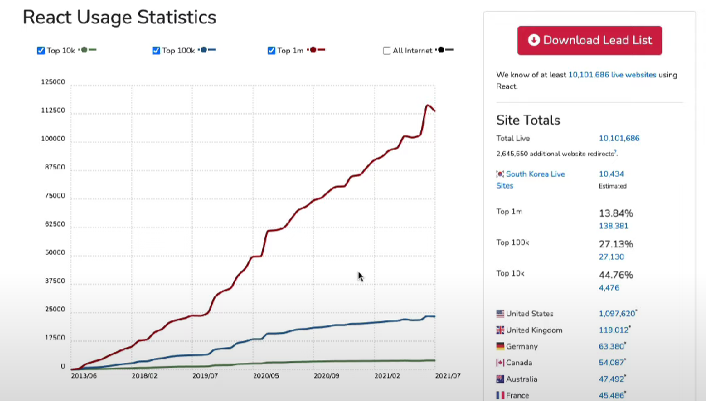

# REACTJS


[toc]

---

### React 소개



- 에어비앤비, 인스타그램, 넷플릭스, 페이스북 등 대기업들이 사용 중
- 페이스북이 만든 React JS, 개선을 위해 투자 중, 개발자 고용하며 투자 중
- 큰 커뮤니티, js와 매우 가깝기 때문에 대부분의 작업은 그냥 js작업이라 봐도 됨
  - React native로 모바일 앱도 작업 가능
  - VR 작업도 가능


---

### React JS 작동 방식

- Vanila JS
  - HTML에 요소들을 먼저 만들고
  - JS로 가져와서
  - HTML을 수정하는 형식
- React JS
  - React JS에서는 JS에서 모두 시작
  - 그 다음에 HTML이 되는 형식


---

### Events in React

- Vanila JS

  - HTML 에서 만든 요소를 변수에 담아준 뒤
  - 함수를 정의하고
  - addEventListener를 통해 함수를 호출하는 방식

  ```html
  <html lang="en">
    <body>
      <span>Total clicks : 0</span>
      <button id="btn">Click me</button>
    </body>
    <script>
      let counter = 0
      const button = document.getElementById("btn")
      const span = document.querySelector('span')
      function handleClick() {
        // console.log('i have been clicked')
        counter += 1
        span.innerText = `Total clicks: ${counter}`
      }
      button.addEventListener("click", handleClick)
  
  
    </script>
  </html>
  ```

  

- React JS

  - JS로 변수를 선언 한 뒤에
  - 요소를 정의한 뒤에
  - 함수를 property 에 작성할 수 있는 방식

  ```html
  <html lang="en">
    <body>
      <div id="root"></div>
    </body>
    <script crossorigin src="https://unpkg.com/react@17/umd/react.production.min.js"></script>
    <script crossorigin src="https://unpkg.com/react-dom@17/umd/react-dom.production.min.js"></script>
    
    <script>
      // root이라는 엘레멘트를 잡고
      const root = document.getElementById('root')
  
      // span을 만들고 id/스타일(property) 부여하고 content
      // react에서는 property에 id, style 등을 줄 수 있으면서 동시에 eventListener를 부여할 수 있음
      const h3 = React.createElement(
        'h3', 
        {
          id: 'title',
          onMouseEnter: () => {
          console.log('mouse enter')
          }
        },
        'Hello i\'m a span'
      )
  
      // 변수 명은 html요소 이름과 동일할 필요 없음, 괄호 안엔 유효한 html 요소가 들어가야 함
      // react에서는 property에 id, style 등을 줄 수 있으면서 동시에 eventListener를 부여할 수 있음
      // 
      const btn = React.createElement('button', {
        onClick: () => console.log('i\'m clicked'),
        style: {
          backgroundColor: 'tomato',
        }
      }, 'Click me')
  
      // 버튼과 div를 동시에 렌더링하고 싶을 경우
      const container = React.createElement('div', null, [h3, btn])
  
      // render는 사용자에게 보여준다 렌더링한다는 뜻
      ReactDOM.render(container, root)
    </script>
  </html>
  ```

  

---

### Recap

- 순서
  1. React JS / React DOM 을 import
     - React JS는 interactive한 힘을 가진 것
     - React DOM은 React element들을 가져다가 HTML로 바꿔야 했기 때문에 import
  2. react element를 담을 빈 div 생성 후 render 실행


---

### JSX

- JSX
  - JS를 확장한 문법
  - HTML이랑 비슷한 형식이어서, JSX로 React요소를 만드는게 편함
  - JSX를 사용하기 위해서는 Babel 필요

- 컴포넌트화
  - 컴포넌트의 첫 글자는 무조건적으로 대문자
  - 그렇지 않으면 HTML 태그로 인식

