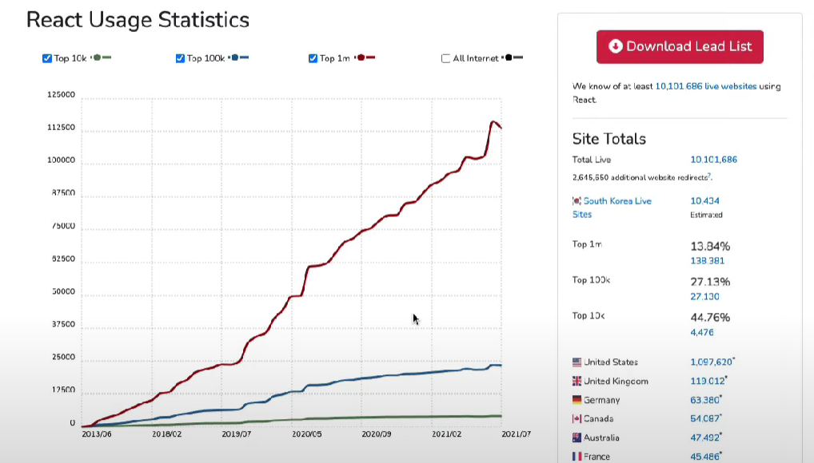

# REACT JS


[toc]

---

### React 소개



- 에어비앤비, 인스타그램, 넷플릭스, 페이스북 등 대기업들이 사용 중
- 페이스북이 만든 React JS, 개선을 위해 투자 중, 개발자 고용하며 투자 중
- 큰 커뮤니티, js와 매우 가깝기 때문에 대부분의 작업은 그냥 js작업이라 봐도 됨
  - React native로 모바일 앱도 작업 가능
  - VR 작업도 가능


---

### React JS 작동 방식

- Vanila JS
  - HTML에 요소들을 먼저 만들고
  - JS로 가져와서
  - HTML을 수정하는 형식
- React JS
  - React JS에서는 JS에서 모두 시작
  - 그 다음에 HTML이 되는 형식


---

### Events in React

- Vanila JS

  - HTML 에서 만든 요소를 변수에 담아준 뒤
  - 함수를 정의하고
  - addEventListener를 통해 함수를 호출하는 방식

  ```js
  <html lang="en">
    <body>
      <span>Total clicks : 0</span>
      <button id="btn">Click me</button>
    </body>
    <script>
      let counter = 0
      const button = document.getElementById("btn")
      const span = document.querySelector('span')
      function handleClick() {
        // console.log('i have been clicked')
        counter += 1
        span.innerText = `Total clicks: ${counter}`
      }
      button.addEventListener("click", handleClick)
  
  
    </script>
  </html>
  ```

  

- React JS

  - JS로 변수를 선언 한 뒤에
  - 요소를 정의한 뒤에
  - 함수를 property 에 작성할 수 있는 방식

  ```js
  <html lang="en">
    <body>
      <div id="root"></div>
    </body>
    <script crossorigin src="https://unpkg.com/react@17/umd/react.production.min.js"></script>
    <script crossorigin src="https://unpkg.com/react-dom@17/umd/react-dom.production.min.js"></script>
    
    <script>
      // root이라는 엘레멘트를 잡고
      const root = document.getElementById('root')
  
      // span을 만들고 id/스타일(property) 부여하고 content
      // react에서는 property에 id, style 등을 줄 수 있으면서 동시에 eventListener를 부여할 수 있음
      const h3 = React.createElement(
        'h3', 
        {
          id: 'title',
          onMouseEnter: () => {
          console.log('mouse enter')
          }
        },
        'Hello i\'m a span'
      )
  
      // 변수 명은 html요소 이름과 동일할 필요 없음, 괄호 안엔 유효한 html 요소가 들어가야 함
      // react에서는 property에 id, style 등을 줄 수 있으면서 동시에 eventListener를 부여할 수 있음
      // 
      const btn = React.createElement('button', {
        onClick: () => console.log('i\'m clicked'),
        style: {
          backgroundColor: 'tomato',
        }
      }, 'Click me')
  
      // 버튼과 div를 동시에 렌더링하고 싶을 경우
      const container = React.createElement('div', null, [h3, btn])
  
      // render는 사용자에게 보여준다 렌더링한다는 뜻
      ReactDOM.render(container, root)
    </script>
  </html>
  ```

  

---

### Recap

- 순서
  1. React JS / React DOM 을 import
     - React JS는 interactive한 힘을 가진 것
     - React DOM은 React element들을 가져다가 HTML로 바꿔야 했기 때문에 import
  2. react element를 담을 빈 div 생성 후 render 실행


---

### JSX

- JSX
  - JS를 확장한 문법
  - HTML이랑 비슷한 형식이어서, JSX로 React요소를 만드는게 편함
  - JSX를 사용하기 위해서는 Babel 필요

- 컴포넌트화
  - 컴포넌트의 첫 글자는 무조건적으로 대문자
  - 그렇지 않으면 HTML 태그로 인식


---

### Understanding State

- state
  - 기본적으로 데이터가 저장되는 곳
  - vanila의 경우 변수에 할당해서 사용하는게 데이터 저장법
  - 바닐라의 경우 데이터가 바뀔 때 해당 태그가 전부 바뀌지만,
  - 리액트의 경우 바뀌는 부분만 바뀜
    - 효율성 증가!

- eventListener 사용시 rerender를 지속적으로 하지 않는 방법
  - `React.useState()`사용
  
    - 배열을 주는데
    - 첫번째 값은 data이고
    - 두번째는 data를 변경하고 리렌더링해줄 함수
  
    ```js
    <html lang="en">
      <body>
        <div id="root"></div>
      </body>
      <!-- React 세팅 -->
      <script
        crossorigin
        src="https://unpkg.com/react@17/umd/react.production.min.js"
      ></script>
      <script
        crossorigin
        src="https://unpkg.com/react-dom@17/umd/react-dom.production.min.js"
      ></script>
      <!-- 바벨 세팅 -->
      <script src="https://unpkg.com/@babel/standalone/babel.min.js"></script>
    
      <!-- 바벨을 인식하기 위해 type 추가 -->
      <script type="text/babel">
        const root = document.getElementById("root");
    
        function App() {
          // React.useState() 사용시 배열을 주는데 첫 요소는 data, 두번째 요소는 data값을 바꿀 때 사용할 값
          // const data = React.useState(0);
          // console.log(data);
          // const counter = data[0];
          // const modifier = data[1];
          const [counter, modifier] = React.useState(0);
          const onClick = () => {
            // modifier는 값을 바꿔주고 리렌더링
            modifier(counter + 1);
          };
          return (
            <div>
              <h3>Total clicks: {counter}</h3>
              <button onClick={onClick}>Click me</button>
            </div>
          );
        }
    
        ReactDOM.render(<App />, root);
      </script>
    </html>
    
    ```
  
    

---

### State Functions

- modifier를 통해 값을 할당할 때에는

  - modifier에 값을 직접 대입

- modifier를 사용해 이전 값을 토대로 값을 변경할 경우에는 함수 삽입

  ```js
  function App() {
        const [counter, setCounter] = React.useState(0);
        const onClick = () => {
          // modifier(counter + 1);
          // counter를 사용하면 다른곳에서 조작 가능
          // 함수를 넣어줌으로써 current값을 입력받고 조작하는 형식으로
          // 보다 안전한 방법
          // 함수는 항상 현재의 state를 받아오기로 되어있음
          setCounter((currnet) => current + 1);
        };
        return (
          <div>
            <h3>Total clicks: {counter}</h3>
            <button onClick={onClick}>Click me</button>
          </div>
        );
      }
  ```

  

---

### Inputs and State

- input value 값에 state를 바인딩 할 수 있고
- 삼항 연산자 등을 통해 if문을 건들 수 도 있음
- 또한 disabled와 같은 속성도 조정할 수 있음

```js
 function MinutesToHours() {
      // useState()의 괄호 안에는 data의 default 값을 설정
      const [amount, setAmount] = React.useState();
      const [inverted, setInverted] = React.useState(false);
      function onChange(event) {
        // console.log(event.target.value);
        // minutes를 출력하기 위해 저장해주는 단계
        setAmount(event.target.value);
      }
      function reset() {
        setAmount(0);
      }
      // const reset = () => setMinutes(event.target.value)
      function onInvert() {
        reset();
        setInverted((current) => !current);
      }
      // const onInvert = () => setInverted((current) => !current);
      return (
        // 리엑트에서는 for를 사용할 수 없음. js가 선점했기 때문에 htmlFOR를 사용
        // 동일하게 class도 className을 사용
        <div>
          <div>
            <label htmlFor="minutes">Minutes</label>
            <input
              value={inverted ? amount * 60 : amount}
              id="minutes"
              placeholder="Minutes"
              type="number"
              // onChange 이벤트 핸들러 : 변화하는 값을 캐치
              // 캐치해서 onChange 함수 실행
              onChange={onChange}
              disabled={inverted}
            />
            <h4>You want convert {amount}</h4>
          </div>
          <div>
            <label htmlFor="hours">Hours</label>
            <input
              // Math.round => 반올림해주는 메서드
              value={inverted ? amount : Math.round(amount / 60)}
              id="hours"
              placeholder="Hours"
              type="number"
              disabled={!inverted}
              onChange={onChange}
            />
          </div>
          <button onClick={reset}>reset</button>
          <button onClick={onInvert}>
            {inverted ? "Turn back" : "Invert"}
          </button>
        </div>
      );
    }
```


---

### Props

- 버튼이 많을 때,

  - 로그인, 저장, 취소 등등

- 렌더링하는 함수에서 컴포넌트들로 데이터를 props할 때

  - 컴포넌트 함수의 인자 값이 props의 값
  - 하시만 인자값 하나를 받아 그를 탐색하는 형식이 아니라
  - 객체로 묶어 직관적으로 많이 사용함

  ```js
      // 함수가 받는 인자로 props 가능
  
      // shorcut (이 방법으로 자주 쓰임)
      // 받은 데이터 명칭을 그대로 사용하면
      // {banana}를 인자값으로 명시하면
      // props.banana는 banana로 쓸 수 있음
      // 두 개를 동시에 받을 수도 있음
      // function Btn(props) {
      function Btn({ banana, big }) {
        // console.log(props);
        console.log(banana);
        return (
          <button
            style={{
              backgroundColor: "tomato",
              color: "white",
              padding: "10px 20px",
              borderRadius: 10,
              border: 0,
              fontSize: big ? 20 : 16,
            }}
          >
            {banana}
          </button>
        );
      }
  
      // function ConfirmBtn() {
      //   return <button>Confirm</button>;
      // }
  
      // 문제 상황
      // 모든 버튼에 동일한 스타일을 주고 싶음
      // 다시 쓰기 귀찮음
      // 컴포넌트 함수에 인자로 넣어줄 값을 줄 수 있음
      // 밑 경우에은 Btn({banana : 'Save Changes' , x = 'x'})를 실행하는 형식
  
      function App() {
        return (
          <div>
            <Btn banana="Save Changes" big={true} />
            <Btn banana="Continue" bit={false} />
          </div>
        );
      }
  ```

  

- `컴포넌트에 단 onClick은 prop!!`
  - 컴포넌트 속 실제 html요소의 onClick은 이벤트 리스너
  - 컴포넌트에 이벤트 리스너를 단 후
  - 실제 html에서 조작해주어야 함


- 중요!

  - 컴포넌트를 통해 state가 변경될 때 모든 component 요소들이 새로 고침 됨

  - state의 두번째 인자 함수가 실행되면 자동적으로 rerender되기 때문

  - 최적화 방법.

    - React Memo

      - 같은 함수가 사용되더라도,
      - props가 바뀌지 않으면 리렌더링하지 않는 방법

      ```js
          function Btn({ text, changeValue }) {
            // console.log(props);
            console.log(text, "was rendered");
            return (
              <button
                onClick={changeValue}
                style={{
                  backgroundColor: "tomato",
                  color: "white",
                  padding: "10px 20px",
                  borderRadius: 10,
                  border: 0,
                  fontSize: 16,
                }}
              >
                {text}
              </button>
            );
          }
      
          // React memo
          // Btn이 props로 인해 바뀔 때 바뀐 부분만 다시 렌더링
          const MemorizedBtn = React.memo(Btn);
          
          function App() {
            const [value, setValue] = React.useState("Save Changes");
            const changeValue = () => setValue("RevertChanges");
            // 주의!
            // 실제 html요소에 onClick은 이벤트 리스너,
            // 컴포넌트에 단 onClick은 prop
            // 함수도 props 가능
            return (
              <div>
                <MemorizedBtn text={value} changeValue={changeValue} />
                <MemorizedBtn text="Continue" />
              </div>
            );
          }
      ```


- props가 잘못되었을 때 인지하는 방법

  - Prop Types 설치
    - React 팀에서 개발한 패키지
    - prop 타입 설정가능

  ```js
    <!-- Prop Types 세팅 -->
    <script src="https://unpkg.com/prop-types@15.7.2/prop-types.js"></script>
  
  	// prop types 설정
      Btn.propTypes = {
        // 이름 : PropTypes.타입
        // 이름 : PropTypes.타입.isRequired => 반드시 필요
        text: PropTypes.string,
        fontSize: PropTypes.number,
      };
  ```

  


- props 시 인자값 default 설정

  - 받아오는 인자값에 설정

  ```js
      function Btn({ text, fontSize = 60 }) {
        // 주의
        // 받아오는 인자와 스타일 이름이 같다면 객체 형식이 아니라 이름 하나로 대체
        // 그렇지 않으면 작동하지 않음
        // 예) 이 경우의 fontSize
        return (
          <button
            style={{
              backgroundColor: "tomato",
              color: "white",
              padding: "10px 20px",
              borderRadius: 10,
              border: 0,
              fontSize,
            }}
          >
            {text}
          </button>
        );
      }
  ```

  

---

### Create React App

- 앱 생성

  ```bash
  // 앱 생성
  npx create-react-app {project-name}
  ```

- package.json

  - scripts 객체에서
    - 실행할 수 있는 명령어 목록

- npm run start

  - 로컬 서버 실행

- src/

  - index.js
    - App.js를 렌더링하도록 설정
    - public/index.html에 들어가도록 설정

- public/

  - index.html
    - 실제로 렌덜이 되는 페이지

- propTypes를 설치하기 위한 코드

  ```bash
  npm i prop-types
  ```

  - propTypes를 쓰고 싶은 컴포넌트에 코드 추가

    ```js
    // bash에서 npm i prop-types
    // PropTypes import
    import PropTypes from "prop-types";
    
    function Btn({ text }) {
      return <button>{text}</button>;
    }
    
    Btn.PropTypes = {
      text: PropTypes.string,
    };
    
    // Btn을 export하는 코드
    export default Btn;
    ```

- CSS 사용하기

  - .css 생성

    - index.js로 가서 import하기

  - 각 컴포넌트에 직접 작성하기

    ```js
    import PropTypes from "prop-types";
    
    function Btn({ text }) {
      return (
        <button
          style={{
            backgroundColor: "tomato",
            color: "white",
          }}
        >
          {text}
        </button>
      );
    }
    
    Btn.propTypes = {
      text: PropTypes.string.isRequired,
    };
    
    export default Btn;
    ```

  - CSS modules

    - 폴더에 {컴포넌트}.module.css 생성 후 스타일 작성

    - 각 컴포넌트에 import

    - import 규칙

      - `import styles from "./{컴포넌트}.module.css"`

      - className , id 등 각 파트에 맞게 작성

        ```js
        import PropTypes from "prop-types";
        import styles from "./Button.module.css";
        
        function Btn({ text }) {
          return <button className={styles.btn}>{text}</button>;
        }
        
        Btn.propTypes = {
          text: PropTypes.string.isRequired,
        };
        
        export default Btn;
        ```

    - 장점

      - 스타일도 모듈이 될 수 있고 다른 컴포넌트들에 같은 스타일을 적용할 수 있음


---

### Effect

- 가끔은 렌더될때마다 실행되어도 괜찮은 코드가 있고, 처음 렌더될 때만 실행되어야 하는 코드도 있다.

- state를 변경할 때마다 코드가 모두 다시 실행되면 비효율적이다.

- `useEffect를 사용해 처음 한번만 실행되도록 설정할 수 있음!!!`

  - useEffect

    ```
    import { useState, useEffect } from "react";
    ```

  - 실행법

    - 함수 설정

    - `useEffect({함수이름}, deps)`

      ```js
      // 효율성을 위해 useEffect import
      import { useState, useEffect } from "react";
      
      function App() {
        const [counter, setValue] = useState(0);
        const onClick = () => setValue((prev) => prev + 1);
        console.log("i run all the time");
      
        // Effect
        // 첫 렌더링때만 콘솔로그를 찍고 싶다할 떄 있음 , 다음 state가 변경되어도 콘솔하고 싶지 않을 수도
        // 코드가 처음에만 실행되도록 도와줌
        const iRunOnlyOnce = () => {
          console.log("call the api");
        };
        useEffect(iRunOnlyOnce, []);
      
        return (
          <div>
            <h1>{counter}</h1>
            <button onClick={onClick}>click me</button>
          </div>
        );
      }
      
      export default App;
      ```

    - deps는 Effect가 지켜볼 값

      ```js
      import { useState, useEffect } from "react";
      
      function App() {
        const [counter, setValue] = useState(0);
        const onClick = () => setValue((prev) => prev + 1);
        console.log("i run all the time");
      
        // Effect
        // 첫 렌더링때만 콘솔로그를 찍고 싶다할 떄 있음 , 다음 state가 변경되어도 콘솔하고 싶지 않을 수도
        // 코드가 처음에만 실행되도록 도와줌
        const iRunOnlyOnce = () => {
          console.log("call the api");
        };
        // 두번째 인자값이 비어있으면 볼게 없으니 한번만 실행
        useEffect(iRunOnlyOnce, []);
      
        // 이대로라면 click을 실행해도 console.log가 실행됨
        const [keyword, setKeyword] = useState("");
        const onChange = (event) => setKeyword(event.target.value);
        // console.log("search for", keyword);
      
        // keyword가 바뀌는 것을 두번째 인자(deps || dependency)에 입력하면 인식 && 두 개 입력하면 둘 다 볼 수 있음
        // keyword가 바뀌면 console.log 실행
        useEffect(() => {
          console.log("search for", keyword);
        }, [keyword]);
      
        return (
          <div>
            <input
              value={keyword}
              onChange={onChange}
              type="text"
              placeholder="Search here..."
            />
            <h1>{counter}</h1>
            <button onClick={onClick}>click me</button>
          </div>
        );
      }
      
      export default App;
      ```

- Cleanup

  - 코드가 사라질 때(destroy될 때) 실행할 수 있게 도와줌

  - useEffect에서 함수를 리턴하는 형식

    ```js
    import { useState, useEffect } from "react";
    
    function Hello() {
      // useEffect(() => {
      //   console.log("created :)");
      // cleanup function
      // destroy 될 때 실행될 함수
      // useEffect에서 함수를 리턴하는 형식
      //   return () => console.log("destroyed :(");
      // }, []);
    
      function destroyFn() {
        console.log("destroyed");
      }
      function effectFn() {
        console.log("created");
        return destroyFn;
      }
      useEffect(effectFn, []);
    
      return <h1>Hello</h1>;
    }
    
    function App() {
      const [showing, setShowing] = useState(false);
      const onClick = () => {
        setShowing((prev) => !prev);
      };
      return (
        <div>
          {showing ? <Hello /> : null}
          <button onClick={onClick}>{showing ? "Hide" : "Show"}</button>
        </div>
      );
    }
    
    export default App;
    ```

    

---

### to do list

```js
import { useState } from "react";

function App() {
  const [toDo, setToDo] = useState("");
  const [toDos, setToDos] = useState([]);
  const onChange = (event) => {
    setToDo(event.target.value);
  };
  const onSubmit = (event) => {
    event.preventDefault();
    // console.log(toDo);
    if (toDo === "") {
      return;
    }
    setToDos((currentArray) => [toDo, ...currentArray]);
    // 이거는 왜 안되지??
    // setToDos((currentArray) => currentArray.push(toDo));
    setToDo("");
  };
  return (
    <div>
      <h1>My To Dos : {toDos.length}</h1>
      <form action="" onSubmit={onSubmit}>
        <input
          onChange={onChange}
          value={toDo}
          type="text"
          placeholder="Write ur to do..."
        ></input>
        <button>Add To Do</button>
      </form>
      <hr />
      {/* map은 자바스크립트 함수
      리스트를 가지고 있을 때 각각의 값들을 바꿔주는 것
      인자로 수정 함수를 받음
      모든 값들을 한번씩 받기 때문에 모두 변형 가능
      */}
      {toDos.map((toDo, index) => (
        <li key={index}>{toDo}</li>
      ))}
    </div>
  );
}

export default App;
```


---

### movie app

```js
import { useEffect, useState } from "react";

function App() {
  const [loading, setLoading] = useState(true);
  const [movies, setMovies] = useState([]);
  const getMovies = async () => {
    const response = await fetch(
      `https://yts.mx/api/v2/list_movies.json?minimum_rating=8&sort_by=year`
    );
    const json = await response.json();
    setMovies(json.data.movies);
    setLoading(false);
  };

  useEffect(() => {
    // fetch(
    //   `https://yts.mx/api/v2/list_movies.json?minimum_rating=9&sort_by=yare`
    // )
    // () => {} 는 리턴 값을 따로 설정해주어야하고, () => 는 리턴 값을 따로 설정하지 않아도 됨.
    // .then((res) => res.json())
    // .then((json) => {
    //   setMovies(json.data.movies);
    //   setLoading(false);
    // });

    // 최근에는 .then을 사용하지 않는 추세, 대신 async-await사용, 기능은 동일하나 더 보기 좋음
    getMovies();
  }, []);

  console.log(movies);

  return (
    <div>
      {loading ? (
        <h1>Loading...</h1>
      ) : (
        <div>
          {/* map을 쓸 때는 key를 줘야한다는 점을 잊지 말자! */}
          {movies.map((movie) => (
            <div key={movie.id}>
              </img>
              <h2>{movie.title}</h2>
              <p>{movie.summary}</p>
              <ul>
                {/* for문 두번 돌리기 */}
                {movie.genres.map((genre) => (
                  <li key={genre}> {genre} </li>
                ))}
              </ul>
            </div>
          ))}
        </div>
      )}
    </div>
  );
}

export default App;
```


---

### Movie app component

```js
// App.js

import { useEffect, useState } from "react";
import Movie from "./Movie";

function App() {
  const [loading, setLoading] = useState(true);
  const [movies, setMovies] = useState([]);
  const getMovies = async () => {
    const response = await fetch(
      `https://yts.mx/api/v2/list_movies.json?minimum_rating=8&sort_by=year`
    );
    const json = await response.json();
    setMovies(json.data.movies);
    setLoading(false);
  };

  useEffect(() => {
    getMovies();
  }, []);

  console.log(movies);

  return (
    <div>
      {loading ? (
        <h1>Loading...</h1>
      ) : (
        <div>
          {/* map을 쓸 때는 key를 줘야한다는 점을 잊지 말자! */}
          {movies.map((movie) => (
            <Movie
              // key는 프롭되지 않음
              key={movie.id}
              coverImg={movie.medium_cover_image}
              title={movie.title}
              summary={movie.summary}
              genres={movie.genres}
            />
          ))}
        </div>
      )}
    </div>
  );
}

export default App;
```

```js
import PropTypes from "prop-types";

function Movie({ coverImg, title, summary, genres }) {
  return (
    <div>
      </img>
      <h2>{title}</h2>
      <p>{summary}</p>
      <ul>
        {/* for문 두번 돌리기 */}
        {genres.map((genre) => (
          <li key={genre}> {genre} </li>
        ))}
      </ul>
    </div>
  );
}

Movie.propTypes = {
  coverImg: PropTypes.string.isRequired,
  title: PropTypes.string.isRequired,
  summary: PropTypes.string.isRequired,
  genres: PropTypes.arrayOf(PropTypes.string).isRequired,
};

export default Movie;
```


---

### React Router

- install

  ```bash
  npm install react-router-dom@5.3.0
  ```

- router 기본

  ```js
  // src/App.js
  
  import Home from "./routes/Home";
  import Detail from "./routes/Detail";
  // 임포트 하고 사용 , Link는 새로고침 없이 이동시켜줌
  import { BrowserRouter as Router, Switch, Route } from "react-router-dom";
  
  function App() {
    return (
      // 형식
      <Router>
        {/* 라우터 하나씩 렌더링하기 위해 Switch 사용 */}
        <Switch>
          <Route path="/movie">
            <Detail />
          </Route>
          <Route path="/">
            <Home />
          </Route>
        </Switch>
      </Router>
    );
  }
  
  export default App;
  ```

  ```js
  // src/routes/Home.js
  
  import { useEffect, useState } from "react";
  import Movie from "../components/Movie";
  
  function Home() {
    const [loading, setLoading] = useState(true);
    const [movies, setMovies] = useState([]);
    const getMovies = async () => {
      const response = await fetch(
        `https://yts.mx/api/v2/list_movies.json?minimum_rating=8&sort_by=year`
      );
      const json = await response.json();
      setMovies(json.data.movies);
      setLoading(false);
    };
  
    useEffect(() => {
      getMovies();
    }, []);
  
    console.log(movies);
  
    return (
      <div>
        {loading ? (
          <h1>Loading...</h1>
        ) : (
          <div>
            {/* map을 쓸 때는 key를 줘야한다는 점을 잊지 말자! */}
            {movies.map((movie) => (
              <Movie
                // key는 프롭되지 않음
                key={movie.id}
                coverImg={movie.medium_cover_image}
                title={movie.title}
                summary={movie.summary}
                genres={movie.genres}
              />
            ))}
          </div>
        )}
      </div>
    );
  }
  
  export default Home;
  ```

  ```js
  // src/routes/Detail.js
  
  function Detail() {
    return <h1>Detail</h1>;
  }
  
  export default Detail;
  ```

  ```js
  // src/components/Movie.js
  
  import PropTypes from "prop-types";
  // a태그처럼 보내주지만, 새로고침하지 않음
  import { Link } from "react-router-dom";
  
  function Movie({ coverImg, title, summary, genres }) {
    return (
      <div>
        </img>
        <p>
          <Link to="/movie">{title}</Link>
        </p>
        <p>{summary}</p>
        <ul>
          {/* for문 두번 돌리기 */}
          {genres.map((genre) => (
            <li key={genre}> {genre} </li>
          ))}
        </ul>
      </div>
    );
  }
  
  Movie.propTypes = {
    coverImg: PropTypes.string.isRequired,
    title: PropTypes.string.isRequired,
    summary: PropTypes.string.isRequired,
    genres: PropTypes.arrayOf(PropTypes.string).isRequired,
  };
  
  export default Movie;
  ```

- 동적 라우터

  ```js
  // src/App.js
  
  import Home from "./routes/Home";
  import Detail from "./routes/Detail";
  // 임포트 하고 사용 , Link는 새로고침 없이 이동시켜줌
  import { BrowserRouter as Router, Switch, Route } from "react-router-dom";
  
  function App() {
    return (
      // 형식
      <Router>
        {/* 라우터 하나씩 렌더링하기 위해 Switch 사용 */}
        <Switch>
          <Route path="/movie/:id">
            <Detail />
          </Route>
          <Route path="/">
            <Home />
          </Route>
        </Switch>
      </Router>
    );
  }
  
  export default App;
  ```

  ```js
  // src/routes/Home.js
  
  import { useEffect, useState } from "react";
  import Movie from "../components/Movie";
  
  function Home() {
    const [loading, setLoading] = useState(true);
    const [movies, setMovies] = useState([]);
    const getMovies = async () => {
      const response = await fetch(
        `https://yts.mx/api/v2/list_movies.json?minimum_rating=8&sort_by=year`
      );
      const json = await response.json();
      setMovies(json.data.movies);
      setLoading(false);
    };
  
    useEffect(() => {
      getMovies();
    }, []);
  
    console.log(movies);
  
    return (
      <div>
        {loading ? (
          <h1>Loading...</h1>
        ) : (
          <div>
            {/* map을 쓸 때는 key를 줘야한다는 점을 잊지 말자! */}
            {movies.map((movie) => (
              <Movie
                // key는 프롭되지 않음
                key={movie.id}
                id={movie.id}
                coverImg={movie.medium_cover_image}
                title={movie.title}
                summary={movie.summary}
                genres={movie.genres}
              />
            ))}
          </div>
        )}
      </div>
    );
  }
  
  export default Home;
  ```

  ```js
  // src/routes/Detail.js
  
  // 라우터로 오는 id 잡아내기
  // 리액트에서 잡아주는 useParams
  import { useEffect } from "react";
  import { useParams } from "react-router-dom";
  
  function Detail() {
    // params에서 id 가져오기
    const { id } = useParams();
  
    // 요청을 보내고 json파일 처리
    const getMovie = async () => {
      const json = await (
        await fetch(`https://yts.mx/api/v2/movie_details.json?movie_id=${id}`)
      ).json();
      console.log(json);
    };
  
    // 처음 한번만 실행할 함수
    useEffect(() => {
      getMovie();
    }, []);
  
    // 렌더링할 부분
    return <h1>Detail</h1>;
  }
  
  export default Detail;
  ```

  ```js
  // src/components/Movie.js
  
  import PropTypes from "prop-types";
  // a태그처럼 보내주지만, 새로고침하지 않음
  import { Link } from "react-router-dom";
  
  function Movie({ id, coverImg, title, summary, genres }) {
    return (
      <div>
        </img>
        <p>
          <Link to={`/movie/${id}`}>{title}</Link>
        </p>
        <p>{summary}</p>
        <ul>
          {/* for문 두번 돌리기 */}
          {genres.map((genre) => (
            <li key={genre}> {genre} </li>
          ))}
        </ul>
      </div>
    );
  }
  
  Movie.propTypes = {
    id: PropTypes.number.isRequired,
    coverImg: PropTypes.string.isRequired,
    title: PropTypes.string.isRequired,
    summary: PropTypes.string.isRequired,
    genres: PropTypes.arrayOf(PropTypes.string).isRequired,
  };
  
  export default Movie;
  ```

  

---

### Publishing

- install

  ```bash
  // 깃헙에 업로드해주는 패키지
  
  npm i gh-pages
  ```

  ```bash
  // 최적화해주고 준비해주는 명령어
  
  npm run build
  ```

  ```json
  ...
    "scripts": {
      "start": "react-scripts start",
      "build": "react-scripts build",
      "test": "react-scripts test",
      "eject": "react-scripts eject",
      "deploy": "gh-pages -d build",
      "predeploy": "npm run build"
    },
  ...
    "browserslist": {
      "production": [
        ">0.2%",
        "not dead",
        "not op_mini all"
      ],
      "development": [
        "last 1 chrome version",
        "last 1 firefox version",
        "last 1 safari version"
      ]
    },
    "hompage": "https://{사용자닉네임}.gihub.io/{깃헙 레퍼지토리}"
  ```

  
