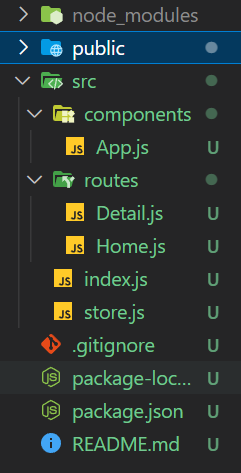

# Redux

[toc]

### Intro

- intro
  - 리덕스는 사실 리액트와 별개, 의존적인 라이브러리가 아님
  - 다른 프레임워크와도 사용가능(앵귤러, 뷰)
  - 하지만 리액트와 많이 쓰임


---

### Requirements

- 구글 크롬, 깃헙, node.js, vscode


---

### Pure Vanilla Redux

#### Vanilla Counter

```html
// index.html

<!DOCTYPE html>
<html lang="en">
  <head>
	...
    <title>Vanilla Redux</title>
  </head>
  <body>
    <button id="plus">plus</button>
    <span>0</span>
    <button id="minus">Minus</button>
  </body>
</html>
```

```js
// index.js

// 1. 요소 잡아주기
const plus = document.getElementById("plus");
const minus = document.getElementById("minus");
const number = document.querySelector("span");

// 3-1. 숫자 할당
let count = 0;

// 3-2. number값에 숫자 넣어주기
number.innerText = count;

// 3.3 number값 변경해줄 함수
const updateText = () => {
  number.innerText = count;
};

// 3. 이벤트리스너에 삽입될 함수 정의
const handlePlus = () => {
  count++;
  updateText();
};

const handleMinus = () => {
  count--;
  updateText();
};

// 2. 선택된 요소에 이벤트 리스너 추가
plus.addEventListener("click", handlePlus);
minus.addEventListener("click", handleMinus);
```


---

#### Store and Reducer

```bash
npm add redux
```

- store
  - 우리의 data(state)가 들어갈 곳

```js
// index.js

// npm add redux로 redux 설치
// 임포트
// store는 데이터가 들어갈 곳 이경우에는 counter
import { createStore } from "redux";

const plus = document.getElementById("plus");
const minus = document.getElementById("minus");
const number = document.querySelector("span");

// store에 삽입하기 위한 함수
// reducer는 data를 변화시키기 위한 함수
// 이 경우에는 count를 올리거나 줄이는 것
// const reducer = () => {
//   return "hello";
// };
const countModifier = () => {};

// store는 reducer라는 함수를 인자로 받아옴
// const store = createStore(reducer);
const countStore = createStore(countModifier);

// console.log(countStore);
// 4개의 함수가 적혀있음
// countStore.getState === 변화된 data값, reducer가 리턴하는 값
```


---

#### Actions

```js
// index.js

import { createStore } from "redux";

const plus = document.getElementById("plus");
const minus = document.getElementById("minus");
const number = document.querySelector("span");

// actions는 reducer에 들어가는 두번쨰 인자임
// reducer와 소통하기 위한 도구가 action
const countModifier = (count = 0, action) => {
  if (action.type === "Plus") {
    return count + 1;
  } else if (action.type === "Minus") {
    return count - 1;
  } else {
    return count;
  }
};

const countStore = createStore(countModifier);

// action을 호출하기 위한 메서드 dispatch
// action은 반드시 타입을 가지고 있어야 함 (액션이름이라고 보면 될듯..!)
countStore.dispatch({ type: "Plus" });
countStore.dispatch({ type: "Plus" });
countStore.dispatch({ type: "Plus" });
countStore.dispatch({ type: "Minus" });

console.log(countStore.getState());
```


---

#### Subscriptions

```js
// index.js

import { createStore } from "redux";

const plus = document.getElementById("plus");
const minus = document.getElementById("minus");
const number = document.querySelector("span");

// actions는 reducer에 들어가는 두번쨰 인자임
// reducer와 소통하기 위한 도구가 action
const countModifier = (count = 0, action) => {
  if (action.type === "Plus") {
    return count + 1;
  } else if (action.type === "Minus") {
    return count - 1;
  } else {
    return count;
  }
};

const countStore = createStore(countModifier);

// 이제 만들어진 store, reducer, action과 요소들을 연결해줄 예정, 버튼 누르면 증가 및 감소
// 방법 1
// plus.addEventListener("click", () => countStore.dspatch({ type: "Plus" }));
// minus.addEventListener("click", () => countStore.dspatch({ type: "Minus" }));

// 방법 2
const handlePlus = () => {
  countStore.dispatch({ type: "Plus" });
};

const handleMinus = () => {
  countStore.dispatch({ type: "Minus" });
};

plus.addEventListener("click", handlePlus);
minus.addEventListener("click", handleMinus);

// console.log(countStore);
// dispatch , subscribe , getState , repLaceReducer
// subscribe는 store에 있는 변화를 알려줌

// const onChange = () => {
//   console.log("there a change");
// };
// countStore.subscribe(onChange);

const onChange = () => {
  number.innerText = countStore.getState();
};
countStore.subscribe(onChange);
```

- 조금의 꿀팁들

```js
import { createStore } from "redux";

const plus = document.getElementById("plus");
const minus = document.getElementById("minus");
const number = document.querySelector("span");

// state를 볼 때 if문이 반복되면 보기 안좋음
// switch를 사용해 간략히 표현해보자!
const countModifier = (count = 0, action) => {
  switch (action.type) {
    case "Plus":
      return count + 1;
    case "Minus":
      return count - 1;
    default:
      return count;
  }
};

const countStore = createStore(countModifier);

// string 쓰면 오타 발생 가능성 증가 , 자바스크립트가 잡아주지도 않음...ㅠㅠ
// 변수에 담아서 사용해주자! 자바스크립트가 잡아준다

const PLUS = "Plus";
const MINUS = "Minus";

const handlePlus = () => {
  countStore.dispatch({ type: PLUS });
};

const handleMinus = () => {
  countStore.dispatch({ type: MINUS });
};

plus.addEventListener("click", handlePlus);
minus.addEventListener("click", handleMinus);

const onChange = () => {
  number.innerText = countStore.getState();
};
countStore.subscribe(onChange);
```


---

#### Vanila ToDo

- 기본 세팅

```html
// index.html

<!DOCTYPE html>
<html lang="en">
  <head>
	...
    <title>Vanilla Redux</title>
  </head>
  <body>
    <h1>To Dos</h1>
    <form action="">
      <input type="text" placeholder="Write to do" />
      <button>Add</button>
    </form>
    <ul></ul>
  </body>
</html>
```

```js
// index.js

import { createStore } from "redux";

const form = document.querySelector("form");
const input = document.querySelector("input");
const ul = document.querySelector("ul");

const createToDO = (toDo) => {
  const li = document.createElement("li");
  li.innerText = toDo;
  ul.appendChild(li);
};

const onSubmit = (e) => {
  e.preventDefault();
  const toDo = input.value;
  input.value = "";
  createToDO(toDo);
};

form.addEventListener("submit", onSubmit);
```

- 문제점
  - 데이터는 존재하지 않음
  - 화면에만 렌더링되지 이를 활용해 조작할 수 없음
  - 데이터를 계속 가지고 싶음
  - 데이터를 계속 가지고 있으려면
    - 배열을 만들어서 조작
    - 지우거나 로컬 스토리지에 할 때 계속 재렌더링되고 많은 함수들이 필요함
    - 편하게 할 방법을 찾자!

- 리덕스는 이를 편하게 해준다


---

#### Vanila ToDo -> Redux ToDo

```html
// index.html

그대로 이하 동문
```

```js
// index.js

import { createStore } from "redux";

const form = document.querySelector("form");
const input = document.querySelector("input");
const ul = document.querySelector("ul");

const ADD_TODO = "ADD_TODO";
const DELETE_TODO = "DELETE TODO";

const reducer = (state = [], action) => {
  // console.log(action);
  switch (action.type) {
    case ADD_TODO:
      return [];
    case DELETE_TODO:
      return [];
    default:
      return state;
  }
};

const store = createStore(reducer);

const onSubmit = (e) => {
  e.preventDefault();
  const toDo = input.value;
  input.value = "";
  // reducer랑 커뮤니케이션을 위해 두번째 객체값으로 text설정
  store.dispatch({ type: ADD_TODO, text: toDo });
};

form.addEventListener("submit", onSubmit);

// 기존의 바닐라 JS

// const createToDO = (toDo) => {
//   const li = document.createElement("li");
//   li.innerText = toDo;
//   ul.appendChild(li);
// };

// const onSubmit = (e) => {
//   e.preventDefault();
//   const toDo = input.value;
//   input.value = "";
//   createToDO(toDo);
// };

// form.addEventListener("submit", onSubmit);

// 중요!!
// 절대 mutate state 사용하지 말것!!!!!!!
```


---

#### State Mutation

- 꼭 지켜야 할 원칙
  - **single source of truth**
    - state는 read-only
    - `직접 state를 조작하지 않는다!`
    - `state를 조작하는 것은 actions`
  - **never mutate state**
    - mutate 대신 새로운 state를 리턴해야한다
    - mutation이 뭘까?
      - 예시
        - array가 있다고 가정
        - array에 push로 바꾸는 과정
        - `새로운 array를 만들어 리턴하는 형식이라고 생각하면 됨`


---

#### Create ToDo

```js
import { createStore } from "redux";

const form = document.querySelector("form");
const input = document.querySelector("input");
const ul = document.querySelector("ul");

const ADD_TODO = "ADD_TODO";
const DELETE_TODO = "DELETE TODO";

const reducer = (state = [], action) => {
  // console.log(action);
  switch (action.type) {
    case ADD_TODO:
      // ...state -> ES6 spread
      return [...state, { text: action.text }];
    case DELETE_TODO:
      return [];
    default:
      return state;
  }
};

const store = createStore(reducer);

store.subscribe(() => console.log(store.getState()));

const onSubmit = (e) => {
  e.preventDefault();
  const toDo = input.value;
  input.value = "";
  // reducer랑 커뮤니케이션을 위해 두번째 객체값으로 text설정
  store.dispatch({ type: ADD_TODO, text: toDo, id: Date.now() });
};

form.addEventListener("submit", onSubmit);

// 기존의 바닐라 JS

// const createToDO = (toDo) => {
//   const li = document.createElement("li");
//   li.innerText = toDo;
//   ul.appendChild(li);
// };

// const onSubmit = (e) => {
//   e.preventDefault();
//   const toDo = input.value;
//   input.value = "";
//   createToDO(toDo);
// };

// form.addEventListener("submit", onSubmit);

// 중요!!
// 절대 mutate state 사용하지 말것!!!!!!!
```


---

#### Delete ToDo

```js
// index.js

import { createStore } from "redux";

const form = document.querySelector("form");
const input = document.querySelector("input");
const ul = document.querySelector("ul");

const ADD_TODO = "ADD_TODO";
const DELETE_TODO = "DELETE TODO";

// action 목록들은 보통 reducer위에 작성
const addToDo = (text) => {
  return {
    type: ADD_TODO,
    text,
  };
};

const deleteToDo = (id) => {
  return {
    type: DELETE_TODO,
    id,
  };
};

const reducer = (state = [], action) => {
  // console.log(action);
  switch (action.type) {
    case ADD_TODO:
      // ...state -> ES6 spread
      return [{ text: action.text, id: Date.now() }, ...state];
    case DELETE_TODO:
      // splice는 mutation이 일어난다... filter를 사용할 예정(새로운 배열 생성)
      return state.filter((toDo) => toDo.id !== action.id);
    default:
      return state;
  }
};

const store = createStore(reducer);

store.subscribe(() => console.log(store.getState()));

const dispatchAddToDo = (text) => {
  store.dispatch(addToDo(text));
};

// 이벤트 리스너에 추가하고, delete를 시켜줄 함수 생성
const dispatchDeleteToDo = (e) => {
  // 버튼의 부모 노드의 id
  // console.log(e.target.parentNode.id);
  const id = parseInt(e.target.parentNode.id);
  store.dispatch(deleteToDo(id));
};

// to do를 만들어주기위해서는 새로운 subscription이 필요
const paintToDos = () => {
  const toDos = store.getState();
  // 전에 쓰인 리스트까지 다 쓰이기 때문에
  // ul.innerHTML을 초기화해줘야 함
  ul.innerHTML = "";
  toDos.forEach((toDo) => {
    const li = document.createElement("li");
    // delete하기 위해서는 버튼 필요
    // 버튼 생성 후 li에 appendChild해주고
    // eventListener 달아주기
    const btn = document.createElement("button");
    btn.addEventListener("click", dispatchDeleteToDo);
    btn.innerText = "DEL";
    li.id = toDo.id;
    li.innerText = toDo.text;
    li.appendChild(btn);
    ul.appendChild(li);
  });
};

store.subscribe(paintToDos);

const onSubmit = (e) => {
  e.preventDefault();
  const toDo = input.value;
  input.value = "";
  // reducer랑 커뮤니케이션을 위해 두번째 객체값으로 text설정
  dispatchAddToDo(toDo);
};

form.addEventListener("submit", onSubmit);
```


---

### REACT REDUX

```bash
// 라우터는 나중에 이용

npm add react-redux react-router-dom
```

- 폴더 구성

  

#### Connecting the Store

```js
// src/index.js

import React from "react";
import ReactDOM from "react-dom/client";
// provider 임포트
import { Provider } from "react-redux";
import App from "./components/App";
import store from "./store";

const root = ReactDOM.createRoot(document.getElementById("root"));
root.render(
  <Provider store={store}>
    <App />
  </Provider>
);
```

```js
// src/store.js

import { createStore } from "redux";

// action 명 정의
const ADD = "ADD";
const DELETE = "DELETE";

// action 함수 정의
export const addToDo = (text) => {
  return {
    type: ADD,
    text,
  };
};

export const deleteToDo = (id) => {
  return {
    type: DELETE,
    id,
  };
};

// reducer 정의
const reducer = (state = [], action) => {
  switch (action.type) {
    case ADD:
      return [{ text: action.text, id: Date.now() }, ...state];
    case DELETE:
      return state.filter((toDo) => toDo.id !== action.id);
    default:
      return state;
  }
};

// store 생성
const store = createStore(reducer);

// subscription은 각 컴포넌트에서 필요함

export default store;
```

```js
// src/components/App.js
// 라우터 설정

import React from "react";
import { BrowserRouter as Router, Route, Routes } from "react-router-dom";
import Home from "../routes/Home";
import Detail from "../routes/Detail";

function App() {
  return (
    <Router>
      <Routes>
        <Route path="/" element={<Home />}></Route>
        <Route path="/:id" element={<Detail />}></Route>
      </Routes>
    </Router>
  );
}

export default App;
```

```js
// src/routes/Home.js

import React, { useState } from "react";

function Home() {
  const [text, setText] = useState("");

  const onChange = (e) => {
    setText(e.target.value);
  };

  const onSubmit = (e) => {
    e.preventDefault();
    // console.log(text);
    setText("");
  };

  return (
    <div>
      <h1>To Do</h1>
      <form onSubmit={onSubmit}>
        <input type="text" value={text} onChange={onChange} />
        <button>Add</button>
      </form>
      <ul></ul>
    </div>
  );
}

export default Home;
```

```js
// src/routes/Detail.js

export default () => "Detail";
```


---

- useSelector

```js
// src/index.js

import React from "react";
import ReactDOM from "react-dom/client";
// provider 임포트
import { Provider } from "react-redux";
import App from "./components/App";
import store from "./store";

const root = ReactDOM.createRoot(document.getElementById("root"));
root.render(
  <Provider store={store}>
    <App />
  </Provider>
);
```

```js
// src/components/Home.js

import React, { useState } from "react";
import { useSelector, useDispatch } from "react-redux";
import { addToDo } from "../store";

function Home() {
  // console.log(porps);
  const [text, setText] = useState("");

  // store의 state
  // useSelector는 getState랑 똑같은 기능(store에서 정보를 가져옴)이고 리액트에서는 mapStateToProps 대체입니다.
  const toDos = useSelector((state) => state);

  // useDispatch는 mapDispatchToProps 대체입니다.
  // store로 dispatch할 때 쓰임
  // 이 훅은 Redux store에서 dispatch 함수에 대한 참조를 반환합니다. (mapDispatchToProps대신 사용 가능)
  const dispatch = useDispatch();

  const onChange = (e) => {
    setText(e.target.value);
  };

  const onSubmit = (e) => {
    e.preventDefault();
    // console.log(text);
    setText("");
    dispatch(addToDo(text));
    // props를 받아왔기 때문에 조작할 힘이 생겼다.
  };

  return (
    <div>
      <h1>To Do</h1>
      <form onSubmit={onSubmit}>
        <input type="text" value={text} onChange={onChange} />
        <button>Add</button>
      </form>
      <ul>
      </ul>
    </div>
  );
}

export default Home;
```


---

#### mapDispatchToProps

