# Vue02

- SFC
- Vue CLI
- Babel & Webpack
- Pass Props & Emit Events
- Vue Router
- Youtube Project
- 마무리

---

### SFC

- Component (컴포넌트)
  - **'다시 쓸 수 있는 부품!'**
  - 기본 HTML 엘리먼트를 확장하여 재사용 가능한 코드를 캡슐화 하는데 도움을 줌
  - CS에서는 다시 사용할 수 있는 범용성을 위해 개발된 소프트웨어 구성 요소를 의미
  - 즉, 컴포넌트는 유지보수를 쉽게 만들어 줄 뿐만 아니라, 재사용성의 측면에서도 매우 강력한 기능을 제공
  - `Vue 컴포넌트 === Vue 인스턴스`


- SFC (Single File Component)

  - Vue의 컴포넌트 기반 개발의 핵심 특징
  - 하나의 컴포넌트는 .vue 확장자를 가진 하나의 파일 안에서 작성되는 코드의 결과물
  - 화면의 특정 영역에 대한 HTML, CSS, JavaScript 코드를 하나의 파일(.vue)에서 관리
  - 즉, .vue 확장자를 가진 싱글 파일 컴포넌트를 통해 개발하는 방식

  - `Vue 컴포넌트 === Vue 인스턴스 === .vue 파일`


- Component 예시 - 단일 파일 관리

  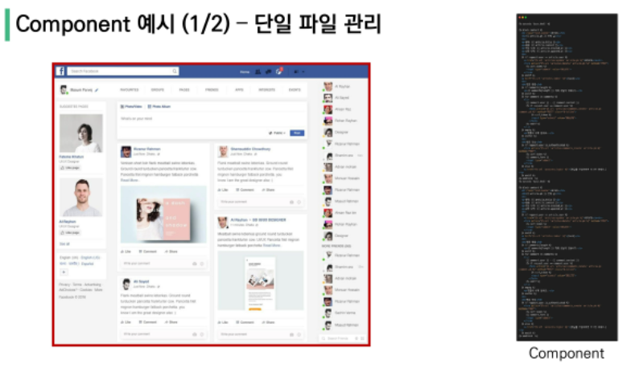

  - 단일 파일에서의 개발
    - 처음 개발을 시작할 때는 크게 신경 쓸 것이 없기 때문에 쉽게 개발 가능
    - 하지만 코드의 양이 많아지면 변수 관리가 힘들어지고 **유지보수에 많은 비용 발생**


- Component 예시 - 한 화면을 구성하는 여러 컴포넌트

  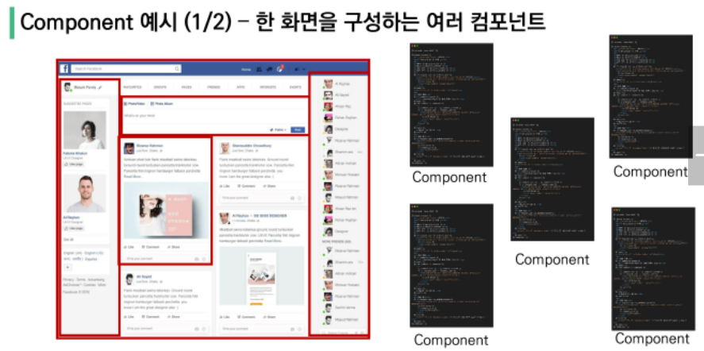

  - 각 기능 별로 파일을 나눠서 개발
    - 처음 개발을 준비하는 단계에서 시간 소요가 증가
    - 하지만 이후 변수 관리가 용이하며 기능 별로 유지 & 보수 비용 감소


- Vue Component 구조 예시
  
  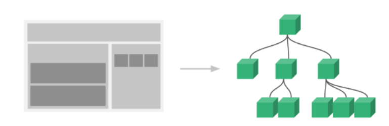
  
  - 한 화면 안에서도 기능 별로 각기 다른 컴포넌트가 존재
    - 하나의 컴포넌트는 여러 개의 하위 컴포넌트를 가질 수 있음
    - Vue는 컴포넌트 기반의 개발 환경 제공
  - Vue 컴포넌트는 `const app = new Vue({...})`의 app을 의미하며 이는 Vue 인스턴스
    - 여기서 오해하면 안되는 것은 컴포넌트 기반의 개발이 `반드시 파일 단위로 구분되어야 하는 것은 아님`
    - 단일 .html 파일 안에서도 여러개의 컴포넌트를 만들어 개발 가능


- 정리
  - Vue 컴포넌트는 Vue 인스턴스(new Vue({ }))이기도 함
  - Vue 인스턴스는 .vue 파일 안에서 작성된 코드의 집합
  - HTML, CSS, 그리고 JavaScript를 .vue라는 확장자를 가진 파일 안에서 관리하며 개발


---

### Vue CLI

- Vue CLI
  - Vue.js 개발을 위한 표준 도구
  - 프로젝트의 구성을 도와주는 역할을 하며 Vue 개발 생태계에서 표준 tool 기준을 목표로 함
  - 확장 플러그인, GUI, Babel 등 다양한 tool 제공


- Node.js
  - 자바스크립트를 브라우저가 아닌 환경에서도 구동할 수 있도록 하는 자바스크립트 런타임 환경
    - 프라우저 밖을 벗어날 수 없던 자바스크립트 언어의 태생적 한계를 해결
  - Chrom V8 엔진을 제공하여 여러 OS 환경에서 실행할 수 있는 환경을 제공
  - 즉, 단순히 브라우저만 조작할 수 있던 자바스크리브를 SSR 아키텍처에서도 사용할 수 있도록 함
  - [참고] 2009년 Ryan Dahl에 의해 발표


- NPM(Node Package Manage)
  - 자바스크립트 언어를 위한 패키지 관리자
    - Python에 pip가 있다면 Node.js에는 NPM
    - pip와 마찬가지로 다양한 의존성 패키지를 관리
  - Node.js의 기본 패키지 관리자
  - Node.js 설치 시 함께 설치됨


- Vue CLI Quick Start

  - 설치

    - -g 옵션은 위험함 / 자의적으로 판단하지 않기
      - 설치 문서에 쓰여있는 경우만 사용하기
  
    ```bash
    $ npm install -g @vue/cli
    ```
  
  - 버전 확인
  
    ```bash
    $ vue --version
    ```
  
  - 프로젝트 생성 -- git bash가 아닌 vscode terminal로 진행
  
    ```bash
    $ vue create my-first-app
    ```
  
  - npm 레지스트리 변경 (환경에 따라 나오지 않을 수 있음)
  
    ```bash
    ? Your connection to the default ...
    ```
  
  - Vue 버전 선택 (Vue 2)
  
    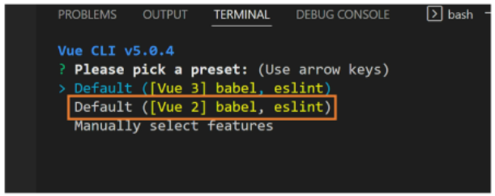
  
  - 프로젝트 생성 성공
  
    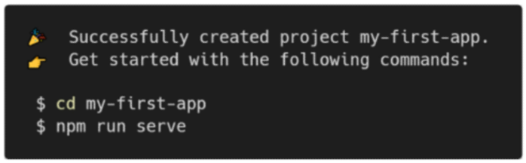
  
  - 프로젝트 디렉토리 이동
  
    ```bash
    $ cd my-first-app
    ```
  
  - 서버 실행
  
    ```bash
    $ npm run serve
    ```
  
  - 프로젝트 메인 페이지
  
    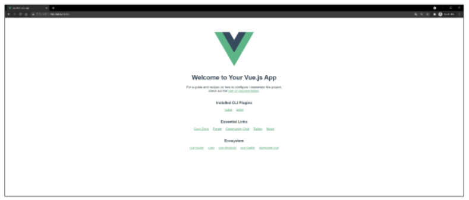


---

### Babel & Webpack

- Vue 프로젝트 구조

  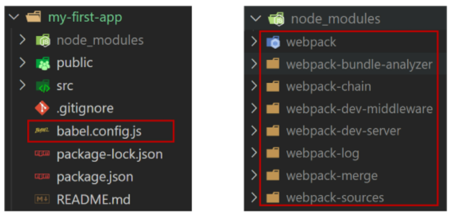


- Babel
  - "JavaScript compiler"
  - 자바스크립트의 ECMAScript 2015+ 코드를 이전 버전으로 번역/변환해 주는 도구
  - 과거 자바스크립트의 파편화와 표준화의 영향으로 코드의 스펙트럼이 매우 다양
    - 이 때문에 최신 문버블 사용해도 이전 브라우저 혹은 환경에서 동작하지 않는 상황이 발생
  - 원시 코드(최신 버전)를 목적 코드(구 버전)로 옮기는 번역기가 등장하면서 개발자는 더 이상 내 코드가 특정 브라우저에서 동작하지 않는 상황에 대해 크게 고민하지 않을 수 있게 됨


- Babel 동작 예시

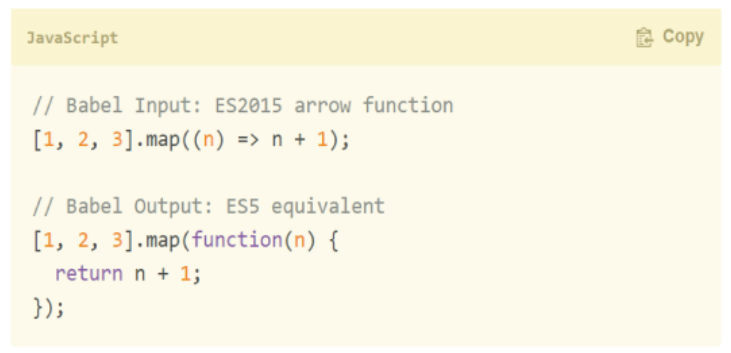

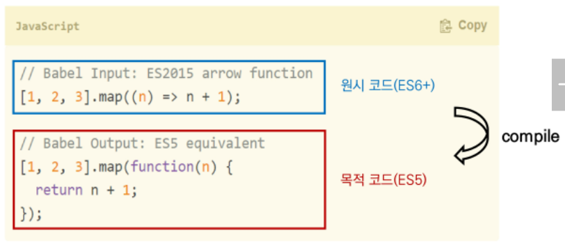


- Webpack
  - "static module bundler"
  - 모듈 간의 의존성 문제를 해결하기 위한 도구
  - 프로젝트에 필요한 모든 모듈을 매핑하고 내부적으로 종속성 그래프를 빌드함


- Static `Module` Bundler
  - 모듈은 단지 파일 하나를 의미 (예, js 파일 하나 === 모듈 하나)
  - 배경
    - 브라우저만 조작할 수 있었던 시기의 자바스크립트는 모듈 관련 문법없이 사용됨
    - 하지만 JS와 애플리케이션이 복잡해지고 크기가 커지자 전역 scope를 공유하는 형태의 기존 개발 방식의 한계점이 드러남
    - 그래서 라이브러리를 만들어 모듈을 언제든지 불러오거나 코드를 모듈 단위로 작성하는 등의 다양한 시도가 이루어짐
    - 여러 모듈 시스템
      - **ESM(ECMA Script Module)**
      - AMD(Asynchronous Module Definition)
      - CommonJS
      - UMD(Universal Module Definition)


- Module 의존성 문제
  - 모듈의 수가 많아지고 라이브러리 혹은 모듈 간의 의존성(연결성)이 깊어지면서 특정한 곳에서 발생한 문제가 어떤 모듈 간의 문제인지 파악하기 어려움
  - 즉, Webpack은 이 모듈 간의 의존성 문제를 해결하기 위해 등장


- Stactic Module `Bundler`
  - 모듈 의존성 문제를 해결해주는 작업을 Bundling이라 함
  - 이러한 일을 해주는 도구가 Bundler이고, Webpack은 다양한 Bundler 중 하나
  - 여러 모듈을 하나로 묶어주고 묶인 파일은 하나(혹은 여러 개)로 합쳐짐
  - Bundling된 결과물은 더 이상 순서에 영향을 받지 않고 동작하게 됨
  - snowpack, parcel, rollup.js등의 webpack 이외에도 다양한 모듈 번들러 존재
  - **Vue CLI는 이러한 Babel, Webpack에 대한 초기 설정이 자동으로 되어 있음**


- node_module의 의존성 깊이

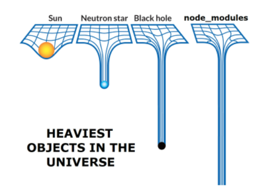


- Webpack

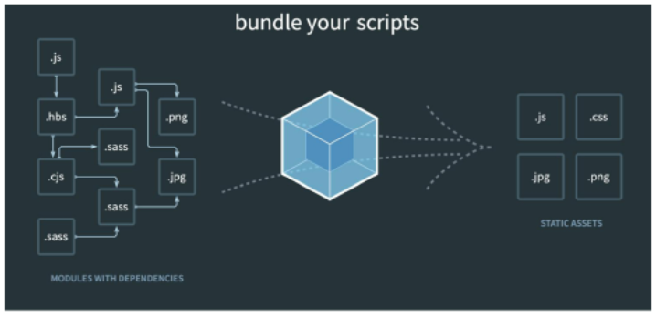


- 정리
  - Node.js
    - JavaScript Runtime Environment
    - JavaScript를 브라우저 밖에서 실행할 수 있는 새로운 환경
  - Babel
    - Compiler
    - ES2015+ JavaScript 코드를 구 버전의 JavaScript로 바꿔주는 도구
  - Webpack
    - Module Bundler
    - 모듈 간의 의존성 문제를 해결하기 위한 도구


- Vue 프로젝트 구조

  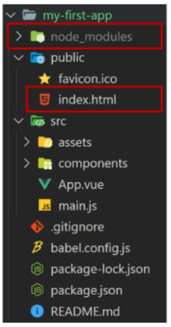

  - node_modules
    - node.js 환경의 여러 의존성 모듈
  - public/index.html
    - Vue 앱의 뼈대가 되는 파일
    - 실제 제공되는 단일 html 파일

  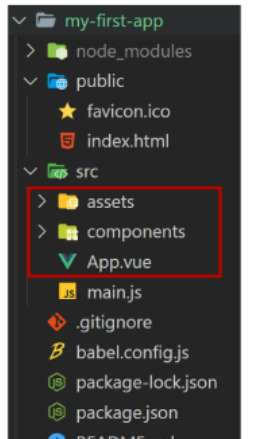

  - src/assets
    - webpack에 의해 빌드 된 정적 파일
  - src/components
    - 하위 컴포넌트들이 위치
  - src/App.vue
    - 최상위 컴포넌트

  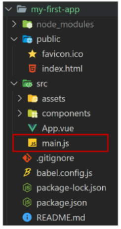

  - src/main.js
    - webpack이 빌드를 시작할 때 가장 먼저 불러오는 entry point
    - 실제 단일 파일에서 DOM과 data를 연결했던 것과 동일한 작업이 이루어지는 곳
    - Vue 전역에서 활용할 모듈을 등록할 수 있는 파일

  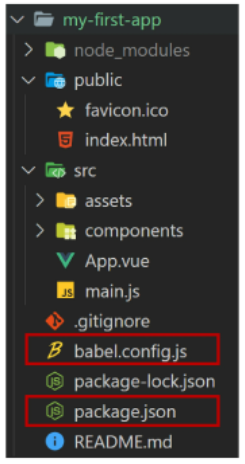

  - babel.config.js
    - babel 관련 설정이 작성된 파일
  - package.json
    - 프로젝트의 종속성 목록과 지원되는 브라우저에 대한 구성 옵션이 포함

  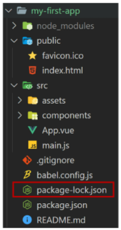

  - package-lock.json
    - node_modules에 설치되는 모듈과 관련된 모든 의존성을 설정 및 관리
    - 팀원 및 배포 환경에서 정확히 동일한 종속성을 설치하도록 보장하는 표현
    - 사용할 패키지의 버전을 고정
    - 개발 과정 간의 의존성 패키지 충돌 방지

---

### Pass Props & Emit Events

- 컴포넌트 작성

  - Vue app은 자연스럽게 중첩된 컴포넌트 트리로 구성됨
  - 컴포넌트간 부모-자식 관계가 구성되며 이들 사이에 필연적으로 의사 소통이 필요함

  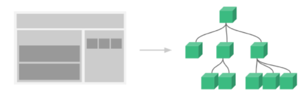

  - 부모는 자식에게 데이터를 전달(Pass props)하며, 자식은 자신에게 일어난 일을 부모에게 알림(Emit event)
    - 부모와 자식이 명확하게 정의된 인터페이스를 통해 격리된 상태를 유지할 수 있음
  - `props는 아래로, events는 위로`
  - 부모는 props를 통해 자식에게 '데이터'를 전달하고, 자식은 events를 통해 부모에게 '메시지'를 보냄


- 컴포넌트 구조

  ​	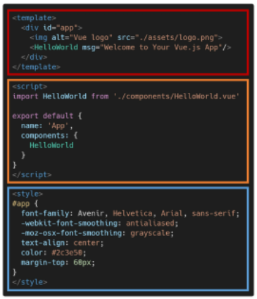

  1. 템플릿 (HTML)
     - HTML의 body 부분
     - 각 컴포넌트를 작성
  2. 스크립트 (JavaScript)
     - JavaScript가 작성되는 곳
     - 컴포넌트 정보, 데이터, 메서드 등 vue인스턴스를 구성하는 대부분이 작성 됨
  3. 스타일 (CSS)
     - CSS가 작성되며 컴포넌트의 스타일을 담당

  

- 컴포넌트 등록 3단계

  ```vue
  <template>
    <div id="app">
      
      <!-- 3. 보여주기 (print) -->
      <!-- 카멜케이스 -->
      <!-- <TheAbout :my-message="parentData"/> -->
      <!-- 케밥케이스/탬플릿에서만 사용/범용성 더 넓음 -->
      <the-about></the-about>
    </div>
  </template>
  
  <script>
  // 1. 불러오기
  import TheAbout from './components/TheAbout.vue'
  
  export default {
    name: 'App',
    // 2. 등록하기 (register)
    components: {
      TheAbout,
    }
  </script>
  ```

  1. 불러오기 (import)
  2. 등록하기 (register)
  3. 보여주기 (print)

  

- Pass Props & Emit Events

  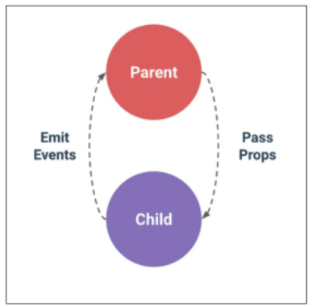

  

- Props

  - Props는 부모(상위) 컴포넌트의 정보를 전달하기 위한 사용자 지정 특성
  - 자식(하위) 컴포넌트는 props 옵션을 사용하여 수신하는 props를 명시적으로 선언해야 함
  - 즉, 데이터는 props 옵션을 사용하여 자식 컴포넌트로 전달됨
  - 주의
    - 모든 컴포넌트 인스턴스에는 자체 격리된 범위가 있음
    - 즉, 자식 컴포넌트의 템플릿에서 상위 데이터를 직접 참조할 수 없음

  

- Stactic Props 작성

  ```vue
  App.vue
  
  <template>
    <div id="app">
      
      <the-about 
      my-message="This is prop data" 
      ></the-about>
    </div>
  </template>
  ```

  - 자식 컴포넌트(TheAbout.vue)에 보낼 prop 데이터 선언

  - 작성법
    - prop-data-name="value"

  ```vue
  // TheAbout.vue
  
  <template>
  <!-- template 안에는 반드시 하나의 Elemnet만 있어야 한다 -->
  <!-- div로 묶어주고 시작하기 -->
    <div>
      <h1>About</h1>
      <h1>{{ myMessage }}</h1>
    </div>
  </template>
  
  <script>
  export default {
    name: 'TheAbout',
    props: {
      myMessage: String, 
    },
  }
  </script>
  ```

  - 수신할 prop 데이터를 명시적으로 선언 후 사용

  

- Dynamic Props 작성

  ```vue
  // App.vue
  
  <template>
    <div id="app">
      
      <the-about 
      :my-message="parentData" 
      ></the-about>
    </div>
  </template>
  
  <script>
  import TheAbout from './components/TheAbout.vue'
  
  export default {
    name: 'App',
    components: {
      TheAbout,
    },
    data: function () {
      return {
        parentData: 'This is parent data to child component'
      }
    },
  }
  </script>
  ```

  - v-bind directive를 사용해 부모 데이터의 props를 동적으로 바인딩
  - 부모에서 데이터가 업데이트될 때마다 자식 데이터로도 전달 됨

  ```vue
  // TheAbout.vue
  
  <template>
  <div>
    <h1>{{ myMessage }}</h1>
    <h1>{{ parentData }}</h1>
  </div>
  </template>
  
  <script>
  export default {
    name: 'TheAbout',
    props: {
      myMessage: String,
      parentData: String,
    },
  }
  </script>
  ```

  - 마찬가지로 수신 할 prop 데이터를 명시적으로 선언 후 사용


- Props 이름 컨벤션
  - duringDeclaration (선언 시)
    - camelCase
  - in-template (HTML)
    - kebab-case


- `컴포넌트의 'data'는 반드시 함수여야 함`

  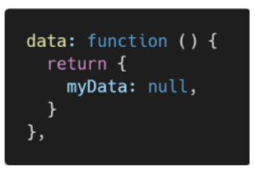

  - 기본적으로 각 인스턴스는 모두 같은 data 객체를 공유하므로 새로운 data 객체를 반환(return)하여야 함


- Props 시 자주하는 실수

  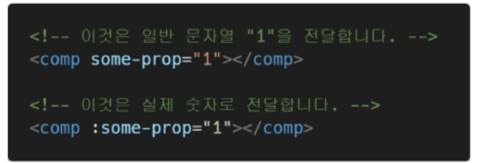

  - Stactic 구문을 사용하여 숫잘ㄹ 전달하려고 시도하는 것
  - 실제 JavaScript 숫자를 전달하려면 값이 JavaScript 표현식으로 평가되도록  v-bind를 사용해야 함


- 단방향 데이터 흐름
  - 모든 props는 하위 속성과 상위 속성 사이의 `단방향`바인딩을 형성
  - 부모의 속성이 변경되면 자식 속성에게 전달되지만, 반대 방향으로는 안 됨
    - 자식 요소가 의도치 않게 부모 요소의 상태를 변경하여 앱의 데이터 흐름을 이해하기 어렵게 만드는 일을 방지
  - 부모 컴포넌트가 업데이트될 때마다 자식요소의 모든 prop들이 최신 값으로 업데이트 됨


- Emit event
  - "Listening to Child Components Events"
  - $emit(eventName)
    - 현재 인스턴스에서 이벤트를 트리거
    - 추가 인자는 리스너의 콜백 함수로 전달
  - 부모 컴포넌트는 자식 컴포넌트가 사용되는 템플릿에서 v-on을 사용하여 자식 컴포넌트가 보낸 이벤트를 청취 (v-on을 이용한 사용자 지정 이벤트)


- Emit event 작성
  - 현재 인스턴스에서 $emit 인스턴스 메서드를 통해 child-input-change 이벤트를 트리거
  - 부모 컴포넌트(App.vue)는 자식 컴포넌트(About.vue)가 사용되는 템플릿에서 v-on directive를 사용하여 자식 컴포넌트가 보낸 이벤트(child-inpu-change)를 청취

---

