# Vuex

- Vuex Intro
- Vuex Core Concepts
- Vuex Todo App
  - Set project & components
  - Create Todo
  - Delete Todo
  - Update Todo
  - Getters
  - Component Binding Helper
  - LocalStorage

---

### Vuex Intro

- Vuex

  - "Statement management patter + Library" for vue.js

    - 상태관리 패턴 + 라이브러리

    - 상태(state)를 전역 저장소로 관리할 수 있도록 지원하는 라이브러리
      - 상태가 예측 가능한 방시그로만 변경될 수 있도록 보장하는 규칙 설정
      - 애플리케이션의 모든 컴포넌트에 대한 `중앙 집중식 저장소` 역할

  - Vue의 공식 devtools와 통합되어 기타 고급 기능을 제공


- State
  - state는 곧 data이며 해당 애플리케이션의 핵심이 되는 요소
  - 중앙에서 관리하는 모든 상태 정보
  - ~~다음 챕터에서 상세히 다룰 예정~~


- 상태 관리 패턴
  - 컴포넌트의 공유된 상태를 추출하고 이를 전역에서 관리하도록 함
  - 컴포넌트는 커다란 view가 되며 모든 컴포넌트는 트리에 상과없이 상태에 액세스 하거나 동작을 트리거 할 수 있음
  - 상태 관리 및 특정 규칙 적용과 관련된 개념을 정의하고 분리함으로써 코드의 구조와 유지관리 기능 향상
  - [참고] 트리거
    - 특정한 동작에 반응해 자동으로 필요한 동작을 실행하는 것


- 기존 Pass props & Emit event

  - 각 컴포넌트는 독립적으로 데이터를 관리
  - 데이터는 단방향 흐름으로 부모 -> 자식 간의 전달만 가능하며 반대의 경우 이벤트를 트리거
  - 장점
    - 데이터의 흐름을 직관적으로 파악 가능
  - 단점
    - 컴포넌트 중첩이 깊어지는 경우 동위 관계의 컴포넌트로 데이터 전달이 불편해짐

  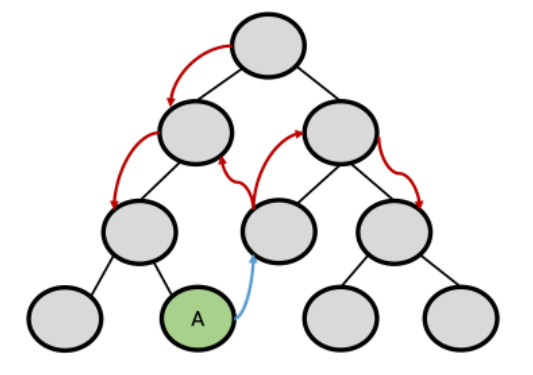

  - 공통의 상태를 공유하는 여러 컴포넌트가 있는 경우 데이터 전달 구조가 매우 복잡해짐
  - 예를 들면, 지나치게 중첩된 컴포넌트를 통화하는 prop
  - 단방향 데이터 흐름
    - state는 앱을 작동하는 원본 소스 (data)
    - view는 state의 선언적 매핑
    - action은 view에서 사용자 입력에 대해 반응적으로 state를 바꾸는 방법 (methods)

  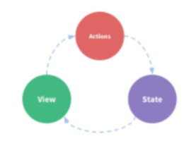


- Vuex management pattern

  - 중앙 저장소(store)에 state를 모아놓고 관리
  - 규모가 큰 (컴포넌트 중첩이 깊은) 프로젝트에서 매우 효율적
  - 각 컴포넌트에서는 중앙 집중 저장소의 state만 신경 쓰면 됨
    - 동일한 state를 공유하는 다른 컴포넌트들도 동기화 됨

  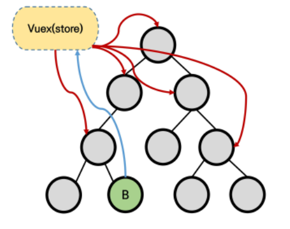


- 비교

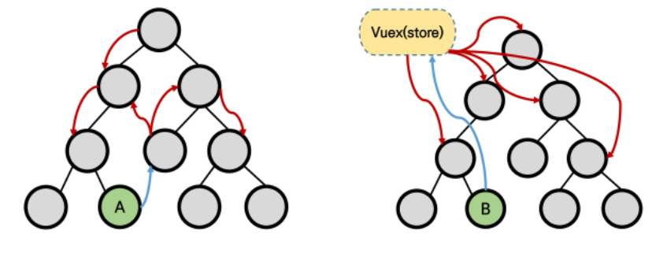


- 단방향 흐름에 의존한 state(상태) 관리
  1. 부모 자식 간의 컴포넌트 관계가 단순하거나 depth가 깊지 않은 경우에는 문제가 없음
     - 몇 단계만 거치면 데이터를 쉽게 이동시킬 수 있으며 훨씬 직관적으로 데이터 흐름을 파악할 수 있음
  2. 하지만 규모가 커졌을 경우의 사태 관리가 어려워짐
     - 상태를 공유하는 컴포넌트의 상태 동기화 관리가 어려움
     - 상태를 전달할 때 상->하로만 가능
  3. A 컴포넌트의 상태를 공유하는 다른 컴포넌트에 pass props & emit event를 통해 동기화해야 함


- Vuex를 활용한 state(상태)관리
  1. 상태의 변화에 따른 여러 흐름을 모두 관리해야 하는 불편함을 해소 할 필요가 있음
     - 상태는 데이터를 주고 받는 컴포넌트 사이의 관계도 충분히 고려해야하기 때문에 상태 흐름 관리가 매우 중요해짐
  2. 결국 이러한 상태를 '올바르게 관리하는 저장소'의 필요성을 느끼게 됨
     - 상태르르 한 곳(store)에 모두 모아 놓고 관리하자
     - 상태의 변화는 모든 컴포넌트에서 공유
     - 상태의 변화는 오로지 Vuex가 관리하여 해당 상태를 공유하고 있는 모든 컴포넌트는 변화에 '반응'
  3. A 컴포넌트와 같은 상태를 공유하는 다른 컴포넌트는 신경쓰지 않고, 오로지 상태의 변화를 Vuex에 알림


---

### Vuex Core Concepts

- Vuex 핵심 컨셉

  1. Stae
  2. Mutations
  3. Actions
  4. Getters

  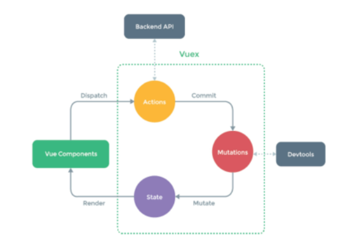


1. State

   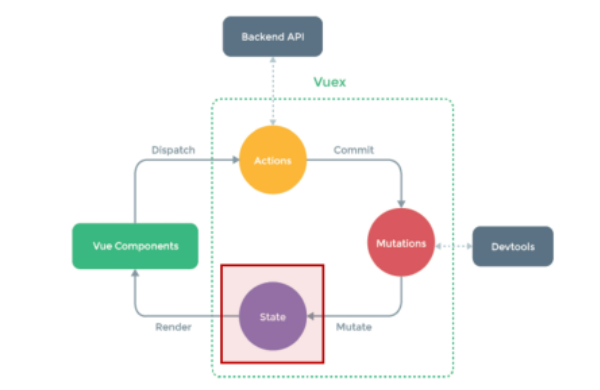

   - "중앙에서 관리하는 모든 상태 정보 (data)"
     - Vuex는 single state tree를 사용
     - 즉, 이 단일 객체는 모든 애플리케이션 상태를 포함하는 "원본 소스(single source of truth)"의 역할을 함
     - 이는 각 애플리케이션마다 하나느이 저장소만 갖게 된다는 것을 의미함
   - 여러 컴포넌트 내부에 있는 특정 state를 중앙에서 관리하게 됨
     - 이전의 방식은 state를 찾기 위해 각 컴포넌트를 직접 확이해야 했음
     - Vuex를 활용하는 방식은 Vuex Store에서 각 컴포넌트에서 사용하는 state를 한 눈에 파악 가능
   - State가 변화하면 해당 state를 공유하는 여러 컴포넌트의 DOM은 (알아서) 렌더링
   - 각 컴포넌트는 이제 Vuex Store에서 state 정보를 가져와 사용


2. Mutations

   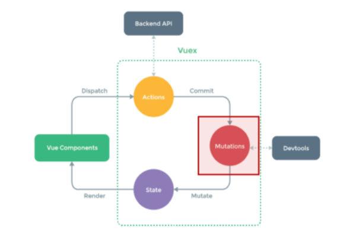

   - "실제로 state를 변경하는 유일한 방법"
   - mutation의 handler(핸들러 함수)는 반드시 동기적이어야 함
     - 비동기적 로직(예. 콜백함수)은 state가 변화하는 시점이 의도한 것과 달라질 수 있으며, 콜백이 실제로 호출될 시기를 알 수 있는 방법이 없음 (추적할 수 없음)
   - 첫번째 인자로 항상 `state`를 받음
   - Actions에서 `commit()` 메서드에 의해 호출 됨

   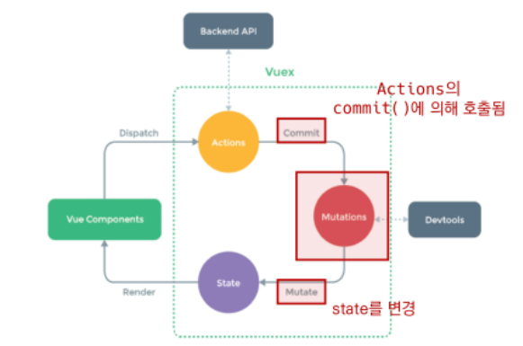


3. Actions

   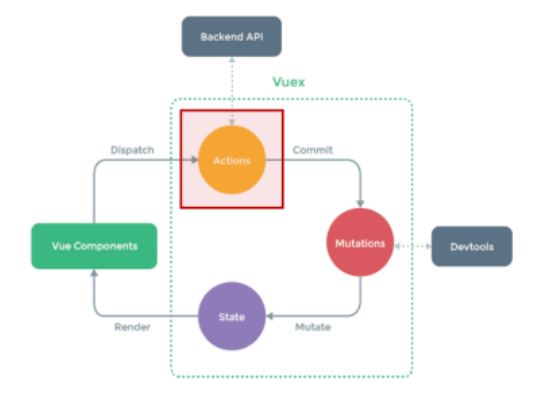

   - Mutations와 유사하지만 다음과 같은 차이점이 있음
     1. state를 변경하는 대신 mutations를 `commit()`메서드로 호출해서 실행
     2. mutations와 달리 비동기 작업이 포함될 수 있음
        (Backend API와 통신하여 Data Fetching 등의 작업 수행)
   - `context`객체 인자를 받음
     - context 객체를 통해 store/index.js 파일 내에 있는 모든 요소의 속성 접근 & 메서드 호출이 가능
     - 단, (가능하지만) state를 직접 변경하지 않음
   - 컴포넌트에서 `dispatch()`메서드에 의해 호출됨
   - "Actions를 통해 state를 조작할 수 있지만, state는 오로지 Mutations를 통해 조작해야함"
     - `명확한 역할 분담`을 통해 서비스 규모가 커져도 state를 올바르게 관리하기 위함

   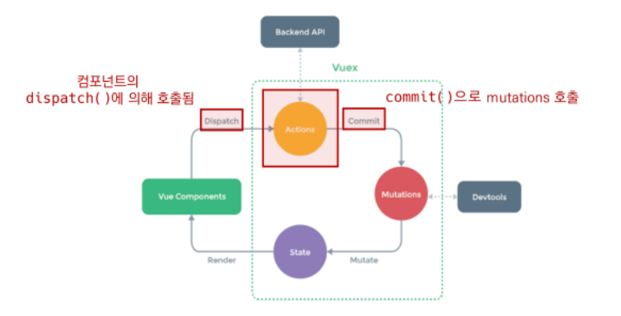


4. Getters

   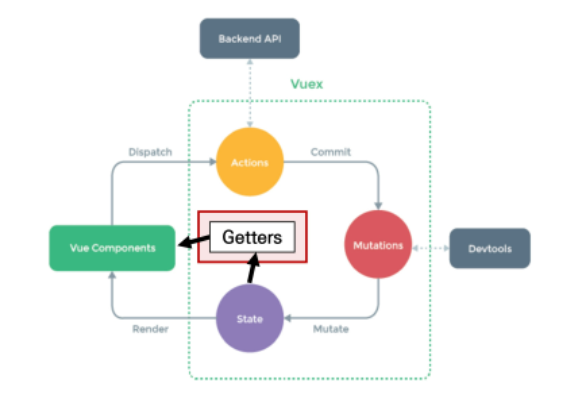

   - state를 변경하지 않고 활용하여 계산을 수행 (computed 속성과 유사)
     - compute를 사용하는 것처럼 getters는 저장소의 상태(state)를 기준으로 계산
     - 예를 들어, state에 todoList라는 해야 할 일의 목록의 경우 완료된 todo 목록만을 필터링해서 출력해야 하는 경우가 있음
     - computed 속성과 마찬가지로 getters의 결과는 state 종속성에 따라 캐시(cached)되고, 종속성이 변경된 경우에만 다시 재계산 됨
     - getters 자체가 state를 변경하지는 않음
       - state를 특정한 조건에 따라 구분(계산)만 함
       - 즉, 계산된 값을 가져옴


- Vuex Core Concepts 정리

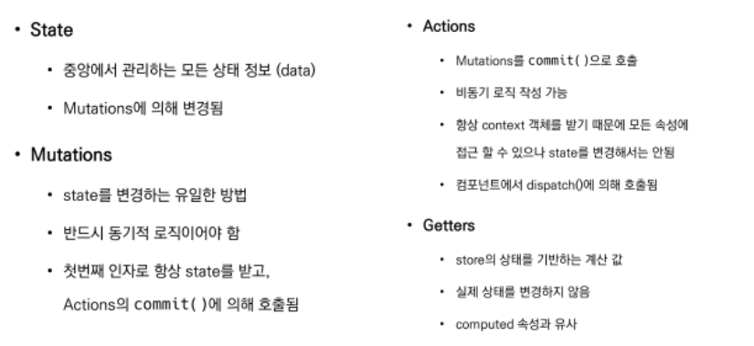


---

### Vuex Todo App

- Vuex Todo App 소개

  - 컴포넌트 구성

  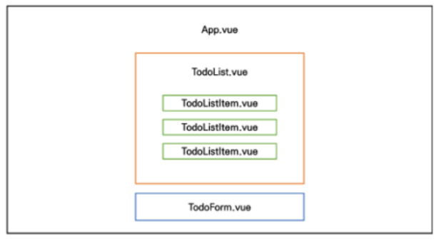

  - 결과 예시

  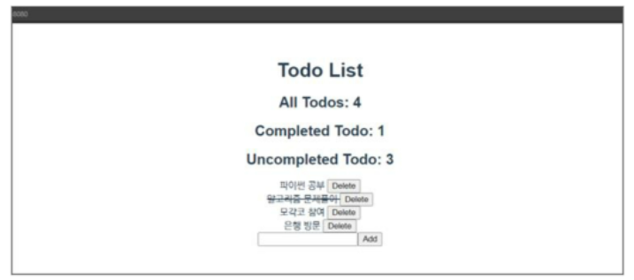

​	

---

### Set project & components

- Init project

  1. Create Project

     ```bash
     $ vue create todo-vuex-app
     
     $ cd todo-vuex-app
     ```

  2. Add Vuex plugin in Vue CLI

     ```bash
     $ vue add vuex
     ```

  3. commit 여부 (Yes)

     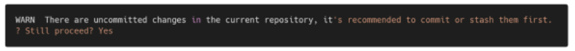


- Vuex로 인한 변화

  1. store 디렉토리 생성
  2. index.js 생성

  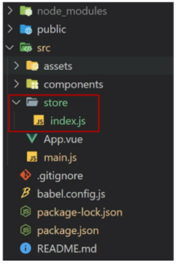

  3. index.js

     - Vuex core concepts가 작성되는 곳

     ```js
     // index.js
     
     import Vue from 'vue'
     import Vuex from 'vuex'
     
     Vue.use(Vuex)
     
     export default new Vuex.Store({		<<<<< Business Logic
       state: {	// data
       },
       getters: {	// computed
       },
       mutations: {	// change
       },
       actions: {	// methods
       },
       modules: {		<<<<<요놈은 지워줄 예정
       }
     })		<<<<< Business Logic
     ```


- 컴포넌트 작성

  - TodoListItem.vue

    - 개별 todo 컴포넌트
    - TodoList 컴포넌트의 자식 컴포넌트

    ```vue
    // components/TodoListItem.vue
    ```

  - TodoList.vue

    - todo 목록 컴포넌트
    - TodoListItem 컴포넌트의 부모 컴포넌트

    ```vue
    // components/TodoList.vue
    ```

  - TodoForm.vue

    - todo 데이터를 입력 받는 컴포넌트

    ```vue
    // components/TodoForm.vue
    ```

  - App.vue

    - 최상위 컴포넌트
    - TodoList, TodoForm 컴포넌트의 부모 컴포넌트

    ```vue
    // App.vue
    ```

    

---

### Create Todo

- State작성

  - state에 2개의 todo 작성

  - [주의]
    - Vuex를 사용한다고 해서 Vuex Store에 모든 상태를 넣어야 하는 것은 아님

	```js
	// index.js
	
	```


- TodoList 데이터 가져오기

  - 컴포넌트에서 Vuex Store의 state에 접근
    - $store.state

  ```vue
  //TodoList.vue
  ```

  
