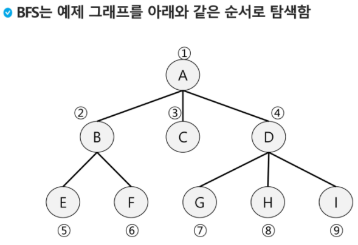
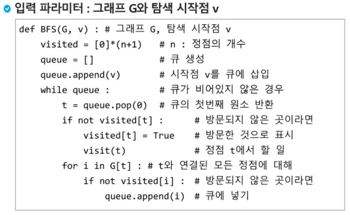

# BFS

- 그래프를 탐색하는 방법에는 크게 두 가지가 있음
  - 깊이 우선 탐색 (DFS)
  - 너비 우선 탐색 (BFS)
- 너비우선탐색은 탐색 시작점의 인접한 정점들을 먼저 모두 차례로 방문한 후에, 방문했던 정점을 시작점으로 하여 다시 인접한 정점들을 차례로 방문하는 방식
- 인접한 정점들에 대해 탐색으 한 후, 차례로 다시 너비 우선 탐색을 진행해야 하므로, 선입선출 형태의 자료구조인 큐를 활용함

