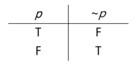
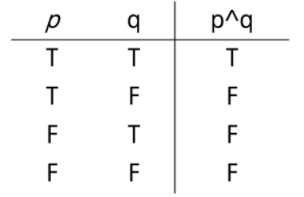
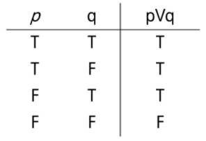
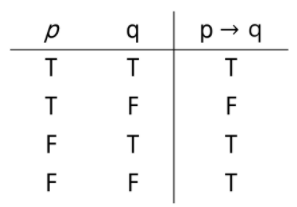
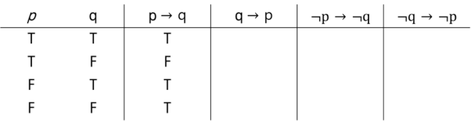
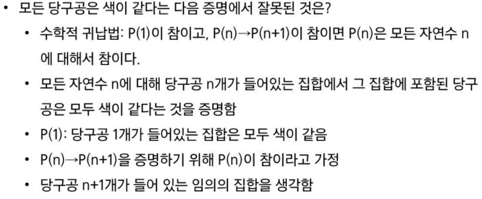
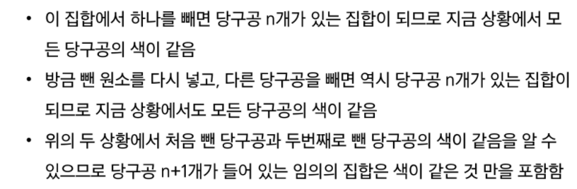

# 프로그래밍과 논리/수학

- 일상 생활에서는 

  - soft logic이 빠르기 때문에 유용
  - 논리적으로 부정확한 표현을 사용하지만, 어떤 의미인지 모든 사람이 이미 알고 있다는 가정이 존재

- 프로그래밍은

  - hard logic을 사용
  - 프로그래밍 언어의 표현들이 모두 논리학에서 나온 것
  - 사용되는 수많은 알고리즘들을 이해하기 위해서는 Hard Logic이 필요

- 오해의 근원

  - soft logic으로 알고리즘을 이해하려고 하는 것!
  - 알고리즘 설명을 보고 또 봐도 이해가 안되는 것은 증명을 안봤기 때문
  - 증명을 봐도 이해가 안되는 것은 직관으로 이해하려고하기 때문
  - 가끔 직관적으로 이해되는 알고리즘이 있지만 조금만 어려워지면 직관으로 완전한 이해를 얻는 것은 사실상 불가능

  ---

  ### [참고]

- 명제

  - 참이나 거짓을 알 수 있는 식이나 문장
  - p q r 로 표현
  - 예) 서울은 대한민국의 수도다. 1+1 =3

- 진릿값

  - 참이나 거짓을 표현
  - T,F 또는 1,0

- 연산

  - 부정 NOT
    - p가 명제일 때, 명제 진릿값이 반대
    - ~p로 표기 (not p 또는 p의 부정으로 읽음)

  

  - 논리 곱 AND
    - p,q가 명제일 때, p,q 모두 참일 때만 참이되는 명제.
    - p ^ q(p and q, p 그리고 q)

  

  - 논리 합 OR
    - p,q가 명제일 때, p,q 모두 거짓일 때만 거짓이 되는 명제.
    - p V q (p or q, p 또는 q)

  

  - 배타적 논리합 XOR
    - p, q가 명제잉ㄹ 때, p, q 중 하나만 참이되는 명제
    - p xor q
  - 합성
    - 연산자 우선순위
      - ~(￢) > V , ^ > ㄷ > ->, <->
    - 항진명제 : 진릿값이 항상 참
    - 모순명제 : 진릿값이 항상 거짓
    - 사건명제 : 항진명제도 모순명제도ㅗ 아닌 명제

- 조건 명제

  - p, q가 명제일 때, 명제 p가 조건(또는 원인), q가 결론(또는 결과)로 제시되는 명제.
  - p -> q (p이면 q이다.)

- 조건 명제의 역, 이, 대우
  - 역 : q -> p
  - 이 : ~p -> ~q
  - 대우: ~q -> ~p    // 조건 명제를 증명하기 힘들 때 시도

- 증명
  - 증명은 정확한 명제식으로 표현할 수 있는 것이라야 함
  - 보통은 정확한 명제식까지 쓰지 않으나 근본적으로는 명제식으로 바꿀 수 있음
  - 증명에 대한 수많은 오해가 p->q를 p<->q와 혼동하는 것에서 일어남

- 수학적 귀납법과 증명의 수준
  - 수학적 귀납법의 기본형 : P(1)이 참이고, P(n) -> P(n+1)이 참이면 P(n)은 모든 자연수 n에 대해서 참이다.
  - 수학적 귀납법의 강한 형태 : P(1)이 참이고, P(1) ^ P(2) ^ ... ^ P(n) -> P(n+1)이 참이면 P(n)은 모든 자연수 n에 대해서 참이다.