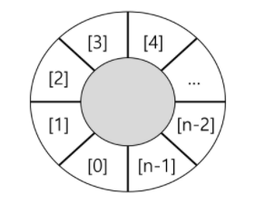

# QUEUE

### 선형큐

### 원형큐

### 우선순위큐

### 큐의 활용 : 버퍼

---

1. 큐의 특성

- 스택과 마찬가지로 삽입과 삭제의 위치가 제한적인 자료구조
  - 큐의 뒤에서는 삽입만 하고, 큐의 앞에서는 삭제만 이루어지는구조

- 선입선출구조(FIFO: First In First Out)
  - 큐의 삽입한 순서대로 원소가 저장되어, 가장 먼저 삽입(First In)된 원소는 가장 먼저 삭제(First Out)된다.


- 큐의 기본 연산
  - 삽입 : enQueue
  - 삭제 : deQueue
- 큐의 주요 연산
  - enQueue(item) : 큐의 뒤쪽(rear 다음)에 원소를 삽입하는 연산
  - deQueue() : 큐의 앞쪽(front)에서 원소를 삭제하고 반환하는 연산
  - createQueue() : 공백상태의 큐를 생성하는 연산
  - isEmpty() : 큐가 공백상태인지를 확인하는 연산
  - isFull() : 큐가 포화 상태인지를 확인하는 연산
  - Qpeek : 큐의 앞쪽(front)에서 원소를 삭제 없이 반환하는 연산

- 선형 큐

  - 1차원 배열을 이용한 큐
    - 큐의 크기 == 배열의 크기
    - front : 저장된 첫 번째 원소의 인덱스 == 마지막으로 꺼내진 위치, dequeue()의 위치
    - rear : 저장된 마지막 원소의 인덱스 == 마지막으로 추가된 위치

  - 상태 표현
    - 초기상태 : front == rear ==  -1
    - 공백상태 : front == rear
    - 포화 상태 : rear == n-1 (n: 배열의 크기, n-1: 배열의 마지막 인덱스)

- 큐의 구현

  - 초기 공백 큐 생성

    - 크기 n인 1차원 배열 생성
    - front와 rear를 -1로 초기화

  - 삽입 : enQueue(item)

    - 마지막 원소 뒤에 새로운 원소를 삽입하기 위해

      1. rear 값을 하나 증가시켜 새로운 원소를 삽입할 자리를 마련
      2. 그 인덱스에 해당하는 배열원소 Q[rear]에 item을 저장

      ```python
      front = -1
      rear = -1
      Q = [0] * n
      def enQueue(item):
          global front
          global rear
          if rear = len(Q)-1 :  # isFull()
              print("Queue_Full")
          else:
              rear = rear + 1
              Q[rear] = item

  - 삭제 : deQueue()

    - 가장 앞에 있는 원소를 삭제하기 위해

      1. front 값을 하나 증가시켜 큐에 남아있게 될 첫 번째 원소 이동
      2. 새로운 첫 번째 원소를 리턴함으로써 삭제와 동일한 기능함

      ```python
      def deQueue():
          global front
          global rear
          if front == rear:  # isEmpty()
              print("Queue_Empty")
          else:
              front = front + 1
              return Q[front]
      ```

  - 공백 상태 및 포화 상태 검사 : isEmpty, isFull()

    - 공백상태 : front == rear
    - 포화상태 : rear == n-1 (n: 배열의 크기, n-1: 배열의 마지막 인덱스)

    ```python
    def isEmpty():
        return front == rear
    
    def Full():
        return rear == len(Q) - 1
    ```

  - 검색 : Qpeek()

    - 가장 앞에 있는 원소를 검색하여 반환하는 연산
    - 현재  front의 한자리 뒤 (front+1)에 있는 원소, 즉 큐의 첫 번째에 있는 원소를 반환

    ```python
    def Qpeek():
        if isEmpty():
            print("Queue_Empty")
        else:
            return Q[front+1]
    ```

- 선형 큐 이용시의 문제점

  - 잘못된 포화상태 인식

    - 선형 큐를 이용하여 원소의 삽입과 삭제를 계속할 경우, 배열의 앞부분에 활용할 공간이 있음에도 불구하고, rear=n-1인 상태 즉, 포화상태로 인식하여 더 이상 삽입을 수행하지 않게됨

  - 해결방법 1

    - 매 연산이 이루어질 때마다 저장된 원소들을 배열의 앞부분으로 모두 이동시킴
    - 원소 이동에 많은 시간이 소요되어 큐의 효율성이 급격히 떨어짐

  - 해결방법 2

    - 1차원 배열을 사용하되, 논리적으로는 배열의 처음과 끝이 연결되어 원형 형태의 큐를 이룬다고 가정하고 사용
    - 원형 큐의 논리적 구조

    