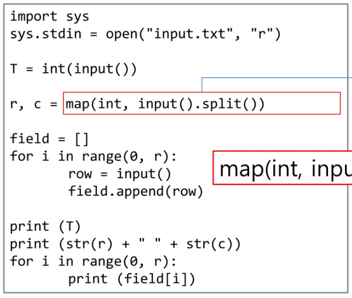

# Start

##### SW 문제 해결

##### 복잡도 분석

##### 표준 입출력 방법

##### 비트 연산

##### 진수

##### 실수

(재귀)

---

1. SW 문제 해결

- 프로그래밍 ... "잘하는 사람과 못하는 사람의 생산성 차이가 스무 배"

- 프로그래밍하기 위한 제약과 조건과 요구사항

  - 프로그래밍 언어의 특성

  --찐 개발자 --

  - 프로그램이 동작할 HW와 OS에 관한 지식
  - 라이브러리들의 유의 사항들
  - 프로그램이 사용할 수 있는 최대 메모리
  - 사용자 대응 시간 제한
  - 재사용성이 높은 간결한 코드

2. 복잡도 분석

- 알고리즘 : " 문제 해결하기 위한 절차나 방법"

- 알고리즘의 효율

  - 공간적 효율성과 시간적 효율성
    - 공간적 효율성은 연산량 대비 얼마나 적은 메모리 공간을 요하는 가를 말한다.
    - 시간적 효율성은 연상량 대비 얼마나 적은 시간을 요하는가를 말한다.
    - 효율성을 뒤집어 표현하면 복잡도가 된다. 복잡도가 높을수록 효율성은 저하노디낟.
  - 시간 복잡도 분석
    - 하드웨어 환경에 따라 처리시간이 달라진다.
      - 부동소수 처리 프로세서 존재유무, 나눗셈 가속기능 유무
      - 입출력 장비의 성능, 공유 여부
    - 소프트웨어 환경에 따라 처리시간이 달라진다.
      - 프로그램 언어의 종류
      - 운영체제, 컴파일러의 종류
    - 이러한 환경적 차이로 인해 분석이 어렵다.

- 복잡도의 점근적 표기

  - 시간(또는 공간) 복잡도는 입력 크기에 대한 함수로 표기하는데, 이 함수는 주로 여러개의 항을 가지는 다항식이다.
  - 이를 단순한 함수로 표현하기 위해 점근적 표기(Asymptotic Notation)를 사용한다.
  - 입력 크기 n이 무한대로 커질 때의 복잡도를 간단히 표현하기 위해 사용하는 표기법이다.
    - O(Big-Oh) 표기
    - Ω(Big-Omega) 표기
    - Θ(Big-Theta) 표기

- O(Big-Oh) 표기

  - O-표긴는 복잡도의 점근적 상한을 나타낸다.
  - 복잡도가 f(n) = 2n^2 - 7n -+ 4라면, f(n)의 O-표기는 O(n^2)이다
  - f(n)의 단순화된 표현은 n^2이다.
  - 단수화된 함수 n^2에 임의의 상수 c를 곱한 cn^2이 n이 증가함에 따라 f(n)의 상한이 된다.
  - 단순히 "실행시간이 n^2에 비례"하는 알고리즘이라고 말함.

- Ω(Big-Omega) 표기

  - 복잡도의 점근적 하한을 의미한다.
  - 복잡도가 f(n) = 2n^2 - 7n -+ 4라면, f(n)의 Ω-표기는 O(n^2)이다
  - f(n)=Ω(n^2)은 "n이 증가함에 따라 2n^2 - 7n -+ 4이 cn^2보다 작을 수 없다"라는 의미이다. 이때 상수 c=1로 놓으면 된다.
  - O-표기 때와 마찬가지로, Ω-표기도 복잡도 다항식의 최고차항마 계수없이 취하면된다.
  - "최소한 이만한 시간은 걸린다."

- Θ(Big-Theta) 표기

  - O-표기와 Ω-표기가 같은 경우에 사용한다.
  - f(n) = 2n^2 - 7n -+ 4 = O(n^2) = Ω(n^2)이므로, f(n) = Θ(n^2)이다.
  - "f(n)은 n이 증가함에 따라 n^2과 동일한 증가율을 가진다"라는 의미이다.

- 자주사용하는 O-표기

  - O(1) : 상수시간 (Constant time)
  - O(logn) : 로그(대수) 시간 (Logarithmic time)
  - O(n) : 선형시간 (Linear time)
  - O(nlogn) : 로그 선형 시간 (Log-linear time)
  - O(n^2) : 제곱사간 (Quadratic time)
  - O(n^3) : 세제곱 시간 (Cubic time)

  -- 여기서부터는 잘못짜면 위험 해짐 --

  - O(2^n) : 지수 시간 (Exponential time)

- 왜 효율적인 알고리즘이 필요한가

  - 10억개의 숫자를 정렬하느데 O(n^2)알고리즘은 300여 년이 걸리는 반면에 O(nlogn)알고리즘은 5분만에 정렬한다.

  

  - 효율적인 알고리즘은 슈퍼 컴퓨터보다 더 큰 가치가 있다.
  - 값 비싼 H/W의 기술 개발보다 효율적인 알고리즘 개발이 훨씬 더 경제적이다.

3. 표준 입출력 방법

- Python3 표준 입출력

  - 입력
    - Raw값의 입력 : input()
      - 받은 입력값을 문자열로 취급
    - ~~Evaluated된 값 입력 : eval(input())~~  // 보안에 취약함
      - ~~받능 입력값을 평가된 데이터 형으로 취급~~
  - 출력
    - print()
      - 표준 출력 함수. 출력값의 마지막에 개행 문자 포함
    - print('text', end='')
      - 출력 시 마지막에 개행문자 제외할 시
    - print('%d' %number)
      - Formatting된 출력

- 파일의 내용을 표준 입력으로 읽어오는 방법

  - import sys  // 1MB가 넘을 경우 이용해야 함
  - sys.stdin = open('a.txt', 'r')

  

  - stdout : output.txt파일에 입력하는 방식

- Python3 소스 코드

4. 비트연산

- 비트 연산자

- 1 << N
  - 2^n의 값을 갖는다.
  - 원소가 n개일 경우 모든 부분집합의 수를 의미한다.
  - Power set (모든 부분 집합)
    - 공집합과 자기자신을 포함한 모든 부분 집합
    - 각 원소가 포함되거나 포함되지 않는 2가지 경우의 수를 계산하면 모든 부분집합의 수가 계산된다.
- i & (1 << j)
  - 계산 결과는 i의 j번째 비트가 1인지 아닌지를 의미한다.
- 비트 연산 예제1

- 비트 연산 예제2

- 엔디안(Endianness)

  - 컴퓨터의 메모리와 같은 1차원 공간에 여러 개의 연속된 대상을 배열하는 방법을 의미하며 HW 아키텍처마다 다르다.

  - 주의 : 속도 향상을 위해 바이트 단위와 워드 단위를 변환하여 연산할 때 올바르게 이해하지 않으면 오류를 발생 시킬 수 있다.

  - 엔디안은 크게 두 가지로 나뉨

    - 빅 엔디안(Big-endian)
      - 보통 큰 단위가 앞에 나옴. 네트워크.
    - 리틀 엔디안(Little-endian)
      - 작은 단위가 앞에 나옴. 대다수 데스크탑 컴퓨터

    

- 비트 연산 예제3

- 비트 연산 예제 4

- 비트 연산 예제 5

5. 진수

- 2진수, 8진수, 10진수, 16진수
- 10진수 => 타 진수로 변환
  - 원하는 타진법의 수로 나눈 뒤 나머지를 거꾸로 읽는다.
  - 예제
    - 149 = 10010101(2진수) = 225(8진수) = 95(16진수)
- 타 진수 => 10진수로 변환
  - 예) 135(8진수) = 1*8^2 + 3\*8 + 5 = 93
  - 소수점이 있을 때의 예)  135.12(8진수) = 1\*8^2 + 3\*8^1 + 5\*8^0 + 1\*8^(-1) + 2\*8^(-2) = 93.15625
- 2진수, 8진수, 16진수 간 변환

- 컴퓨터에서의 음의 정수 표현 방법

  - 1의 보수 : 부호와 절대값으로 표현된 값을 부호 비트를 제외한 나머지 비트들을 0은 1로 1은 0로 변환한다.

  

  - 2의 보수 : 1의 보수 방법으로 표현된 값의 최화위 비트에 1을 더한다.

​		

- 