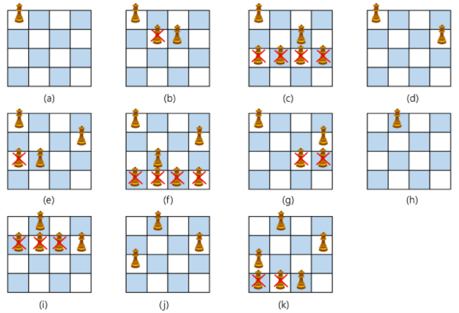

# 분할정복 & 백트래킹

### 분할정복

### 백트래킹

### 트리

---

1. 분할 정복 기법

- 유래
  - 나폴레옹이 사용한 전략
  - 전력이 우세한 연합군을 공격하기 위해 중앙부로 쳐들어가 연합군을 둘로 나눔
  - 둘로 나뉜 연합군을 한 부분씩 격파함
- 설계전략
  - 분할(Divide) : 해결할 문제를 여러개의 작은 부분으로 나눈다.
  - 정복(Conquer) : 나눈 작은 문제를 각각 해결한다.
  - 통합(Combine) : (필요하다면) 해결된 해답을 모은다.
- Top-down approach

- 분할 정복 기반의 알고리즘

- 병합정렬(Merge Sort)

  - 여러 개의 정렬된 자료의 집합을 병합하여 한 개의 정렬된 집합으로 만드는 방식

  - 분할 정복 알고리즘 활용

    - 자료를 최소 단위의 문제까지 나눈 후에 차례대로 정렬하여 최종 결과를 얻어냄
    - top-down 방식

  - 시간 복잡도

    - O(n log n)

  - 병합정렬 과정

    - 분할단계: 전체 자료 집합에 대하여, 최소 크기의 부분집합이 될 때까지 분할작업을 계속한다.

    

    - 병합단계: 2개의 부분집합을 정렬하면서 하나의 집합으로 병합

    

    - 8개의 부분집합이 1개로 병합될 때까지 반복함

  - 알고리즘 : 분할 과정

  
  
  - 알고리즘 : 병합과정
  
  
  
- 퀵 정렬

  - 주어진 배열을 두 개로 분할하고, 각각을 정렬한다.
    - 병합정렬과 동일?
  - 다른점 1: 병합정렬은 그냥 두 부분으로 나누는 반면에, 퀵정려른 분할할 때, 기준 아이템(pivot item) 중심으로, 이보다 작은것은 왼편, 큰 것은 오른편에 위치시킨다.
  - 다른점 2 : 각 부분 정렬이 끝난 후, 병합 정렬은 "병합"이란 후처리 작업이 필요하나, 퀵 정렬은 필요하지 않는다.
  - 알고리즘

  

  - Hoare-Partition 알고리즘

  

  - 아이디어

    - P(피봇)값들 보다 큰 값은 오른쪽, 작은 값들은 왼쪽집합에 위치하도록한다.

    

    - 피봇을 두 집합의 가운데에 위치시킨다.

    

  - 피봇 선택

    - 왼쪽 끝 / 오른쪽 끝 / 임의의 세개 값 중에 중간 값

    

  - Lomuto partiton 알고리즘

  

  

- 이진 검색

  - 자료의 가운데 있는 항목의 키 값과 비굫여 다음검색의 위치를 결정하고 검색을 계속 진행하는 방법
    - 목적 키를 찾을 때까지 이진 검색을 순환적으로 반복 수행함으로써 검색 범위를 반으로 줄여가면서 보다 빠르게 검색을 수행함
  - 이진 검색을 하기 위해서는 자료가 정렬된 상태여야 한다.
  - 검색 과정
    1. 자료의 중앙에 있는 원소를 고른다.
    2. 중앙 원소의 값과 찾고자 하는 목표 값을 비교한다.
    3. 목표 값이 중앙 원소의 값보다 작으면 자료의 왼쪽 반에 대해서 새로 검색을 수행하고, 크다면 자료의 오른쪽 반에 대해서 새로 검색을 수행한다.
    4. 찾고자 하는 값을 찾을 때까지 1~3의 과정을 반복한다.
  - 알고리즘 : 반복구조

  

  - 알고리즘 : 재귀구조

  

- 분할 정복의 활용

  - 병합 정렬은 외부 정렬의 기본이 되는 정렬 알고리즘이다. 또한 멀티코어 CPU나 다수의 프로세서에서 정렬 알고리즘을 병렬화하기 위해 병합 정렬 알고리즘이 활용된다.
  - 퀵 정렬은 매우 큰 입력 데이터에 대해서 좋은 성능을 보이는 알고리즘이다.

2. 백트래킹

- 여러가지 선택지(옵션이)들이 존재하는 상황에서 한가지를 선택한다.

- 선택이 이루어지면 새로운 선택지들의 집합이 생성된다.

- 이런 선택을 반복하면서 최종상태에 도달한다.

  - 올바른 선택을 계속하면 목표 상태(goal state)에 도달한다.

- 당첨리프노드 찾기

  

  - 루트에서 갈 수 있는 노드를 선택한다.
  - 꽝 노드까지 도달하면 최근의 선택으로 되돌아와서 다시 시작한다.
  - 더 이상 선택지가 없다면 이전의 선택지로 돌아가서 다른 선택을 한다.
  - 루트까지 돌아갔을 경우 더 이상 선택지가 없다면 찾는 답이 없다.

- 백트래킹과 깊이 우선 탐색과의 차이

  - 어떤 노드에서 출발하는 경로가 해결책으로 이어질 것 같지 않으면 더 이상 그 경로를 따라가지 않음으로써 시도의 횟수를 줄임. (`Prunning` 가지치기)
  - 깊이 우선 탐색이 모든 경로를 추적하는데 비해 백트래킹은 불필요한 경로를 조기에 차단.
  - 깊이 우선 탐색을 가기에는 경우의 수가 너무 많은 즉, `N!`가지의 경우의 수를 가진 문제에 대해 깊이 우선 탐색을 가하면 당연히 처리 불가능한 문제.
  - <u>백트래킹 알고리즘을 적용하면 일반적으로 경우의 수가 줄어들지만 이 역시 최악의 경우에는 여전히 지수함수 시간(Exponential Time)을 요하므로 처리 불가능</u>

- 8-Queens 문제

  - 퀸 8개를 크기의 체스판 안에 서로를 공격할 수 없도록 배치하는 모든 경우를 구하는 문제

  - 후보 해의 수 : 64C8

  - 실제 해의 수 : 이 중에서 실제 해는 92개 뿐

  - 즉, 44억 개가 넘는 후보 해의 수 속에서 92개를 최대한 효율적으로 찾아내는 것이 관건

  - 4-Queens 문제로 축소해서 생각해보자

    

    - 같은 행에 위치할 수 없다.
    - 모든 경우의 수 : 4 * 4 * 4 * 4 = 256

  - 루트 노드에서 리프(leaf)노드까지의 경로는 해답후보(candidate solution)가 되는데, 깊이 우선 검색을 하여 그 해답 후보 중에서 해답을 찾을 수 있다.
  - 그러나 이 방법을 사용하면 해답이 도리 가능성이 전혀 없는 노드의 후손노드(descendant)들도 모두 검색해야 하므로 비효율적이다.

- 모든 후보를 검사?

  - NO!

- 백트래킹 기법

  - 어떤 노드의 유망성을 점검한 후에 유망(promising)하지 않다고 결정되면 그 노드의 부모로 되돌아가(backtracking) 다음 자식 노드로 감.
  - 어떤 노드를 방문하였을 때 그 노드를 포함한 경로가 해답이 될 수 없으면 그 노드는 유망하지 않다고 하며, 반대로 해답의 가능성이 있으면 유망하다고 한다.
  - 가지치기(pruning): 유망하지 않는 노드가 포함되는 경로는 더 이상 고려하지 않는다.

- 백트래킹을 이용한 알고리즘은 다음과 같은 절차로 진행된다.

  1. 상태 공간 트리의 깊이 우선검색을 실시한다.
  2. 각 노드가 유망한지를 점검한다.
  3. 만일 그 노드가 유망하지 않으면, 그 노드의 부모 노드로 돌아가서 검색을 계속한다.

- 일반 백트래킹 알고리즘

- 상대 공간 트리

- 깊이 우선 검색 vs. 백트래킹
  - 순수한 깊이 우선 검색 = 155 노드
  - 백트래킹 = 27 노드

- {1, 2, 3}의 powerset을 구하는 백트래킹 알고리즘

- 백트래킹을 이용하여 순열 구하기
  - 접근 방법은 앞의 부분집합 구하는 방법과 유사하다.

1. 이미 사용된 숫자인지 기록할 배열 생성

2. 사용할 숫자를 in_perm에 추가

3. c[ncands]에 사용되지 않은 숫자 추가, ncand 추가

4. 결정이 끝난 상황이면 process_solution으로 꺼내주기

   - 순열을 만들 때

   1. 자리교환
   2. 사용할 숫자 표시
   3. 사용하지 않은 숫자 목록 만들기

4. 트리

- 트리는 싸이클이 없는 무향 연결 그래프이다.
  - 두 노드(or 정점) 사이에는 유일한 경로가 존재한다.
  - 각 노드는 최대 하나의 부모 노드가 존재할 수 있다.
  - 각 노드는 자식 노드가 없거나 하나 이상이 존재할 수 있다.
- 비선형 구조
  - 원소들 간에 1:N 관계를 가지는 자료구조
  - 원소들 간에 계층관계를 가지는 계층형 자료구조
- 한 개 이상의 노드로 이루어진 유한 집합이며 다음조건을 만족한다.
  1. 노드 중 부모가 없는 노드를 루트(root)ㄹ 한다.
  2. 나머지 노드들은 N(>= 0)개의 분리집합 T1, ..., TN으로 분리될 수 있다.
- 이들 T1, ... , TN은 각각 하나의 트리가 되며(재귀적 정의) 루트의 서브트리(subtree)라 한다.

- 노드(node) : 트리의 원소이고 정점(vertex)이라고도 한다.
  - 트리 T의 노드 : A B C D E F G H I J K
- 간선(edge) : 노드를 연결하는 선
  - 부모 노드와 자식 노드를 연결
- 루트 노드(root node) : 트리의 시작 노드
  - 트리 T이 루트 노드 - A

- 형제 노드(sibling node) : 같은 부모 노드의 자식 노드들
  - B C D는 형제노드
- 조상 노드 : 간선을 따라 루트 노드까지 이르는 경로에 있는 모든 노드들
  - K의 조상 노드 : F B A
- 자손 노드 : 서브 트리에 있는 하위 레벨의 노드들
  - B의 자손 노드 : E F K
- 차수(degree)
  - 노드의 차수 : 노드에 연결된 자식 노드의 수
    - B의 차수 = 2, C의 차수 = 1
  - 트리의 차수 : 트리에 있는 노드의 차수 중에서 가장 큰 값
    - 트리 T의 차수 = 3
  - 단말 노드(리프 노드) : 차수가 0인 노드, 자식 노드가 없는 노드
- 높이
  - 노드의 높이 : 루트에서 노드에 이르는 간선의 수, 노드의 레벨
    - B의 높이 = 1, F의 높이 = 2
  - 트리의 높이 : 트리에 있는 노드의 높이 중에서 가장 큰 값, 최대 레벨
    - 트리 T의 높이 = 3
- 이진트리
  - 모든 노드들이 최대 2개의 서브트리를 갖는 특별한 형태의 트리
  - 각 노드가 자식 노드를 최대한 2개까지만 가질 수 있는 트리
    - 왼쪽 자식 노드(left child node)
    - 오른쪽 자식 노드(right child node)
  - 이진 트리의 예

- 이진 트리의 특성
  - 레벨 i에서의 노드의 최대 개수는 2^i개
  - 높이가 h인 이진트리가 가질 수 있는 노드의 최소 개수는 (h+1)개가 되며, 최대 개수는 2^(h+1)-1개가 된다.
- 포화 이진 트리(Full Binary Tree)
  - 모든 레벨에 노드가 포화 상태로 채어져 있는 이진 트리
  - 높이가 h일 때, 최대 노드 개수인 2^(h+1)-1의 노드를 가진 이진 트리
    - 높이가 3일 때, 15개의 노드
  - 루트를 1번으로 하여 2^(h+1)-1까지 정해진 위치에 대한 노드 번호를 가짐

- 완전 이진 트리(Complete Binary Tree)
  - 높이가 h이고 노드 수가 n 개일 때(단, 2^h <= n < 2^(h+1)-1), 포화 이지느리의 노드 번호가 1번부터 n번까지 빈자리가 없는 이진트리
  - 예) 노드가 10개인 완전 이진트리

- 편향 이진 트리(Skewed Binary Tree)
  - 높이 h에 대한 최소 개수의 노드를 가지면서 한쪽 방향의 자식 노드만을 가진 이진트리

- 이진트리 - 순회(traversal)

  - 순회란 트리의 각 노드를 중복되지 않게 전부 방문(visit)하는 것을 말하는데 트리는 비 선형 구조이기 때문에 선형구조에서와 같이 선후 관계를 알 수 없다. 따라서 특별한 방법이 필요하다.

  - 순회(traversal) : 트리의 노드들을 체계적으로 방문하는것

  - 세 가지의 기본적인 순회 방법

    

    - 전위순회(preorder traversal) : VLR

      - 자손 노드보다 현재 노드를 먼저 방문한다.
      - 수행 방법
        1. 현재 노드 n을 방문하여 처리한다 : V
        2. 현재 노드 n의 왼쪽 서브 트리를 순회한다 : L
        3. 현재 노드 n의 오른쪽 서브트리를 순회한다 : R
      - 전위 순회 알고리즘

      

    - 중위순회(inorder traversal) : LVR

      - 왼쪽 자손 노드, 현재 노드, 오른쪽 자손 노드 순으로 방문한다.
      - 수행 방법
        1. 현재 노드 n의 왼쪽 서브 트리를 순회한다 : L
        2. 현재 노드 n을 방문하여 처리한다 : V
        3. 현재 노드 n의 오른쪽 서브트리를 순회한다 : R
      - 중위 순회 알고리즘

      

    - 후위순회(postorder traversal) : LRV

      - 현재 노드보다 자손 노드를 먼저 방문한다.
      - 수행 방법
        1. 현재 노드 n의 왼쪽 서브 트리를 순회한다 : L
        2. 현재 노드 n의 오른쪽 서브트리를 순회한다 : R
        3. 현재 노드 n을 방문하여 처리한다 : V
      - 중위 순회 알고리즘

      

- 배열을 이용한 이진트리의 표현

  - 이진트리에 각 번호를 다음과 같이 부여
  - 루트의 번호를 1로 부여하고
  - 레벨 n에 있는 노드에 대하여 왼쪽부터 오늘쪽으로 2^n부터 2^(n+1) - 1까지 번호를 차례로 부여

  

- 노드 번호의 성질

  - 노드 번호가 i 인 노드의 부모 노드 번호? i/2
  - 노드 번호가 i 인 노드의 왼쪽 자식 노드 번호? 2*i
  - 노드 번호가 i 인 노드의 오른쪽 자식 노드 번호? 2*i+1
  - 레벨 n의 노드 번호 시작 번호는 2^n

- 배열을 이용한 이진트리의 표현

  

- 배열을 이용한 이진 틀이의 표현

- 배열을 이용한 이진 트리의 표현의 단점
  - 편향 이진 트리의 경우 사용하지 않는 배열 원소에 대한 메모리 공간 낭비 발생
  - 트리의 중간에 새로운 노드를 삽입하거나 기존의 노드를 삭제할 경우 배열의 크기 변경 어려워 비효율적
- 연결리스트
  - 배열을 이용한 이진트리의 표현의 단점을 보완하기 위해 연결리스트를 이용하여 트리를 표현할 수 있다.
  - 연결리스트를 이용한 이진트리의 표현
    - 이진트리의 모든 노드는 최대 2개의 자식 노드를 가지므로 일정한 구조의 단순 연결 리스트 노드를 사용하여 구현

- 완전 이진 트리의 연결 리스트 표현

- 이진 탐색 트리
  - 탐색 작업을 효율적으로 하기 위한 자료 구조
  - 모든 원소는 서로 다른 유일한 키를 갖는다.
  - key(왼쪽 서브 트리) < key(루트 노드) < key(오른쪽 서브 트리)
  - 왼쪽 서브 트리와 오른쪽 서브 트리도 이진 탐색 트리다.
  - 중위순회하면 오름차순으로 정렬된 값을 얻을 수 있다.

- 탐색 연산
  - 루트에서 탐색 시작
  - 탐색할 키 값 x를 루트 노드의 키 값 k와 비교.
    - x == k : 탐색 성공
    - x < k : 루트 노드의 왼쪽 서브 트리에 대해서 탐색 연산 수행
    - x > k : 루트 노드의 오른쪽 서브 트리에 대해서 타마색 연산 수행
  - 서브 트리에ㅐ 대해서 순환적으로 탐색 연산을 반복한다.
  - 탐색 수행할 서브트리가 없으면 탐색 실패

- 삽입 연산
  1. 먼저 탐색 연산을 수행
     - 삽입할 원소와 같은 원소가 트리에 있으면 삽입할 수 없으므로, 같은 원소가 트리에 있는지 탐색하여 확인한다.
     - 탐색에서 탐색 실패가 결정되는 위치가 삽입 위치가 된다.
  2. 탐색 실패한 위치에 원소를 삽입한다.

- 힙(heap)

  - 완전 이진 트리에 이쓴 노드 중에서 키 값이 가장 큰 노드나 키 값이 가장 작은 노드를 착기 위해서 만든 자료구조

  - 최대 힙(max heap)
    - 키 값이 가장 큰 노드를 찾기 위한 `완전 이진 트리`
    - 부모 노드의 키 값 > 자식 노드의 키 값
    - 루트 노드 : 키 값이 가장 큰 노드
  - 최소 힙(min heap)
    - 키 값이 가장 작은 노드를 찾기 위한 `완전 이진 트리`
    - 부모 노드의 키 값 < 자식 노드의 키 값
    - 루트 노드 : 키 값이 가장 작은 노드

- 힙 연산 - 삭제
  - 힙에서는 루트 노드의 원소만을 삭제할 수 있다.
  - 루트 노드의 원소를 삭제하여 반환한다.
  - 힙의 종류에 따라 최대값 또는 최소값을 구할 수 이싿.
    - 우선 순위 큐와 비교

- 힙의 활용
  - 힙을 활용하는 대표적인 2가지 예는 `특별한 큐의 구현`과 `정렬`이다.
  - 우선 순위 큐를 구현하는 가장 효율적인 방법은 힙을 사용하는 것이다.
    - 노드 하나의 추가/삭제가 시간 복잡도가 O(logN)이고 최대값/최소값을 O(1)에 구할 수 있다.
    - 완전 정렬보다 관리 비용이 적다.
  - 배열을 통해 트리 형태를 쉽게 구현할 수 있다.
    - 부모나 자식 노드를 O(1)연산으로 쉽게 찾을 수 있다.
    - n위치에 있는 노드의 자식은 2n과 2n+1위치한다.
    - 완전 이진 트리의 특성에 의해 추가/삭제의 위치는 자료의 시작과 끝 인덱스로 쉽게 판단할 수 있다.
  - 힙 정렬은 힙 자료구조를 이용해서 이진 탐색과 유사한 방법으로 수행된다.
  - 정렬을 위한 2단계
    1. 하나의 값을 힙에 삽입한다.(반복)
    2. 힙에서 순차적(오름차순)으로 값을 하나씩 제거한다.
  - 힙 정렬의 시간 복잡도
    - N개의 노드 삽입 연산 + N개의 노드 삭제 연산
    - 삽입과 삭제 연산은 각각 O(logN)이다.
    - 따라서, 전체 정렬은 O(NlogN)이다.
  - 힙 정렬은 배열에 저장된 자료를 정렬하기에 유용하다.

- 참고 문헌

