# 그래프

### 그래프 기본

### 그래프 탐색 

### 소로소 집합들

### 최소 비용 신장 트리 (MST)

### 최단경로

---

1. 그래프

- 그래프는 아이템(사물 또는 추상적 개념)들과 이들 사이의 연결 관계를 표현한다.
- 그래프는 정점(Vertex)들의 집합과 이들을 연결하는 간선(Edge)들의 집합으로 구성된 자료 구조
  - V : 정점 개수 , E : 그래프에 포함된 간선개수
  - V개의 정점을 가지는 그래프는 최대 V * (V-1) / 2 간선이다.
- 선형 자료구조나 트리 자료구조로 표현하기 어려운 N : N 관계를 가지는 원소들을 표현하기에 용이하다.

- 그래프 유형

  - 무향 그래프(Undirected Graph)
  - 유향 그래프(Directed Graph)
  - 가중치 그래프(Weighted Graph)
  - 사이클 없는 방향 그래프(DAG, Directed Acyclic Graph)

- 완전 그래프

  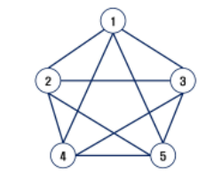

  - 정점들에 대해 가능한 모든 간선들을 가진 그래프

- 부분 그래프
  - 원래 그래프에서 일부 정점이나 간선을 제외한 그래프
- 인접(Adjacency)
  - 두 개의 정점에 간선이 존재(연결됨)하면 서로 인접해 있다고한다.
  - 완전 그래프에 속한 임의의 두 정점들은 모두 인접해 있다.

- 그래프 경로

  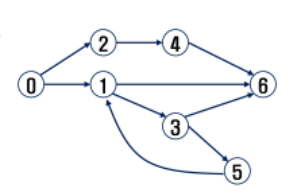

  - 경로란 간선들을 순서대로 나열한것
    - 간선들 : (0, 2) (2, 4) (4, 6)
    - 정점들 : 0 - 2 - 4 - 6
  - 경로 중 한 정점을 최대한 한번만 지나는 경로를 `단순경로`라 한다.
    - 0 - 2 - 4 - 6 , 0 - 1 - 6
  - 시작한 정점에서 끝나는 경로를 `사이클(cycle)`이라고 한다.
    - 1 - 3 - 5 - 1

- 그래프 표현

  - 간선의 정보를 저장하는 방식, 메모리나 성능을 고려해서 결정
  - 인접 행렬 (Adjacent matrix)
    - V x V 크기의 2차원 배열을 이용해서 간선 정보를 저장
    - 배열의 배열 (포인터 배열)
  - 인접 리스트 (Adjacent List)
    - 각 정점마다 해당 정점으로 나가는 간선의 정보를 저장
  - 간선의 배열
    - 간선(시작 정점, 끝 정점)을 배열에 연속적으로 저장

- 인접 행렬

  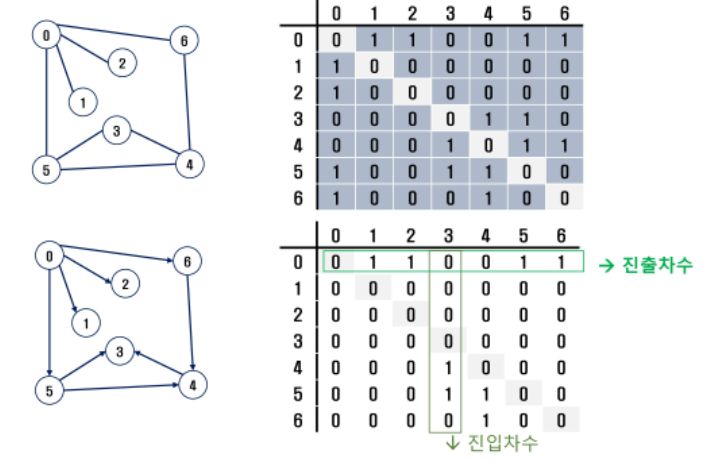

  - 두 정점을 연결하는 간선의 유무를 행렬로 표현
    - V x V 정방 행렬
    - 행 번호와 열 번호는 그래프릥 정점에 대응
    - 두 정점이 인접되어 있으면 1, 그렇지 않으면 0 으로 표현
    - 무향 그래프 
      - i 번째 행의 합 = i 번째 열의 합 = Vi의 차수
    - 유향 그래프
      - 행 i의 합 = Vi의 진출 차수
      - 열 i의 합 = Vi의 진입 차수
  - 단점
    - 비어있는 공간이 많다.
    - 탐색하는데 시간이 오래걸림
    - 대안 : 인접리스트

- 인접 리스트

  - 각 정점에 대한 인접 정점들을 순차적으로 표현

  - 하나의 정점에 대한 인접 정점들을 각각 노드로 연결하는 연결 리스트로 저장

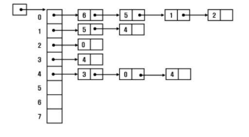

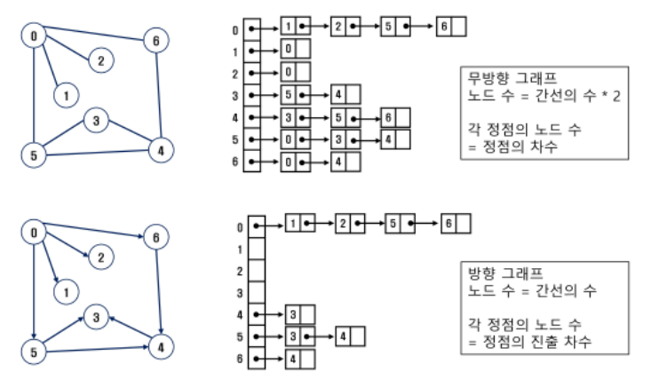

2. 그래프 순회(탐색)

- 그래프 순회는 비선형 구조인 그래프로 표현된 모든 자료(정점)를 빠짐없이 탐색하는것을 의미한다.

- 두 가지 방법
  - 깊이 우선 탐색(Depth First Search, DFS)
  - 너비 우선 탐색(Breadth First Search, BFS)
- DFS
  - 시작 정점의 한 방향으로 갈 수 있는 경로가 있는 곳까지 깊이 탐색해 가다가 더 이상 갈 곳이 없게 되면, 가장 마지막에 만났던 갈림길 간선이 있는 정점으로 되돌아와서 다른 방향의 정점으로 탐색을 계속 반복하여 결국 모든 정점을 방문하는 순회 방법-
  - 가장 마지막에 만났던 갈림길의 정점으로 되돌아가서 다시 깊이 우선 탐색을 반복해야 하므로 후입선출 구조의 스택 사용
  - 스택
    - 스택의 특성
      - 물건을 쌓아 올리듯 자료를 쌓아 올린 형태의 자료 구조이다.
      - 선형 구조 : 자료 간의 관게가 1대1의 관계를 갖는다
        - 비선형 구조 : 자료간의 관계가 1대N의 관계를 갖는다(트리)
      - 마지막에 삽입한 자료를 가장 먼저 꺼낸다
        - 후입선출(LIFO, Last-In-First-Out)이라고 부른다.

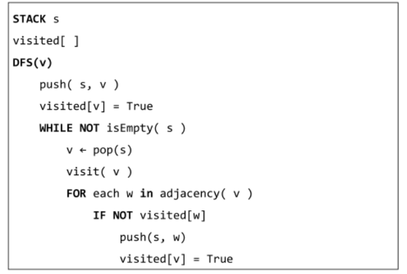

- BFS
  - 너비우선 탐색은 탐색 시작점의 인접한 정점들을 먼저 모두 차례로 방문한 후에, 방문했던 정점을 시작점으로 하여 다시 인접한 정점들을 차례로 방문하는 방식
  - 인접한 정점들에 대해 탐색을 한 후, 차례로 다시 너비 우선 탐색을 진행해야 하므로, 선입선출 형태의 자료구조인 큐를 활용함
  - 큐
    - 큐의 특성
      - 스택과 마찬가지로 삽입과 삭제의 위치가 제한적인 자료구조
        - 큐의 뒤에서는 삽입만하고, 큐의 앞에서는 삭제만 이루어지는 구조
      - 큐에 삽입한 순서대로 원소가 저장되어, 가장 먼저 삽입된 원소는 가장 먼저 삭제된다.
        - 선입선출구조(FIFO : First In First Out)

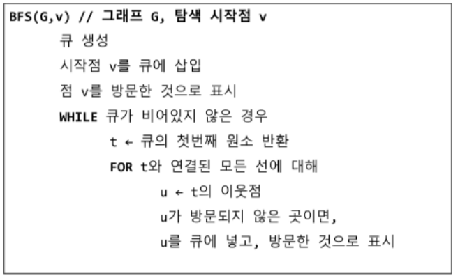

3. 서로소 집합(Disjoint-sets)

- 서로소 또는 상호 배타 집합들은 서로 중복 포함된 원소가 없는 집합들이다. 다시 말해 교집합이 없다.
- 집합에 속한 하나의 특정 멤버를 통해 각 집합들을 구분한다. 이를 대표(representative)라고 한다.

- 상호배타 집합을 표현하는 방법
  - 연결리스트
  - 트리
- 상호배타 집합 연산
  - Make-Set(x)
  - Find-Set(x)
  - Union(x, y) : 합치고 앞에 값을 대표값으로 지정
- 상호 배타 집합 예

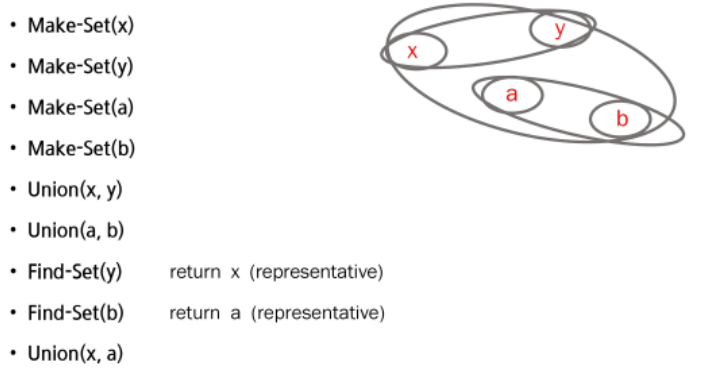

- 상호 배타 집합 표현 - 트리
  - 하나의 집합(a disjoint set)을 하나의 트리로 표현한다.
  - 자식 노드가 부모노드를 가리키며 루트 노드가 대표자가 된다.
  - 상호 배타 집합을 표현한 ㅌ트리의 배열을 이용해 저장된 모습
  
  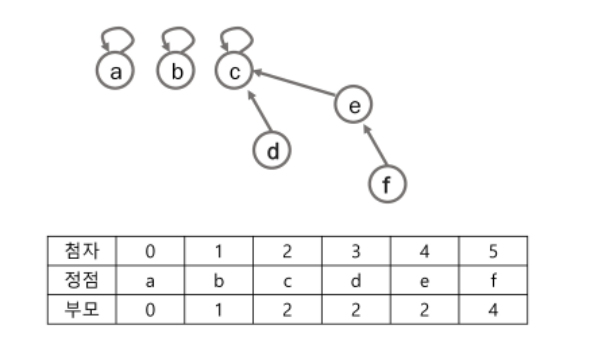
  
- 상호배타 집합에 대한 연산

  - Make_Set(x) : 유일한 멤버 x를 포함하는 새로운 집합을 생성하는 연산
  - Find_Set(x) : x를 포함하는 집합을 찾는 연산
  - Union(x, y): x와 y를 포함하는 두 집합을 통합하는 연산

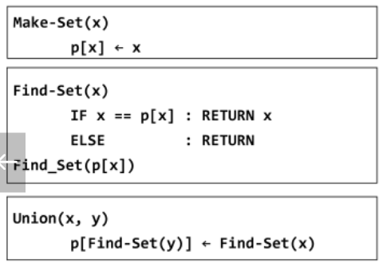

- 연산의 효율을 높이는 방법
  - Rank를 이용한 Union
    - 각 노드는 자신을 루트로 하는 subtree의 높이를 Rank라는 이름으로 저장한다.
    - 두 집합을 합칠 때 rank가 낮은 집합을 rank가 높은 집합에 붙인다.
  - Path compression
    - Find-Set을 행하는 과정에서 만나는 모든 노드들이 직접 root를 가리키도록 포인터를 바꾸어 준다.

4. 최소 신장 트리 (MST)

- 그래프에서 최소 비용 문제
  1. 모든 정점을 연결하는 간선들의 가중치의 합이 최소가 되는 트리
  2. 두 정점 사이의 최소 비용의 경로 찾기
- 신장 트리
  - n개의 정점으로 이루어진 무방향 그래프에서 n개의 정점과 n-1개의 간선으로 이루어진 트리
- 최소 신장 트리 (Minimum Spanning Tree)
  - 무방향 가중치 그래프에서 신장 트리를 구성하는 간선들의 가중치의 합이 최소인 신장 트리
- MST 표현

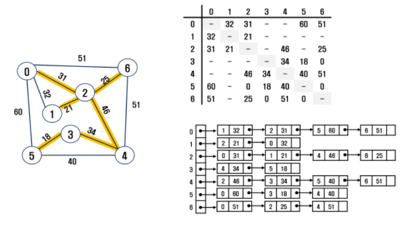

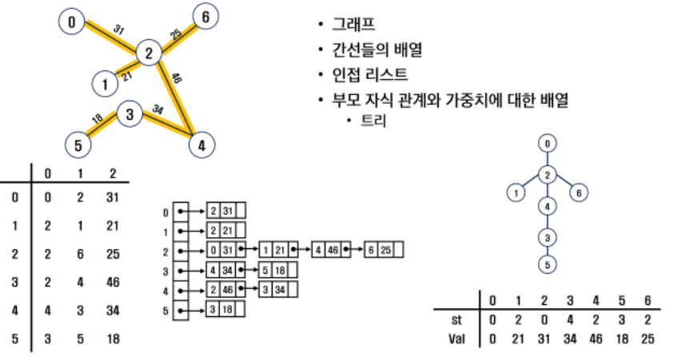

- Prim 알고리즘
  - 하나의 정점에서 연결된 간선들 중에 하나씩 선택하면서 MST를 만들어 가는 방식
    1. 임의 정점 하나 선택해서 시작
    2. 선택한 정점과 인접하는 정점들 중의 최소 비용의 간선이 존재하는 정점을 선택
    3. 모든 정점이 선택될 때까지 1 2 과정 반복
  - 서로소인 2개의 집합(2 disjoint-sets)정보를 유지
    - 트리 정점들(tree vertices) - MST를 만들기 위해 선택된 정점들
    - 비트리 정점들(nontree vertices) - 선택되지 않은 정점들
  - 알고리즘 적용 예

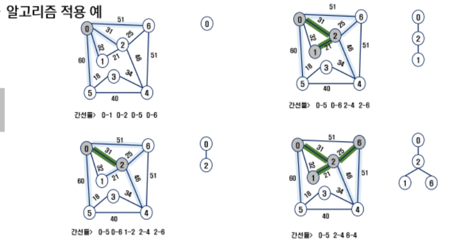

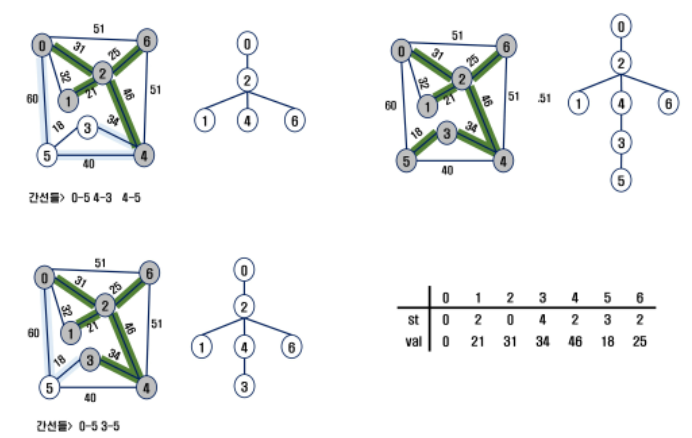

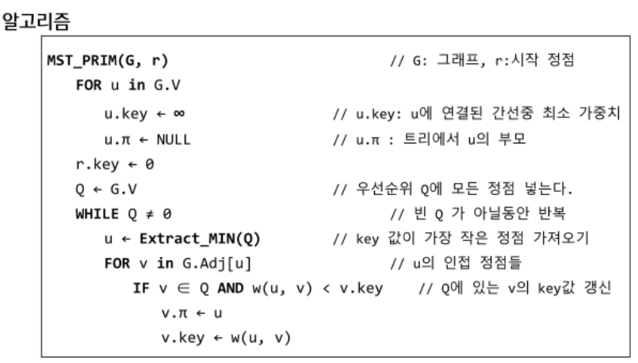

- KRUSKAL 알고리즘
  - 간선을 하나씩 선택해서 MST를 찾는 알고리즘
    1. 최초, 모든 간선을 가중치에 따라 `오름차순`으로 정렬
    2. 가주치가 가장 낮은 간선부터 선택하면서 트리를 증가시킴
       - 사이클이 존재하면 다음으로 가중치가 낮은 간선 선택
    3. n-1개의 간선이 선택될 때까지 2번을 반복
  - 알고리즘 적용 예

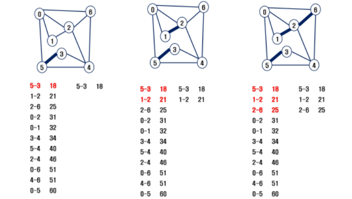

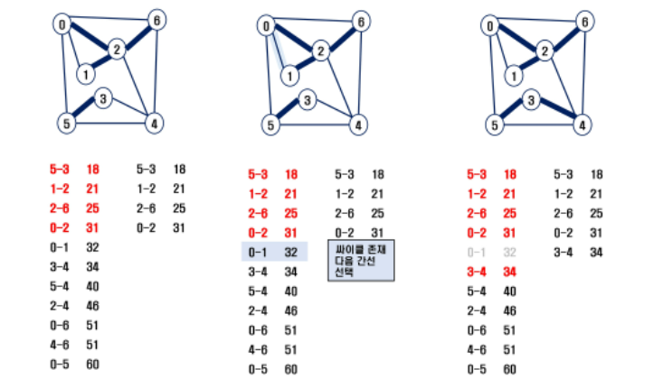

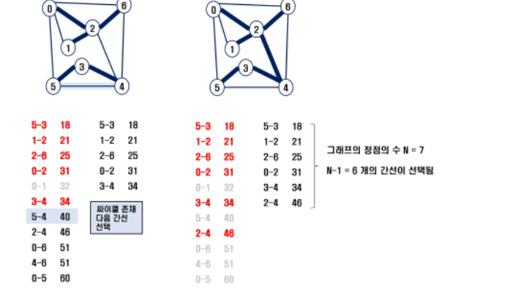

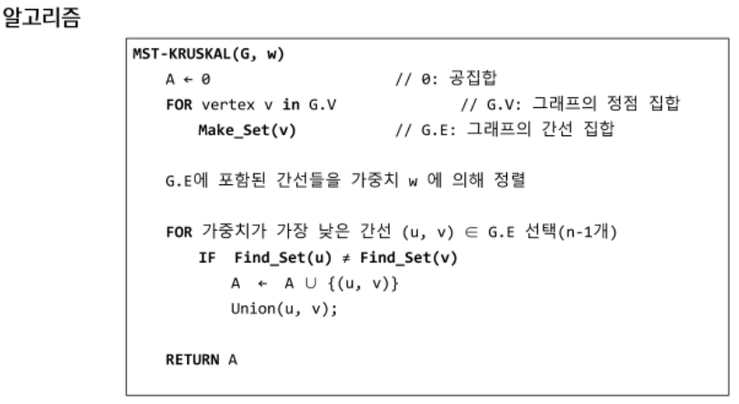

5. 최단경로

- 최단 경로 정의
  - 간선의 가중치가 있는 그래프에서 두 정점 사이의 경로들 중에 간선의 가중치의 합이 최소인 경로
- 하나의 시작 정점에서 끝 정점까지의 최다 ㄴ겨올
  - 다익스트라(dijkstra) 알고리즘
    - 음의 가중치를 허용하지 않음
  - 밸만-포드(Bellman-Ford) 알고리즘
    - 음의 가중치 허용
- 모든 정점들에 대한 최단 경로
  - 플로이드-워샬(Floyd-Warshall) 알고리즘
- Dijkstra 알고리즘
  - 시작 정점에서 거리가 최소인 정점을 선택해 나가면서 최단 경로를 구하는 방식이다.
  - 시작 정점(s)에서 끝정점(t)까지의 최단 경로에 정점 x가 존재한다.
  - 이때, 최단 경로는 s에서 x까지의 최단 경로와 x에서 t까지의 최단경로로 구성된다.
  - 탐욕기법을 이용한 알고리즘으로 MST의 프림 알고리즘과 유사하다.

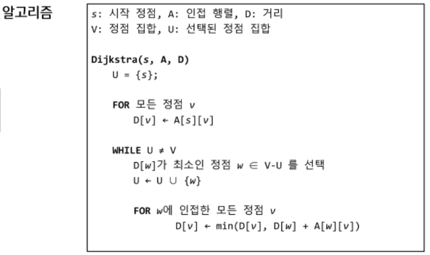

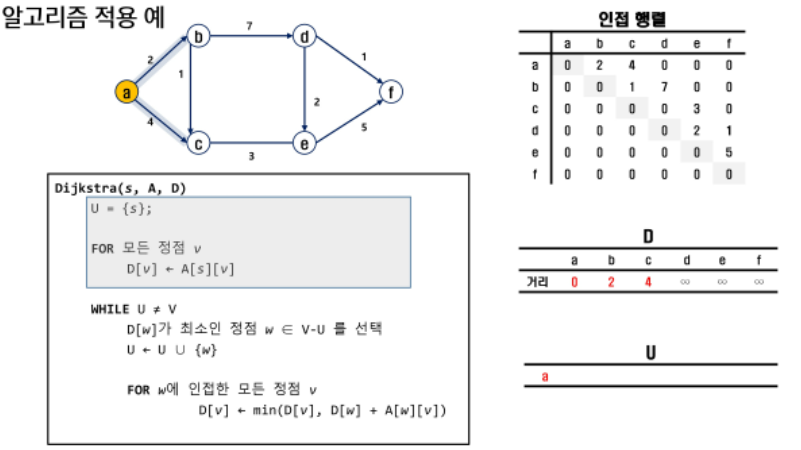

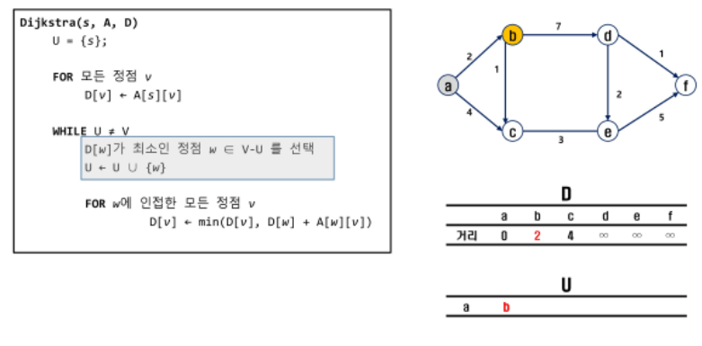

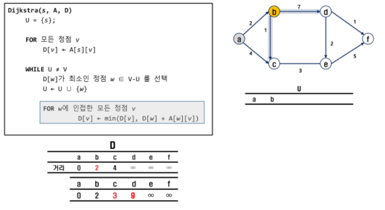

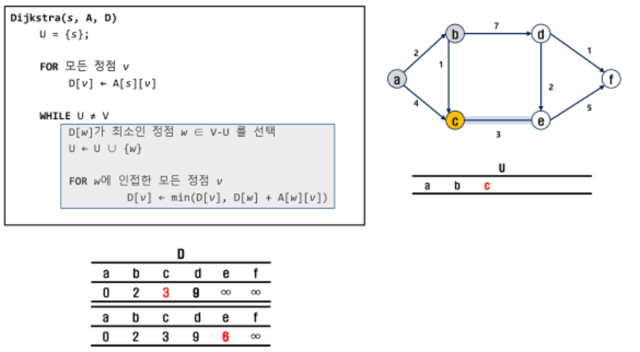

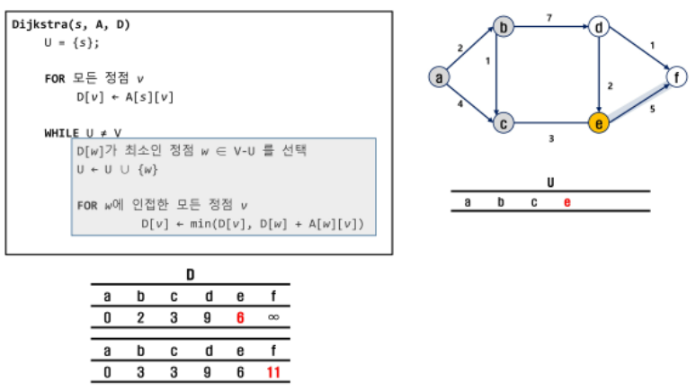

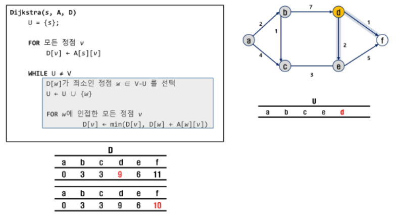

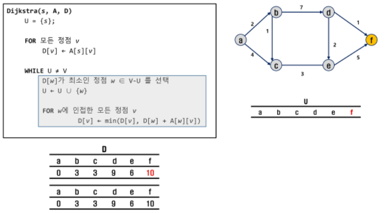

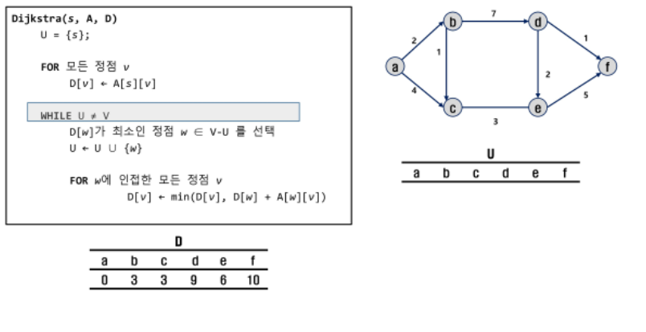