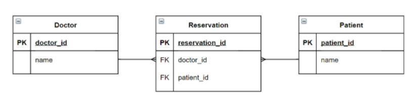

# DB03

- INTRO
- ManyToManyField
- LIKE
- PROFILE
- FOLLOW

---

### INTRO

- 병원 진료 기록 시스템을 통한 M:N관계 학습

  - 환자와 의사가 사용하는 병원 진료 기록 시스템 구축

    - 병원 시스템에서 가장 핵심이 되는 객체는 무엇일까? -> 환자와 의사
    - 이 둘의 관계를 어떻게 표현할 수 있을까?

  - 시작하기 전

    - 모델링은 현실세계를 최대한 유사하게 반영하기 위한 것
    - 우리 일상에 가까운 예시를 통해 DB를 모델링하고, 그 내부에서 일어나는 데이터의 흐름을 어떻게 제어할 수 있을지 고민해보기

  - 1:N의 한계

    - 새로운 예약을 생성하는 것이 불가능
      - 새로운 객체를 생성해야 함
    - 여러 의사에게 진료 받은 기록을 환자 한 명에 저장할 수 없음
      - 외래 키에 '1, 2' 형식의 데이터를 사용할 수 없음

  - 중개 모델

    - 중개모델 (혹은 중개 테이블, Associative Table) 작성

    ```python
    # mtm/hospitals/models.py
    
    from django.db import models
    
    
    class Doctor(models.Model):
        name = models.TextField()
    
        def __str__(self):
            return f'{self.pk}번 의사 {self.name}'
    
    
    # 외래키 삭제
    class Patient(models.Model):
        name = models.TextField()
    
        def __str__(self):
            return f'{self.pk}번 환자 {self.name}'
    
    # 중개모델 작성
    class Reservation(models.Model):
        doctor = models.ForeignKey(Doctor, on_delete=models.CASCADE)
        patient = models.ForeignKey(Patient, on_delete=models.CASCADE)
    
        def __str__(self):
            return f'{self.doctor_id}번 의사의 {self.patient_id}번 환자'
    ```
  
    - 중개 모델과의 모델 관계 확인
  
    
  
  - ManyToManyField
  
    - 다대다 (M:N, many to many) 관계 설정 시 사요하는 모델 필드
  
    - 하나의 필수 위치 인자(M:N 관계로 설정할 모델 클래스) 가 필요
  
    - ManyToManyField 작성
  
      - 필드 작성 위치는 Doctor, Patient 모두 가능
  
      ```python
      # mtm/hospitals/models.py
      
      from django.db import models
      
      class Doctor(models.Model):
          name = models.TextField()
      
          def __str__(self):
              return f'{self.pk}번 의사 {self.name}'
      
      
      class Patient(models.Model):
          # ManyToManyField 작성
          # 1:N 모델이 존재한다면 아래와 같이 작성할 때 오류 발생
          doctors = models.ManyToManyField(Doctor)
          name = models.TextField()
      
          def __str__(self):
              return f'{self.pk}번 환자 {self.name}'
      ```
  
  - related_name
  
    - `target model(관계 필드를 가지지 않은 모델)`이 `source model(관계 필드를 가진 모델)`을 참조할 때 사용할 manager의 이름을 설정
    - 즉 역참조시에 사용하는 manager의 이름을 설정
    - ForeignKey의 related_name과 동일
  
    ```python
    # mtm/hospitals/models.py
    
    from django.db import models
    
    class Doctor(models.Model):
        name = models.TextField()
    
        def __str__(self):
            return f'{self.pk}번 의사 {self.name}'
    
    
    class Patient(models.Model):
        # ManyToManyField - related_name 작성
        doctors = models.ManyToManyField(Doctor, related_name='patients')
        name = models.TextField()
    
        def __str__(self):
            return f'{self.pk}번 환자 {self.name}'
    
    ```
  
  - 중개 모델 (테이블) in Django
  
    - 장고는 ManyToManyField를 통해 중개 테이블을 자동으로 생성
    - 그렇다면 중개 테이블을 직접 작성하는 경우는 없을까?
      - 주액 테이블을 수동으로 지정하려는 경우 through 옵션을 사용하여 , 중개 테이블을 나타내는 장고 모델을 지정할 수 있음 (다음 챕터에서 확인)
      - 가장 일반적인 용도는 중개 테이블에 추가 데이터를 사용해 다대다 관계로 연결하려는 경우에 사용
  
  - 요약
  
    - 실제 Doctor와 Patient 테이블이 변하는 것은 없음
    - 1:N 관계는 완전한 종속 관계지만, M:N 관계는 `의사에게 진찰받는 환자, 환자를 진찰하는 의사의 두가지 형태로 모두 표현이 가능한 것`

---

### ManyToManyField

- 다대다 (M:N , many-to-many)관계 설정시 사용하는 모델 필드

- 하나의 필수 위치 인자 (M:N 관계로 설정할 모델 클래스)가 필요

- 모델 필드의 RelatedManager를 사용하여 관련 개체를 추가, 제거 또는 만들 수 있음

  - add(), remove(), ~~create(), clear()~~

- [참고] RelatedManager

  - 일대다 또는 다대다 관련 컨텍스트에서 사용되는 manager

- ManyToManyField의 **Arguments**

  1. **related_name**

     - `target model(관계 필드를 가지지 않은 모델)`이 `source model(관계 필드를 가진 모델)`을 참조할 때 사용할 manager의 이름을 설정
     - ForeignKey의 related_name과 동일

  2. **through**

     - 중개 테이블을 직접 작성하는 경우, through 옵션을 사용하여 중개 테이블을 나타내는 장고 모델을 지정할 수 있음
     - 일반적으로 중개 테이블에 추가 데이터를 사용하는 다대다 관계와 연결하려는 경우(extra data with a many-to-many relationship)에 주로 사용됨

  3. **symmetrical** (대칭여부)

     ```python
     # accounts/models.py
     
     from django.db import models
     from django.contrib.auth.models import AbstractUser
     
     class User(AbstractUser):
         followings = models.ManyToManyField('self', symmetrical=False, related_name='followers')  # <<<<
     
     
     ```

     - ManyToManyField가 동일한 모델(on self)을 가리키는 정의에서만 사용
     - symmetrical=True(기본값)일 경우 장고는 person_set 매니저를 추가하지 않음
     - source 모델의 인스턴스가 target 모델의 인스턴스를 참조하면, target 모델 인스턴스도 source 모델 인스턴스를 자동으로 참조하도록 함
       - 즉 내가 당신의 친구라면 당신도 내 친구가 되는 것
       - `대칭을 원하지 않는 경우 False로 설정`
       - Follow 기능 구현에서 확인!!!!

- Related Manager

  - 1:N 또는 M:N 관련 컨텍스트에서 사용되는 매니저

  - 같은 이름의 메서드여도 각 관계(1:N  ,  M:N)에 따라 다르게 사용 및 동작

    - 1:N에서는 target 모델 인스턴스만 사용가능
    - M:N 관계에서는 관련된 두 객체에서 모두 사용가능

  - 메서드 종류

    - add(), remove(), ~~create(), clear(), set() 등~~

  - add()

    - "지정된 객체를 관련 객체 집합에 추가"
    - 이미 존재하는 관계에 사용하면 관계가 복제되지 않음
    - 모델 인스턴스, 필드값(PK)을 인자로 허용

    ```python
    doctor1 = Doctor.objects.create(name='justin')
    patient1 = Patient.objects.create(name='tony')
    
    doctor1.patient_set.add(patient1)
    patient.doctors.add(doctor1)
    ```

  - remove()

    - "관련 객체 집합에서 지정된 모델 객체를 제거"
    - 내부적으로 QuerySet.delete()를 사용하여 관계가 삭제됨
    - 모델 인스턴스, 필드 값(PK)을 인자로 허용

    ```python
    doctor1 = Doctor.objects.get(pk=1)
    patient1 = Patient.objects.get(pk=1)
    
    doctor1.patient_set.remove(patient1)
    patient2.doctors.remove(doctor1)
    ```

- through 예시

  - 모델 관계 설정

  ```python
  # mtm/hopitals/models.py
  
  from django.db import models
  
  
  class Doctor(models.Model):
      name = models.TextField()
  
      def __str__(self):
          return f'{self.pk}번 의사 {self.name}'
  
  
  class Patient(models.Model):
      doctors = models.ManyToManyField(Doctor, through='Reservation')
      name = models.TextField()
  
      def __str__(self):
          return f'{self.pk}번 환자 {self.name}'
  
  
  class Reservation(models.Model):
      doctor = models.ForeignKey(Doctor, on_delete=models.CASCADE)
      patient = models.ForeignKey(Patient, on_delete=models.CASCADE)
      symptom = models.TextField()
      reserved_at = models.DateTimeField(auto_now_add=True)
  
      def __str__(self):
          return f'{self.doctor.pk}번 의사의 {self.patient.pk}번 환자'
  ```

- 데이터베이스에서의 표현
  - 장고는 다대다 관계를 나타내는 중개 테이블을 만듦
  - 테이블 이름은 다대다 필드의 이름과 이를 포함하느 ㄴ모델의 테이블 이름을 조합하여 생성됨
- 중개 테이블 필드 생성 규칙
  1. source model 및 target model이 다른 경우
     - id
     - <containing_model>_id
     - <other_model>_id
  2. ManyToManyField가 동일한 모델을 가리키는 경우
     - id
     - from_\<model>\_id
     - to\_<model\>_id

---

### LIKE

- LIKE 구현

  - ManyToManyField 작성 후 마이그레이션

  ```python
  # articles/models.py
  
  from django.db import models
  from django.conf import settings
  
  # Create your models here.
  class Article(models.Model):
      user = models.ForeignKey(settings.AUTH_USER_MODEL, on_delete=models.CASCADE)
      like_users =models.ManyToManyField(settings.AUTH_USER_MODEL)  # <<<<
      title = models.CharField(max_length=10)
      content = models.TextField()
      created_at = models.DateTimeField(auto_now_add=True)
      updated_at = models.DateTimeField(auto_now=True)
  
      def __str__(self):
          return self.title
  ```

  ```bash
  $ python manage.py makemigrations
  
  
  SystemCheckError: System check identified some issues:
  ERRORS:
  articles.Article.like_users: (fields.E304) Reverse accessor for 'articles.Article.like_users' clashes with reverse accessor for 'articles.Article.user'.
          HINT: Add or change a related_name argument to the definition for 'articles.Article.like_users' or 'articles.Article.user'.
      articles.Article.user: (fields.E304) Reverse accessor for 'articles.Article.user' clashes with reverse accessor for 'articles.Article.like_users'.
          HINT: Add or change a related_name argument to the definition for 'articles.Article.user' or 'articles.Article.like_users'.
      (venv) 
  ```

  - 에러 발생 원인
    - like_users 필드 생성 시 자동으로 역참조는 .article_set 매니저를 생성
    - 그러나 이전 1:N(User:Article) 관계에서 이미 해당 매니저 이름을 사용중이기 때문
    - User와 관계된 ForeignKey 또는 ManyToManyField 중 하나에 related_name 추가 필요
  - related_name 설정 후 다시 마이그레이션

  ```python
  # articles/models.py
  
  from django.db import models
  from django.conf import settings
  
  # Create your models here.
  class Article(models.Model):
      user = models.ForeignKey(settings.AUTH_USER_MODEL, on_delete=models.CASCADE)
      like_users =models.ManyToManyField(settings.AUTH_USER_MODEL, related_name='like_articles')  # <<<< 
      title = models.CharField(max_length=10)
      content = models.TextField()
      created_at = models.DateTimeField(auto_now_add=True)
      updated_at = models.DateTimeField(auto_now=True)
  
      def __str__(self):
          return self.title    
  ```

  - 현재 User - Article간 사용가능한 DB API
    - article.user
      - 게시글을 작성한 유저 - 1:N
    - article.like_users
      - 게시글을 좋아요한 유저 - M:N
    - user.article_set
      - 유저가 작성한 게시글(역참조) - 1:N
    - user.like_articles
      - 유저가 좋아요한 게시글(역참조) - M:N
  - url 작성

  ```python
  # articles/urls.py
  
  from django.urls import path
  from . import views
  
  
  app_name = 'articles'
  urlpatterns = [
      path('', views.index, name='index'),
      path('create/', views.create, name='create'),
      path('<int:pk>/', views.detail, name='detail'),
      path('<int:pk>/delete/', views.delete, name='delete'),
      path('<int:pk>/update/', views.update, name='update'),
      path('<int:pk>/comments/', views.comment_create, name='comment_create'),
      path('<int:article_pk>/comments/<int:comment_pk>/delete/', views.comment_delete, name='comment_delete'),
      path('<int:article_pk>/likes/', views.likes, name='likes'),  # <<<<
  ]
  ```

  - like view 함수 작성

  ```python
  # articles/views.py
  
  # 누르는게 무조건 좋아요를 활성화만 시킬까?
  # 두번 누르면 취소도 가능하도록
  # aritcle에 좋아요를 누른 목록에 있다면 remove(delete)
  # article에 좋아요를 누른 목록에 없다면 add(create)
  @require_POST
  def likes(request, article_pk):  # <<<<
      article = get_object_or_404(Article, pk=article_pk)
      # 이 게시글에 좋아요를 누른 유저 목록에 현재 요청하는 유저가 있다면.... 좋아요 취소
      # if request.user in article.like_users.all():
      if article.like_users.filter(pk=request.user.pk).exists():
          article.like_users.remove(request.user)
      else:
          article.like_users.add(request.user)
      return redirect('articles:index')
  ```

  - QuerySet API - 'exists()'
    - QuerySet에 결과가 포함되어 있으면 True를 반환하고 그렇지 않으면 False를 반환
    - 특히 규모가 큰 QuerySet의 컨텍스트에서 특정 개체 존재 여부와 관련된 검색에 유용
    - 고유한 필드 (예: PK)가 있는 모델이 QuerySet의 구성원인지 여부를 찾는 `가장 효율적인 방법`
  - index.html 작성

  ```django
  # articles/index.html
  
  
  
  
    <h1>Articles</h1>
    ...
    
      ...
  
  
      <div>   <<<< 
          
        <form action="" method="POST">
          
          
          <input type="submit" value="♥">
          
          <input type="submit" value="♡">
          
        </form>
          
      </div>   <<<< 
  
  
     ...
    
  
  ```

---

### Profile Page

- 자연스로운 follow 흐름을 위한 회원 프로필 페이지 작성하기

- url 작성

  ```python
  # accounts/urls.py
  
  from django.urls import path
  from . import views
  
  
  app_name = 'accounts'
  urlpatterns = [
      path('login/', views.login, name='login'),
      path('logout/', views.logout, name='logout'),
      path('signup/', views.signup, name='signup'),
      path('delete/', views.delete, name='delete'),
      path('update/', views.update, name='update'),
      path('password/', views.change_password, name='change_password'),
      path('<username>/', views.profile, name="profile"),  # <<<< 맨위에 두면 밑에 것들 다 문자열로 읽혀서 문제 발생
  ]
  ```

- view 함수 작성

  ```python
  # accounts/views.py
  
  from django.shortcuts import render, redirect, get_object_or_404
  from django.contrib.auth import get_user_model
  
  
  def profile(request, username):  # <<<<
      person = get_object_or_404(get_user_model(), username=username)
      context = {
          'person': person
      }
  
      return render(request, 'accounts/profile.html',context)
  ```

- profile page 작성

  ```django
  # accounts/profile.html
  
  
  
  
  
  <h1>{{ person.username }}님의 프로필</h1>
  
  <hr>
  
   이 사람이 작성한 게시글 목록 
  <h2>{{ person.user }}이 작성한 게시글 </h2>
  
    <p>{{ article.title }}</p>
  
  
  <hr>
  
   이 사람이 작성한 댓글 목록 
  <h2>{{ person.username }}이 작성한 댓글</h2>
  
  <p>{{ comment.content }}</p>
  
  
  <hr>
  
   이 사람이 좋아요를 누른 게시글 목록 
  <h2>{{ person.username }}이 좋아요를 누른 게시글</h2>
  
    <p>{{ article.title }}</p>
  
  
  <a href="">[BACK]</a>
  
  
  ```

- base.html에 프로필 링크 작성

  ```django
  # base.html
  
  ...
  
  <body>
    <div class="container">
      
        <h3>Hello, {{ user }}</h3>
        <a href=""> MY PROFILE </a>
        
        ...
  ```

---

### Follow

- ManyToManyField 작성 후 마이그레이션

  ```python
  # accounts/models.py
  
  from django.db import models
  from django.contrib.auth.models import AbstractUser
  
  # Create your models here.
  class User(AbstractUser):
      followings = models.ManyToManyField('self', symmetrical=False, related_name='followers')  # <<<<
  ```

- url 작성

  ```python
  # accounts/urls.py
  
  from django.urls import path
  from . import views
  
  
  app_name = 'accounts'
  urlpatterns = [
      path('login/', views.login, name='login'),
      path('logout/', views.logout, name='logout'),
      path('signup/', views.signup, name='signup'),
      path('delete/', views.delete, name='delete'),
      path('update/', views.update, name='update'),
      path('password/', views.change_password, name='change_password'),
      path('<username>/', views.profile, name="profile"),
      path('<int:user_pk>/follow/', views.follow, name='follow'),  # <<<<
  ]
  
  ```

- follow view 함수 작성

  ```python
  # accounts/views.py
  
  @require_POST
  def follow(request, user_pk):  # <<<<
      if request.user.is_authenticated:
          person = get_object_or_404(get_user_model(), pk=user_pk)
          me = request.user
  		
          # 자기자신은 팔로우 할 수 없음
          if me != person:
              # 언팔로우
              # if request.user in person.followers.all():
              if person.followers.filter(pk=me.pk).exists():
                  person.followers.remove(request.user)
              # 팔로우
              else:
                  person.followers.add(request.user)
  
  
          return redirect('accounts:profile', person.username)
      return redirect('accounts:login')
  ```

- profile 페이지에 팔로우와 언팔로우 버튼 생성

  - 팔로잉 / 팔로워 수 출력
  - 자기 자신을 팔로우할 수 없음

  ```django
  # accounts/profile.html
  
  
  
  
  
  <h1>{{ person.username }}님의 프로필</h1>
  
   중복되는 태그들 변수화 (with로 감싸주기) 
  
  
  <div>
     팔로워 : {{ person.followers.all|length }}  / 팔로우 : {{ person.followings.all|length }} 
    팔로워 : {{ followers|length }}  / 팔로우 : {{ followings|length }}
  
  </div>
  
  <div>
  
    <form action="" method="POST">
      
        
      
      <input type="submit" value="UNFOLLOW">
      
      <input type="submit" value="FOLLOW">
      
    </form>
  
  </div>
  
  
  
  ...
  
  
  ```

  

