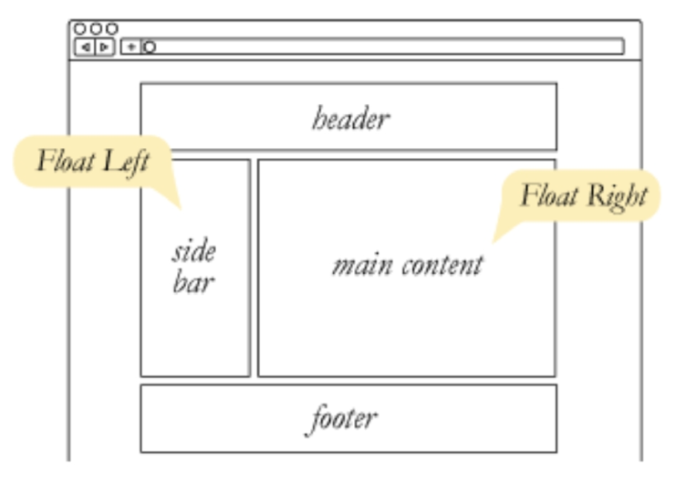
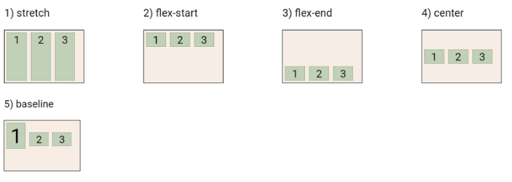
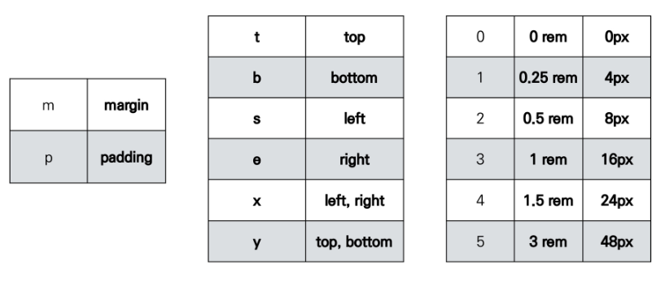

# CSS Layout

- Float
- Flexbox
- Bootstrap
- Bootstrap Grid System

---

- CSS layout techniques
  - Display
  - Position
  - Float
  - Flexbox
  - Grid
  - 기타
    - Responsive Web Design, Media Queries

---

### Float

- Float

  - 박스가 왼쪽 혹은 오른쪽으로 이동시켜 텍스트를 포함 인라인 요소들이 주변을 wrapping하도록 함
  - 요소가 Normal flow를 벗어나도록 함

  

- Float 속성

  - none : 기본값
  - left : 요소를 왼쪽으로 띄움
  - right : 요소를 오른쪽으로 띄움

  

- Float 예시

  

  

- Clearing Float

  - Float는 Normal Flow에서 벗어나 부동 상태(떠 있음)

  - 따라서, 이후 요소에 대하여 Float 속성이 적용되지 않도록 Clearing이 필수적임

    - ::after : 선택한 요소의 맨 마지막 자식으로 가상 요소를 하나 생성

      - 보통 content 속성과 함께 짝지어, 요소에 장식용 콘텐츠를 추가할 때 사용

    - clear 속성 부여

      

      

      

- Float 정리
  - Float는 레이아웃을 구성하기 위해 필수적으로 활용 되었으며, 최근엔 Flexbox, Grid 등장과 함께 사용도가 낮아짐
  - Float 활용 전략 - Normal Flow에서 벗어난 레이아웃 구성
    - 원하는 요소들을 Float로 지정하여 배치
    - 부모 요소에 반드시 Clearing Float를 하여 요소부터 Normal Flow를 가지도록 지정

---

### Flexbox

- CSS Flexible Box Layout

  - 행과 열 형태로 아이템들을 배치하는 1차원 레이아웃 모델
  - 축
    - main axis (메인 축)
    - cross axis (교차 축)
  - 구성 요소
    - Flex Container (부모 요소)
    - Flex Item (자식 요소)

  

- Flexbox 구성 요소
  - Flex Container (부모 요소)
    - flexbox 레이아웃을 형성하는 가장 기본적인 모델
    - Flex Item들이 놓여있는 영역
    - display 속성을 flex 혹은 inline-flex로 지정
  - Flex Item (자식 요소)
    - 컨테이너에 속해 있는 컨텐츠(박스)

- 왜 Flexbox를 사용해야 할까?
  - 이전까지 Normal Flow를 벗어나는 수단은 Float 혹은 Position
  - 하기 어려웠던 것?
    1. (수동 값 부여 없이) 수직 정렬
    2. 아이템의 너비와 높이 혹은 간격을 동일하게 배치

- flexbox 시작

  - 부모 요소에 display: flex혹은 inline-flex

  

- Flex 속성
  - 배치 설정
    - flex-direction
    - flex-wrap
  - 공간 나누기
    - justify-content (main axis)
    - align-content (cross axis)
  - 정렬
    - align-items (모든 아이템을 cross axis 기준으로)
    - align-self (개별 아이템)

- Flex 속성 : flex-direction

  - Main axis 기준 방향 설정
  - 역방향의 경우 HTML 태그 선언 순서와 시각적으로 다르니 유의 (웹 접근성에 영향)

  

- Flex 속성 : flex-wrap

  - 아이템이 컨테이너를 벗어나는 경우 해당 영역 내에 배치되도록 설정
  - 즉, 기본적으로 컨테이너 영역을 벗어나지 않도록 함

  

- Flex 속성 : flex-direction & flex-wrap
  - flex-direction : Main axis의 방향을 설정
  - flex-wrap  : 요소들이 강제로 한 줄에 배치 되게  할 것인지 여부 설정
    - nowrap(기본 값) : 한줄에 배치
    - wrap : 넘치면 그 다음 줄로 배치
  - flex-flow
    - flex-direction과 flex-wrap의 shorhand
    - flex-direction과 flex-wrap에 대한 설정 값을 차례로 작성
    - 예) flex-flow: row nowrap;

- Flex 속성 : justify-content

  - Main axis를 기준으로 공간 배분

  

- Flex 속성 : align-content

  - Cross axis를 기준으로 공간 배분 (아이템이 한 줄로 배치되는 경우 확인할 수 없음)

  

- Flex 속성 : justify-content & align-content
  - 공간배분
    - flex-start (default) : 아이템을 axis 시작점으로
    - flex-end : 아이템들을 axis 끝 쪽으로
    - center : 아이템들을 axis 중앙으로
    - space-between : 아이템 사이 간격을 균일하게 분배
    - space-around : 아이템을 둘러싼 영역을 균일하게 분배 (가질 수 있는 영역을 반으로 나눠서 양쪽에)
    - space-evenly : 전체 영여ㅛㄱ에서 아이템 간 간격을 균일하게 분배

- Flex 속성 : align-items

  - 모든 아이템을 Cross axis 기준으로 정렬

  

- Flex 속성 : align-self

  - 개별 아이템을 Cross axis 기준으로 정렬

    - `주의! 해당 속성은 컨테이너에 적용하는 것이 아니라 개별 아이템에 적용`

    

- Flex 속성 : align-items & align-self
  - Cross axis를 중심으로
    - stretch (default) : 컨테이너를 가득 채움
    - flex-start : 위
    - flex-end : 아래
    - center : 가운데
    - baseline : 텍스트 baseline에 기준선을 맞춤

- Flex에 적용하는 속성
  - 기타 속성
    - flex-grow : 남은 영역을 아이템에 분배
    - order : 배치 순서

- 활용 레이아웃 - 수직 수평 가운데 정렬

  

- 활용 레이아웃 - 카드 배치

  

---

### Bootstrap

- CDN
  - Content Delivery(Distribution) Network
    - 컨텐츠(CSS, JS, Image, Text 등)을 효율적으로 전달하기 위해 여러 노드에 가진 네트워크에 데이터를 제공하는 시스템
    - 개별 end-user의 가까운 서버를 통해 빠르게 전달 가능(지리적 이점)
    - 외부 서버를 활용함으로써 본인 서버의 부하가 적어짐

- spacing

- Responsive Web

  - 같은 컨텐츠를 보는 각기 다른 디바이스

  

  - 다양한 화면 크기를 가진 디바이스들이 등장함에 따라 responsive web design 개념이 등장
  - 반응형 웽은 별도의 기술 이름이 아닌 웹 디자인에 대한 접근 방식, 반흥형 레이아웃 작성에 도임이 되는 사례들의 모음 등을 기술하는데 사용되는 용어
  - 예시
    - Media Queries, Flexbox, Bootstrap Grid System, The viewport meta tag

---

### Bootstrap Grid System

- Grid System (web design)
  - 요소들의 디자인과 배치에 도움을 주는 시스템
  - 기본 요소
    - Coloumn : 실제 컨텐츠를 포함하는 부분
    - Gutter :  칼럼과 칼럼 사이의 공간 (사이 간격)
    - Container : Column들을 담고 있는 공간

- Bootstrap grid System
  - Bootstrap Grid system은 flexbox로 제작됨
  - container, rows, column으로 컨텐츠를 배치하고 정렬
  - 반드시 기억해야할 2가지
    1. 12개의 column
    2. 6개의 grid breakpoints
